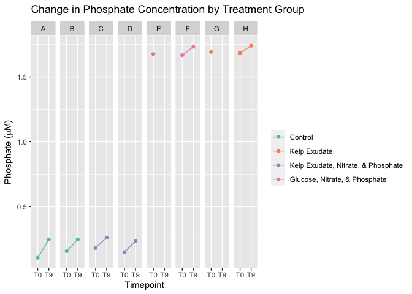
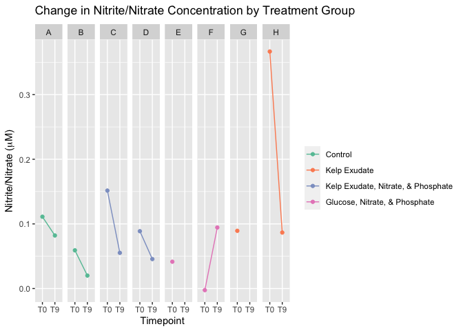
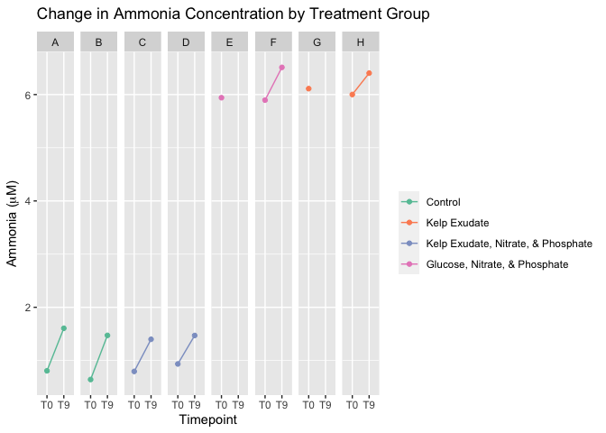

Nutrient Plots
================
Victor Trandafir
11/18/2021

##### This document contains nutrient plots for the DOC remineralization experiment.

``` r
#Plot phosphate data.

nutrients %>%
  ggplot(aes(x = Time, y = Phosphate_uM, group = Sample, color = Treatment)) +
  geom_point() +
  geom_line() +
  facet_wrap(~factor(Sample, levels = trial), nrow = 1) +
  ggtitle(expression(paste("Change in Phosphate Concentration by Treatment Group"))) +
  xlab("Timepoint")+
  ylab(expression(paste("Phosphate (", mu, "M)"))) +
  custom_colors +
  custom_legend
```

    ## Scale for 'colour' is already present. Adding another scale for 'colour',
    ## which will replace the existing scale.

    ## geom_path: Each group consists of only one observation. Do you need to adjust
    ## the group aesthetic?
    ## geom_path: Each group consists of only one observation. Do you need to adjust
    ## the group aesthetic?

<!-- -->

<!-- -->

<!-- -->
