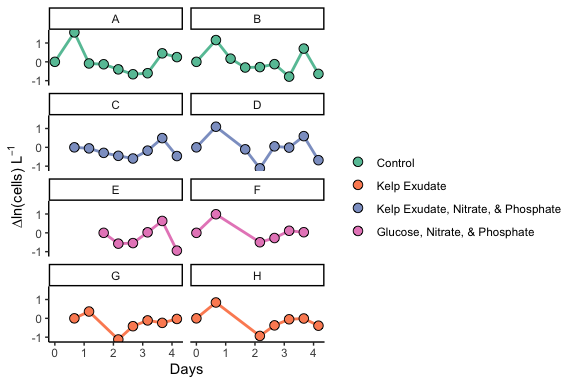

Bacterial Abundance Plots
================
Victor Trandafir
12/07/2021

# Goal

This document shows **individual bottle** bacterial abundance data
analysis and plots.

``` r
#Load packages.

library(tidyverse)
```

    ## ── Attaching packages ─────────────────────────────────────── tidyverse 1.3.1 ──

    ## ✓ ggplot2 3.3.5     ✓ purrr   0.3.4
    ## ✓ tibble  3.1.6     ✓ dplyr   1.0.7
    ## ✓ tidyr   1.1.4     ✓ stringr 1.4.0
    ## ✓ readr   2.0.2     ✓ forcats 0.5.1

    ## ── Conflicts ────────────────────────────────────────── tidyverse_conflicts() ──
    ## x dplyr::filter() masks stats::filter()
    ## x dplyr::lag()    masks stats::lag()

``` r
library(readxl)
library(lubridate)
```

    ## 
    ## Attaching package: 'lubridate'

    ## The following objects are masked from 'package:base':
    ## 
    ##     date, intersect, setdiff, union

``` r
library(RColorBrewer)
```

### Import Data

``` r
excel_sheets("~/Documents/College/Fourth Year/EEMB 144L/Github/144l_students_2021/Input_Data/week2/144L_2021_BactAbund.xlsx")
```

    ## [1] "Metadata"  "FCM_Data"  "DAPI_Data" "TOC_Data"

``` r
metadata <- read_excel("~/Documents/College/Fourth Year/EEMB 144L/Github/144l_students_2021/Input_Data/week2/144L_2021_BactAbund.xlsx", sheet = "Metadata")

data <-  read_excel("~/Documents/College/Fourth Year/EEMB 144L/Github/144l_students_2021/Input_Data/week2/144L_2021_BactAbund.xlsx", sheet = "FCM_Data")

joined <- left_join(metadata, data)
```

    ## Joining, by = c("Bottle", "Timepoint")

### Prepare Data

``` r
#Transform data.

joined$all_cells_uL <- as.numeric(joined$all_cells_uL)
```

    ## Warning: NAs introduced by coercion

``` r
cells <- joined %>%
  mutate(Datetime = ymd_hm(Datetime),
  cells_L = all_cells_uL * 1000000) %>%
  group_by(Treatment, Bottle) %>%
  mutate(interv = interval(first(Datetime), Datetime),
         s = as.numeric(interv),
         hours = s/3600,
         days = hours/24) %>%
  ungroup() %>%
  select(Experiment:DNA_Sample, cells_L, hours, days) %>%
  drop_na(cells_L)
```

``` r
#Set levels, custom labels, and custom colors.

treatment <- c("Control", "Kelp Exudate", "Kelp Exudate_Nitrate_Phosphate", "Glucose_Nitrate_Phosphate")

treatment_names <- as_labeller(c(
  "Control" = "Control",
  "Kelp Exudate" = "Kelp Exudate",
  "Kelp Exudate_Nitrate_Phosphate" = "Kelp Exudate, Nitrate, & Phosphate",
  "Glucose_Nitrate_Phosphate" = "Glucose, Nitrate, & Phosphate"
))

myColors <- brewer.pal(4, "Set2")

names(myColors) <- levels(treatment)

custom_colors <- scale_color_manual(name = "", values = myColors, labels = c("Control", "Kelp Exudate", "Kelp Exudate, Nitrate, & Phosphate", "Glucose, Nitrate, & Phosphate"))

custom_legend <- scale_fill_discrete(labels = c("Control", "Kelp Exudate", "Kelp Exudate, Nitrate, & Phosphate", "Glucose, Nitrate, & Phosphate"))

custom_fill <- scale_fill_manual(name = "", values = myColors, labels = c("Control", "Kelp Exudate", "Kelp Exudate, Nitrate, & Phosphate", "Glucose, Nitrate, & Phosphate"))
```

### Growth Curves

``` r
#Plot growth curves.

cells %>%
  mutate(dna = ifelse(DNA_Sample == T, "*", NA)) %>%
  ggplot(aes(x = days, y = cells_L, fill = Treatment, color = Treatment)) +
  geom_line(size = 1) +
  geom_point(size = 3, shape = 21, color = "black") +
  labs(x = "Days", y = expression(paste("cells L"^-1)), fill = "") +
  guides(color = "none") +
  theme_classic() +
  custom_legend +
  custom_fill +
  custom_colors +
  facet_wrap("Bottle", nrow = 4)
```

    ## Scale for 'fill' is already present. Adding another scale for 'fill', which
    ## will replace the existing scale.

<!-- -->

#### Identify Exponential Phase of Growth in Our Remineralization Experiment

``` r
#Calculate ln(cells).

ln_cells <- cells %>%
  group_by(Treatment, Bottle) %>%
  mutate(ln_cells = log(cells_L),
         diff_ln_cells = ln_cells - lag(ln_cells, default = first(ln_cells)))
```

#### Plot Log Transformed Data

``` r
#Plot ln transformed data.

ln_cells %>%
  mutate(dna = ifelse(DNA_Sample == T, "*", NA)) %>%
  ggplot(aes(x = days, y = diff_ln_cells, fill = Treatment, color = Treatment)) +
  geom_line(size = 1) +
  geom_point(size = 3, shape = 21, color = "black") +
  labs(x = "Days", y = expression(paste("∆ln(cells) L"^-1)), fill = "") +
  guides(color = "none") +
  theme_classic() +
  custom_legend +
  custom_fill +
  custom_colors +
  facet_wrap("Bottle", nrow = 4, ncol = 2)
```

    ## Scale for 'fill' is already present. Adding another scale for 'fill', which
    ## will replace the existing scale.

<!-- -->

``` r
ln_cells %>%
  mutate(dna = ifelse(DNA_Sample == T, "*", NA)) %>%
  ggplot(aes(x = days, y = ln_cells, fill = Treatment, color = Treatment)) +
  geom_line(size = 1) +
  geom_point(size = 3, shape = 21, color = "black") +
  labs(x = "Days", y = expression(paste("ln(cells) L"^-1)), fill = "") +
  guides(color = "none") +
  theme_classic() +
  custom_legend +
  custom_fill +
  custom_colors +
  facet_wrap("Bottle", nrow = 4, ncol = 2)
```

    ## Scale for 'fill' is already present. Adding another scale for 'fill', which
    ## will replace the existing scale.

<!-- -->
