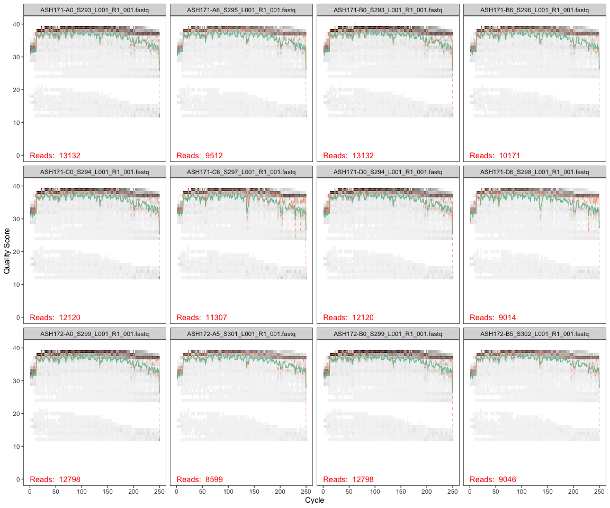
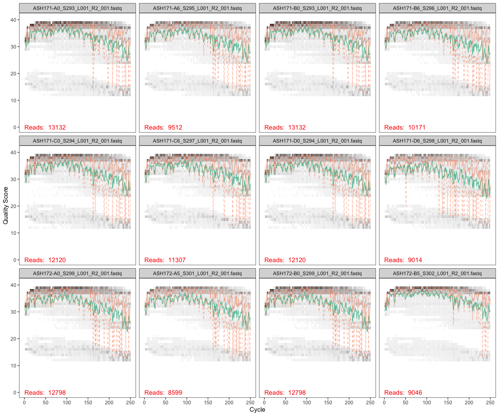
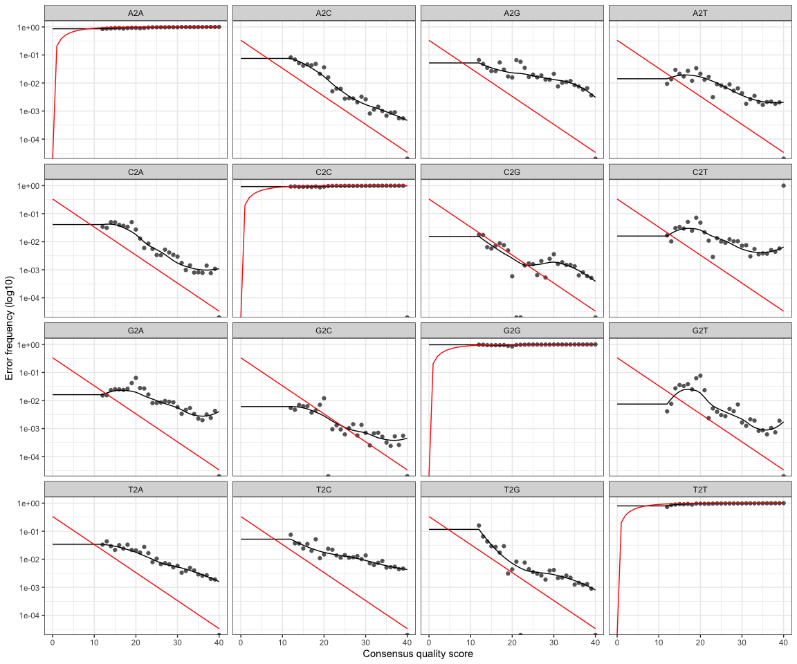
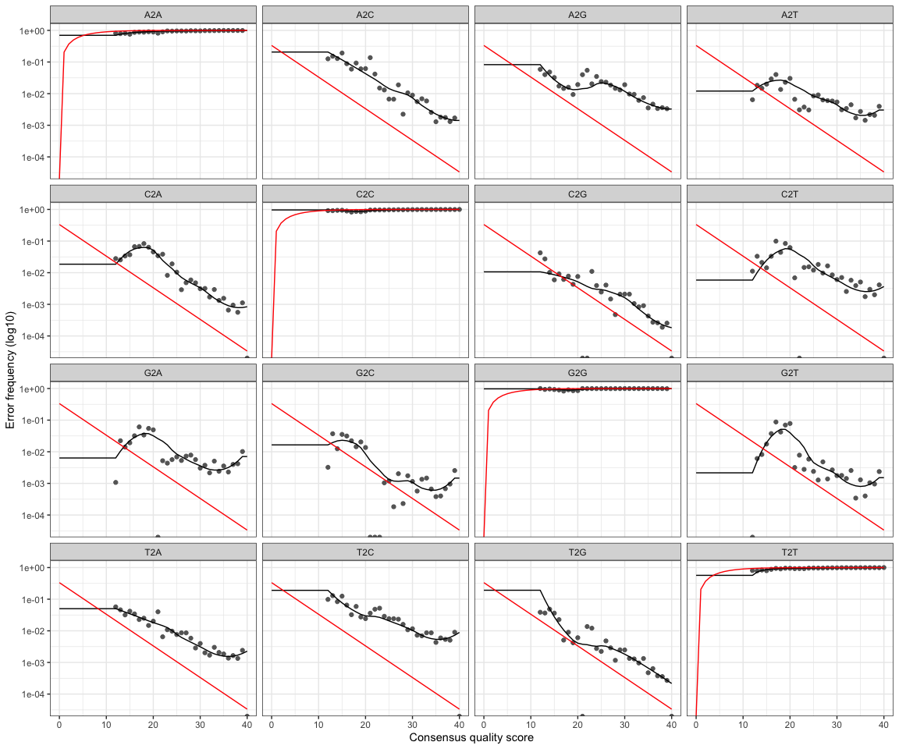

DADA2
================
Victor Trandafir
11/8/2021

This script processes trimmed (w/o primers) sequences through the [DADA2
(1.18) pipeline](https://benjjneb.github.io/dada2/tutorial.html).

# Install and load DADA2 and Shortread from Bioconductor

uncomment (remove the #’s preceding each line of code) the following
code to install the required packages. This may take a few minutes.

``` r
#if (!requireNamespace("BiocManager", quietly = TRUE))
#    install.packages("BiocManager")
#BiocManager::install("dada2", version = '3.14')
#BiocManager::install("ShortRead")
```

# Load packages

``` r
library(tidyverse)
library(dada2)
library(ShortRead)
```

# Import data

You will need to download your sequences from the [shared google
drive](https://drive.google.com/drive/folders/1kmLhML2Sanv0gE8RnxpcyNEcrhan-Q2h?usp=sharing)
to a folder in your repository. Because this folder will then contain a
lot of data (over the limit for pushing to the GitHub server), you’ll
want to have your commits ignore the addition and any changes to that
folder. THIS IS IMPORTANT. You can modify the .gitignore file in your
repository by:

-clicking on the .gitignore file to open it in R Studio if you can see
it in the “Files” tab of RStudio (the bottom right pane where you can
navigate around inside your 144L repository)

OR by:  
- revealing hidden files (command + shift + . on a mac and in
[windows](https://support.microsoft.com/en-us/help/4028316/windows-view-hidden-files-and-folders-in-windows-10),
open *file explorer*, select *view \> options \> change folder* and
*search options*, select *view* and in *advanced setting*, select *show
hidden files, folders, and drives* ) - open the .gitignore file
(textedit on a mac and notepad in widows) - add the name of the folder
containing the fastq (sequence) files to the .gitignore file, save, and
close

``` r
#save the path to the directory with a COPY of your unzipped fastq files that you WILL work with. MAKE SURE YOU HAVE ANOTHER DIRECTORY WITH THE FILES THAT YOU WILL NEVER DIRECTLY WORK WITH. 

path <- "~/Documents/College/Fourth Year/EEMB 144L/Github/144l_students_2021/Input_Data/week7/ACIDD_Remin_fastq" 
#make sure there is no / at the end of the path
#also make sure there are no unzipped files in this directory

#store the names of fwd and rv files as lists
fnFs <- list.files(path, pattern = "_R1_001.fastq", full.names = TRUE)
fnRs <- list.files(path, pattern = "_R2_001.fastq", full.names = TRUE)
```

# Retrieve orientation of primers

This part stores all the orientations of the V4 514F-Y and 806RB primers
( [see Apprill et al.,
2015](http://www.int-res.com/articles/ame_oa/a075p129.pdf)), so that we
can look for them when we want to trim them out.

``` r
FWD = "GTGYCAGCMGCCGCGGTAA"
REV = "GGACTACNVGGGTWTCTAAT"

#now store all orientations of fwd and rvs primers 
allOrients <- function(primer) {
  # Biostrings works w/ DNAString objects rather than character vectors
  require(Biostrings)
  dna <- DNAString(primer)
  orients <- c(Forward = dna, Complement = complement(dna), Reverse = reverse(dna), 
              RevComp = reverseComplement(dna))
  #Convert back to character vector
  return(sapply(orients, toString))
  }
  
#Store the fwd and rvs orientations separately 
FWD.orients <- allOrients(FWD)
REV.orients <- allOrients(REV)

#view the orientations of the primers
FWD.orients
```

    ##               Forward            Complement               Reverse 
    ## "GTGYCAGCMGCCGCGGTAA" "CACRGTCGKCGGCGCCATT" "AATGGCGCCGMCGACYGTG" 
    ##               RevComp 
    ## "TTACCGCGGCKGCTGRCAC"

``` r
REV.orients
```

    ##                Forward             Complement                Reverse 
    ## "GGACTACNVGGGTWTCTAAT" "CCTGATGNBCCCAWAGATTA" "TAATCTWTGGGVNCATCAGG" 
    ##                RevComp 
    ## "ATTAGAWACCCBNGTAGTCC"

#search for Primers

``` r
primerHits <- function(primer, fn) {
  #Counts number of reads in which the primer is found
  nhits <- vcountPattern(primer, sread(readFastq(fn)), fixed = FALSE)
  return(sum(nhits >0))
}
rbind(FWD.ForwardReads = sapply(FWD.orients, primerHits, fn = fnFs[[1]]), 
      FWD.ReverseReads = sapply(FWD.orients, primerHits, fn = fnRs[[1]]), 
      REV.ForwardReads = sapply(REV.orients, primerHits, fn = fnFs[[1]]), 
      REV.ReverseReads = sapply(REV.orients, primerHits, fn = fnRs[[1]]))
```

    ##                  Forward Complement Reverse RevComp
    ## FWD.ForwardReads       0          0       0       0
    ## FWD.ReverseReads       0          0       0       2
    ## REV.ForwardReads       0          0       0       3
    ## REV.ReverseReads       0          0       0       0

Q1: Why do we see primers in the reverse complement of FWD.ReverseReads
and REV.ForwardReads? What will we use to remove them later?

A1: We see these primers because the reads are long enough to detect the
primers on the end. We will use the ‘MergePairs’ function to remove them
later.

# Insepct read quality profiles

You should look at least some of the quality profiles to assess the
quality of the sequencing run.

## Forward reads

``` r
plotQualityProfile(fnFs[1:12])
```

    ## Warning: `guides(<scale> = FALSE)` is deprecated. Please use `guides(<scale> =
    ## "none")` instead.

<!-- -->
Q2: Where will we trim our forward reads, and why?

A2: We will trim our forward reads at position 240 to avoid the errors
that arise at the end of the run despite their not being a significant
drop in the quality read.

# Reverse reads

``` r
plotQualityProfile(fnRs[1:12])
```

    ## Warning: `guides(<scale> = FALSE)` is deprecated. Please use `guides(<scale> =
    ## "none")` instead.

<!-- -->

Q3: How does the quality of the reverse reads compare to the forward
reads? Is the quality of these reads acceptable to continue through the
DADA2 pipeline? Why or why not?

A3: The quality of the reverse reads is lower than that of the forward
reads which is expected because the quality of revers reads in Illumina
sequencing is not as high as the quality of forward reads. We can
continue through the DADA2 pipeline with this quality because quality
information is incorporated into the error model that will be run which
improves the power of the algorithm.

Q4: Where will we trim our reverse reads and why?

A4: We will trim at position 150 because that is where the quality of
the reads begins to significantly decline.

# Filtering and Trimming

``` r
#Get the sample names
#define the basename of the fnFs as the first part of each fastq file name until "_L"
#apply this to all samples
sample.names <- sapply(strsplit(basename(fnFs), "_L"), `[`, 1)
sample.names
```

    ##  [1] "ASH171-A0_S293" "ASH171-A6_S295" "ASH171-B0_S293" "ASH171-B6_S296"
    ##  [5] "ASH171-C0_S294" "ASH171-C6_S297" "ASH171-D0_S294" "ASH171-D6_S298"
    ##  [9] "ASH172-A0_S299" "ASH172-A5_S301" "ASH172-B0_S299" "ASH172-B5_S302"
    ## [13] "ASH172-C0_S300" "ASH172-C5_S303" "ASH172-D0_S300" "ASH172-D5_S304"

``` r
#created a "filtered" folder in the working directory as a place to put all the new filtered fastQ files. 
filt_path <- file.path(path, "filtered")
#add the appropriate designation string to any new files made that will be put into the "filtered" folder
filtFs <- file.path(filt_path, paste0(sample.names, "_F_filt.fastq"))
filtRs <- file.path(filt_path, paste0(sample.names, "_R_filt.fastq"))
```

Below is the actual filtering step. We’re using standard filtering
parameters. 1. dada2 generally advises trimming the last few nucleotides
for weird sequencing errors that can pop up there. 2. maxEE is the max
number of expected errors (calculated from Q’s) to allow in each read.
This is a probability calculation. 3. minQ is threshold Q - and read
with a Q \< minQ after truncating reads get discarded. This isn’t that
important for 16S.

``` r
out <- filterAndTrim(fnFs, filtFs, fnRs, filtRs, truncLen = c(240, 150), maxN = 0, maxEE = c(2,2), truncQ = 2, rm.phix = TRUE, compress = TRUE)
#look at this output. This tells you how many reads were removed. 
out <- transform(out, percent_retained = ((reads.out/reads.in)*100)) #Add column to out with the percent retained for each read.
out
```

    ##                                  reads.in reads.out percent_retained
    ## ASH171-A0_S293_L001_R1_001.fastq    13132     12306         93.71002
    ## ASH171-A6_S295_L001_R1_001.fastq     9512      8807         92.58831
    ## ASH171-B0_S293_L001_R1_001.fastq    13132     12306         93.71002
    ## ASH171-B6_S296_L001_R1_001.fastq    10171      9494         93.34382
    ## ASH171-C0_S294_L001_R1_001.fastq    12120     11231         92.66502
    ## ASH171-C6_S297_L001_R1_001.fastq    11307     10310         91.18245
    ## ASH171-D0_S294_L001_R1_001.fastq    12120     11231         92.66502
    ## ASH171-D6_S298_L001_R1_001.fastq     9014      8211         91.09164
    ## ASH172-A0_S299_L001_R1_001.fastq    12798     11824         92.38944
    ## ASH172-A5_S301_L001_R1_001.fastq     8599      7988         92.89452
    ## ASH172-B0_S299_L001_R1_001.fastq    12798     11824         92.38944
    ## ASH172-B5_S302_L001_R1_001.fastq     9046      8624         95.33495
    ## ASH172-C0_S300_L001_R1_001.fastq    11371     10559         92.85903
    ## ASH172-C5_S303_L001_R1_001.fastq     9621      9127         94.86540
    ## ASH172-D0_S300_L001_R1_001.fastq    11371     10559         92.85903
    ## ASH172-D5_S304_L001_R1_001.fastq     7081      6759         95.45262

``` r
mean(out$percent_retained) #Calculate average retention for all reads.
```

    ## [1] 93.12504

Q5: What does it mean if a base call (base pairs read by the sequencer)
is an “N”? Are we going to use sequences that contain N’s in the rest of
our workflow? Which part of the filterAndTrim function specifies how to
treat sequences with N’s in them?

A5: If a base call is an “N,” the sequencer was unable to determine
which nucleotide should have been placed in a certain position so it
replaced it with an “N.” We will be removing all reads that contain an
N. To remove reads with an N, we included “maxN = 0” in our
filterAndTrim function.

Q6: Based on the “out” table, what is the average percentage of our
reads that we retain (reads that did not get filtered out) going forward
in the pipeline?

A6: Approximately 93.1% of the reads were retained.

# Learn the error rates

``` r
errF <- learnErrors(filtFs, multithread = TRUE)
```

    ## 38678400 total bases in 161160 reads from 16 samples will be used for learning the error rates.

``` r
errR <- learnErrors(filtRs, multithread = TRUE)
```

    ## 24174000 total bases in 161160 reads from 16 samples will be used for learning the error rates.

This took \~20 seconds each on a 2021 MacBook Pro.

This dada2 algorithm makes use of a parametric error model (err) as
every amplicon dataset has a different set of error rates. This is what
dada2 is all about. The step creates the parameters for designating
unique sequences.

Each sequence has an x number of reads. dada2 uses the numbers of reads
per sequence as well as the q-score to build this model. This algorithm
assumes that your most abundant sequence is “real” (the true sequence
for a particular organism). There is a very high probability that it is.

What the algorithm does is look at each base pair of an individual
sequence and calculate the probability that the base pair is an error
based on the quality score of the read and the sequence of your most
abundant read. It also does this for the second most abundant sequence,
etc. etc. hence the message “convergence after x rounds” after running
the algorithm.




Q7: What is the relationship between quality score and error rate show
in the 2 plots above?

A7: Overall, there is an inverse relationship between quality score and
error rate. As quality score increases, error rates decrease which is
what is expected because increased quality of the data should correlate
with less error and higher confidence in the data.

# Dereplication

This is another big thing that dada2 does. It combines all identical
sequences into one unique sequence, keeping track of the number of
identical sequences.

``` r
derepFs <- derepFastq(filtFs, verbose = TRUE)
```

    ## Dereplicating sequence entries in Fastq file: ~/Documents/College/Fourth Year/EEMB 144L/Github/144l_students_2021/Input_Data/week7/ACIDD_Remin_fastq/filtered/ASH171-A0_S293_F_filt.fastq

    ## Encountered 7405 unique sequences from 12306 total sequences read.

    ## Dereplicating sequence entries in Fastq file: ~/Documents/College/Fourth Year/EEMB 144L/Github/144l_students_2021/Input_Data/week7/ACIDD_Remin_fastq/filtered/ASH171-A6_S295_F_filt.fastq

    ## Encountered 5227 unique sequences from 8807 total sequences read.

    ## Dereplicating sequence entries in Fastq file: ~/Documents/College/Fourth Year/EEMB 144L/Github/144l_students_2021/Input_Data/week7/ACIDD_Remin_fastq/filtered/ASH171-B0_S293_F_filt.fastq

    ## Encountered 7405 unique sequences from 12306 total sequences read.

    ## Dereplicating sequence entries in Fastq file: ~/Documents/College/Fourth Year/EEMB 144L/Github/144l_students_2021/Input_Data/week7/ACIDD_Remin_fastq/filtered/ASH171-B6_S296_F_filt.fastq

    ## Encountered 5556 unique sequences from 9494 total sequences read.

    ## Dereplicating sequence entries in Fastq file: ~/Documents/College/Fourth Year/EEMB 144L/Github/144l_students_2021/Input_Data/week7/ACIDD_Remin_fastq/filtered/ASH171-C0_S294_F_filt.fastq

    ## Encountered 6358 unique sequences from 11231 total sequences read.

    ## Dereplicating sequence entries in Fastq file: ~/Documents/College/Fourth Year/EEMB 144L/Github/144l_students_2021/Input_Data/week7/ACIDD_Remin_fastq/filtered/ASH171-C6_S297_F_filt.fastq

    ## Encountered 5448 unique sequences from 10310 total sequences read.

    ## Dereplicating sequence entries in Fastq file: ~/Documents/College/Fourth Year/EEMB 144L/Github/144l_students_2021/Input_Data/week7/ACIDD_Remin_fastq/filtered/ASH171-D0_S294_F_filt.fastq

    ## Encountered 6358 unique sequences from 11231 total sequences read.

    ## Dereplicating sequence entries in Fastq file: ~/Documents/College/Fourth Year/EEMB 144L/Github/144l_students_2021/Input_Data/week7/ACIDD_Remin_fastq/filtered/ASH171-D6_S298_F_filt.fastq

    ## Encountered 4235 unique sequences from 8211 total sequences read.

    ## Dereplicating sequence entries in Fastq file: ~/Documents/College/Fourth Year/EEMB 144L/Github/144l_students_2021/Input_Data/week7/ACIDD_Remin_fastq/filtered/ASH172-A0_S299_F_filt.fastq

    ## Encountered 7240 unique sequences from 11824 total sequences read.

    ## Dereplicating sequence entries in Fastq file: ~/Documents/College/Fourth Year/EEMB 144L/Github/144l_students_2021/Input_Data/week7/ACIDD_Remin_fastq/filtered/ASH172-A5_S301_F_filt.fastq

    ## Encountered 4816 unique sequences from 7988 total sequences read.

    ## Dereplicating sequence entries in Fastq file: ~/Documents/College/Fourth Year/EEMB 144L/Github/144l_students_2021/Input_Data/week7/ACIDD_Remin_fastq/filtered/ASH172-B0_S299_F_filt.fastq

    ## Encountered 7240 unique sequences from 11824 total sequences read.

    ## Dereplicating sequence entries in Fastq file: ~/Documents/College/Fourth Year/EEMB 144L/Github/144l_students_2021/Input_Data/week7/ACIDD_Remin_fastq/filtered/ASH172-B5_S302_F_filt.fastq

    ## Encountered 4735 unique sequences from 8624 total sequences read.

    ## Dereplicating sequence entries in Fastq file: ~/Documents/College/Fourth Year/EEMB 144L/Github/144l_students_2021/Input_Data/week7/ACIDD_Remin_fastq/filtered/ASH172-C0_S300_F_filt.fastq

    ## Encountered 6642 unique sequences from 10559 total sequences read.

    ## Dereplicating sequence entries in Fastq file: ~/Documents/College/Fourth Year/EEMB 144L/Github/144l_students_2021/Input_Data/week7/ACIDD_Remin_fastq/filtered/ASH172-C5_S303_F_filt.fastq

    ## Encountered 4862 unique sequences from 9127 total sequences read.

    ## Dereplicating sequence entries in Fastq file: ~/Documents/College/Fourth Year/EEMB 144L/Github/144l_students_2021/Input_Data/week7/ACIDD_Remin_fastq/filtered/ASH172-D0_S300_F_filt.fastq

    ## Encountered 6642 unique sequences from 10559 total sequences read.

    ## Dereplicating sequence entries in Fastq file: ~/Documents/College/Fourth Year/EEMB 144L/Github/144l_students_2021/Input_Data/week7/ACIDD_Remin_fastq/filtered/ASH172-D5_S304_F_filt.fastq

    ## Encountered 3657 unique sequences from 6759 total sequences read.

``` r
derepRs <- derepFastq(filtRs, verbose = TRUE)
```

    ## Dereplicating sequence entries in Fastq file: ~/Documents/College/Fourth Year/EEMB 144L/Github/144l_students_2021/Input_Data/week7/ACIDD_Remin_fastq/filtered/ASH171-A0_S293_R_filt.fastq

    ## Encountered 6257 unique sequences from 12306 total sequences read.

    ## Dereplicating sequence entries in Fastq file: ~/Documents/College/Fourth Year/EEMB 144L/Github/144l_students_2021/Input_Data/week7/ACIDD_Remin_fastq/filtered/ASH171-A6_S295_R_filt.fastq

    ## Encountered 4706 unique sequences from 8807 total sequences read.

    ## Dereplicating sequence entries in Fastq file: ~/Documents/College/Fourth Year/EEMB 144L/Github/144l_students_2021/Input_Data/week7/ACIDD_Remin_fastq/filtered/ASH171-B0_S293_R_filt.fastq

    ## Encountered 6257 unique sequences from 12306 total sequences read.

    ## Dereplicating sequence entries in Fastq file: ~/Documents/College/Fourth Year/EEMB 144L/Github/144l_students_2021/Input_Data/week7/ACIDD_Remin_fastq/filtered/ASH171-B6_S296_R_filt.fastq

    ## Encountered 5092 unique sequences from 9494 total sequences read.

    ## Dereplicating sequence entries in Fastq file: ~/Documents/College/Fourth Year/EEMB 144L/Github/144l_students_2021/Input_Data/week7/ACIDD_Remin_fastq/filtered/ASH171-C0_S294_R_filt.fastq

    ## Encountered 5887 unique sequences from 11231 total sequences read.

    ## Dereplicating sequence entries in Fastq file: ~/Documents/College/Fourth Year/EEMB 144L/Github/144l_students_2021/Input_Data/week7/ACIDD_Remin_fastq/filtered/ASH171-C6_S297_R_filt.fastq

    ## Encountered 4891 unique sequences from 10310 total sequences read.

    ## Dereplicating sequence entries in Fastq file: ~/Documents/College/Fourth Year/EEMB 144L/Github/144l_students_2021/Input_Data/week7/ACIDD_Remin_fastq/filtered/ASH171-D0_S294_R_filt.fastq

    ## Encountered 5887 unique sequences from 11231 total sequences read.

    ## Dereplicating sequence entries in Fastq file: ~/Documents/College/Fourth Year/EEMB 144L/Github/144l_students_2021/Input_Data/week7/ACIDD_Remin_fastq/filtered/ASH171-D6_S298_R_filt.fastq

    ## Encountered 4353 unique sequences from 8211 total sequences read.

    ## Dereplicating sequence entries in Fastq file: ~/Documents/College/Fourth Year/EEMB 144L/Github/144l_students_2021/Input_Data/week7/ACIDD_Remin_fastq/filtered/ASH172-A0_S299_R_filt.fastq

    ## Encountered 6844 unique sequences from 11824 total sequences read.

    ## Dereplicating sequence entries in Fastq file: ~/Documents/College/Fourth Year/EEMB 144L/Github/144l_students_2021/Input_Data/week7/ACIDD_Remin_fastq/filtered/ASH172-A5_S301_R_filt.fastq

    ## Encountered 4617 unique sequences from 7988 total sequences read.

    ## Dereplicating sequence entries in Fastq file: ~/Documents/College/Fourth Year/EEMB 144L/Github/144l_students_2021/Input_Data/week7/ACIDD_Remin_fastq/filtered/ASH172-B0_S299_R_filt.fastq

    ## Encountered 6844 unique sequences from 11824 total sequences read.

    ## Dereplicating sequence entries in Fastq file: ~/Documents/College/Fourth Year/EEMB 144L/Github/144l_students_2021/Input_Data/week7/ACIDD_Remin_fastq/filtered/ASH172-B5_S302_R_filt.fastq

    ## Encountered 3596 unique sequences from 8624 total sequences read.

    ## Dereplicating sequence entries in Fastq file: ~/Documents/College/Fourth Year/EEMB 144L/Github/144l_students_2021/Input_Data/week7/ACIDD_Remin_fastq/filtered/ASH172-C0_S300_R_filt.fastq

    ## Encountered 6625 unique sequences from 10559 total sequences read.

    ## Dereplicating sequence entries in Fastq file: ~/Documents/College/Fourth Year/EEMB 144L/Github/144l_students_2021/Input_Data/week7/ACIDD_Remin_fastq/filtered/ASH172-C5_S303_R_filt.fastq

    ## Encountered 3582 unique sequences from 9127 total sequences read.

    ## Dereplicating sequence entries in Fastq file: ~/Documents/College/Fourth Year/EEMB 144L/Github/144l_students_2021/Input_Data/week7/ACIDD_Remin_fastq/filtered/ASH172-D0_S300_R_filt.fastq

    ## Encountered 6625 unique sequences from 10559 total sequences read.

    ## Dereplicating sequence entries in Fastq file: ~/Documents/College/Fourth Year/EEMB 144L/Github/144l_students_2021/Input_Data/week7/ACIDD_Remin_fastq/filtered/ASH172-D5_S304_R_filt.fastq

    ## Encountered 2688 unique sequences from 6759 total sequences read.

``` r
# Name the derep-class objects by the sample names 
names(derepFs) <- sample.names
names(derepRs) <- sample.names
```

Q8: What percentage of the reverse reads in the ASH171-A0 sample were
unique?

A8: 50.8% of the reverse reads in the ASH171-A0 sample were unique.

# Infer sequence variants

Apply the core dada2 sample inference algorithm to the dereplicated
data.

Infer the sequence variants in each sample, taking out the sequence
variants that have excessive error rates.

So here, we are applying the error models to the data. Before, the error
models were run using a subset of the data (parameterizing). Now, we’re
using the parameters of the model and applying it to the whole data set
to see which sequences are real and which are not.

``` r
dadaFs <- dada(derepFs, err = errF, multithread = TRUE)
```

    ## Sample 1 - 12306 reads in 7405 unique sequences.
    ## Sample 2 - 8807 reads in 5227 unique sequences.
    ## Sample 3 - 12306 reads in 7405 unique sequences.
    ## Sample 4 - 9494 reads in 5556 unique sequences.
    ## Sample 5 - 11231 reads in 6358 unique sequences.
    ## Sample 6 - 10310 reads in 5448 unique sequences.
    ## Sample 7 - 11231 reads in 6358 unique sequences.
    ## Sample 8 - 8211 reads in 4235 unique sequences.
    ## Sample 9 - 11824 reads in 7240 unique sequences.
    ## Sample 10 - 7988 reads in 4816 unique sequences.
    ## Sample 11 - 11824 reads in 7240 unique sequences.
    ## Sample 12 - 8624 reads in 4735 unique sequences.
    ## Sample 13 - 10559 reads in 6642 unique sequences.
    ## Sample 14 - 9127 reads in 4862 unique sequences.
    ## Sample 15 - 10559 reads in 6642 unique sequences.
    ## Sample 16 - 6759 reads in 3657 unique sequences.

``` r
dadaRs <- dada(derepRs, err = errR, multithread = TRUE)
```

    ## Sample 1 - 12306 reads in 6257 unique sequences.
    ## Sample 2 - 8807 reads in 4706 unique sequences.
    ## Sample 3 - 12306 reads in 6257 unique sequences.
    ## Sample 4 - 9494 reads in 5092 unique sequences.
    ## Sample 5 - 11231 reads in 5887 unique sequences.
    ## Sample 6 - 10310 reads in 4891 unique sequences.
    ## Sample 7 - 11231 reads in 5887 unique sequences.
    ## Sample 8 - 8211 reads in 4353 unique sequences.
    ## Sample 9 - 11824 reads in 6844 unique sequences.
    ## Sample 10 - 7988 reads in 4617 unique sequences.
    ## Sample 11 - 11824 reads in 6844 unique sequences.
    ## Sample 12 - 8624 reads in 3596 unique sequences.
    ## Sample 13 - 10559 reads in 6625 unique sequences.
    ## Sample 14 - 9127 reads in 3582 unique sequences.
    ## Sample 15 - 10559 reads in 6625 unique sequences.
    ## Sample 16 - 6759 reads in 2688 unique sequences.

merge the overlapping reads -> this will also decrease the number of
sequence variants. If you above had hits of the reverse complement in
the FWD.ReverseReads and the REV.ForwardReads, you can trim here by
adding trimOverhang = T.

``` r
mergers <- mergePairs(dadaFs, derepFs, dadaRs, derepRs, verbose = TRUE, trimOverhang = T)
```

    ## 10646 paired-reads (in 99 unique pairings) successfully merged out of 11907 (in 205 pairings) input.

    ## 7785 paired-reads (in 65 unique pairings) successfully merged out of 8471 (in 161 pairings) input.

    ## 10646 paired-reads (in 99 unique pairings) successfully merged out of 11907 (in 205 pairings) input.

    ## 8427 paired-reads (in 76 unique pairings) successfully merged out of 9145 (in 167 pairings) input.

    ## 9578 paired-reads (in 86 unique pairings) successfully merged out of 10900 (in 220 pairings) input.

    ## 9579 paired-reads (in 61 unique pairings) successfully merged out of 10074 (in 146 pairings) input.

    ## 9578 paired-reads (in 86 unique pairings) successfully merged out of 10900 (in 220 pairings) input.

    ## 7710 paired-reads (in 42 unique pairings) successfully merged out of 8037 (in 106 pairings) input.

    ## 10854 paired-reads (in 101 unique pairings) successfully merged out of 11485 (in 209 pairings) input.

    ## 7435 paired-reads (in 72 unique pairings) successfully merged out of 7737 (in 151 pairings) input.

    ## 10854 paired-reads (in 101 unique pairings) successfully merged out of 11485 (in 209 pairings) input.

    ## 7945 paired-reads (in 74 unique pairings) successfully merged out of 8375 (in 151 pairings) input.

    ## 9357 paired-reads (in 100 unique pairings) successfully merged out of 10224 (in 216 pairings) input.

    ## 8643 paired-reads (in 60 unique pairings) successfully merged out of 8900 (in 109 pairings) input.

    ## 9357 paired-reads (in 100 unique pairings) successfully merged out of 10224 (in 216 pairings) input.

    ## 6388 paired-reads (in 59 unique pairings) successfully merged out of 6591 (in 93 pairings) input.

inspect the merged data frame from the first sample. this will output a
table. the numbers in the forward and reverse columns tell where those
sequences are in the dadaFs and dadaRs files.

``` r
head(mergers[[1]])
```

    ##                                                                                                                                                                                                                                                        sequence
    ## 1 TACGGGAGTGGCAAGCGTTATCCGGAATTATTGGGCGTAAAGCGTCCGCAGGCGGCCTTTCAAGTCTGCTGTTAAAGCGTGGAGCTTAACTCCATTATGGCAGTGGAAACTGATCGGCTTGAGTATGGTAGGGGCAGAGGGAATTCCCGGTGTAGCGGTGAAATGCGTAGATATCGGGAAGAACACCAGTGGCGAAGGCGCTCTGCTGGGCCATTACTGACGCTCATGGACGAAAGCCAGGGGAGCGAAAGGG
    ## 2 TACGAAGGGACCTAGCGTAGTTCGGAATTACTGGGCTTAAAGAGTTCGTAGGTGGTTGAAAAAGTTGGTGGTGAAATCCCAGAGCTTAACTCTGGAACTGCCATCAAAACTTTTCAGCTAGAGTATGATAGAGGAAAGCAGAATTTCTAGTGTAGAGGTGAAATTCGTAGATATTAGAAAGAATACCAATTGCGAAGGCAGCTTTCTGGATCATTACTGACACTGAGGAACGAAAGCATGGGTAGCGAAGAGG
    ## 3 TACGAAGGGACCTAGCGTAGTTCGGAATTACTGGGCTTAAAGAGTTCGTAGGTGGTTGAAAAAGTTGGTGGTGAAATCCCAGAGCTTAACTCTGGAACTGCCATCAAAACTTTTCAGCTAGAGTTTGATAGAGGAAAGCAGAATTTCTAGTGTAGAGGTGAAATTCGTAGATATTAGAAAGAATACCAATTGCGAAGGCAGCTTTCTGGATCATTACTGACACTGAGGAACGAAAGCATGGGTAGCGAAGAGG
    ## 4 TACGGGAGTGGCAAGCGTTATCCGGAATTATTGGGCGTAAAGCGTCCGCAGGCGGCCTTTCAAGTCTGCTGTTAAAGCGTGGAGCTTAACTCCATCATGGCAGTGGAAACTGATCGGCTTGAGTATGGTAGGGGCAGAGGGAATTCCCGGTGTAGCGGTGAAATGCGTAGATATCGGGAAGAACACCAGTGGCGAAGGCGCTCTGCTGGGCCATTACTGACGCTCATGGACGAAAGCCAGGGGAGCGAAAGGG
    ## 5 TACGAAGGGACCTAGCGTAGTTCGGAATTACTGGGCTTAAAGAGCTCGTAGGTGGTTAAAAAAGTTGATGGTGAAATCCCAAGGCTCAACCTTGGAACTGCCATCAAAACTTTTTAGCTAGAGTGTGATAGAGGTAAGTGGAATTTCTAGTGTAGAGGTGAAATTCGTAGATATTAGAAAGAACACCAAATGCGAAGGCAACTTACTGGGTCACTACTGACACTGAGGAGCGAAAGCATGGGTAGCGAAGAGG
    ## 6 TACGAAGGGACCTAGCGTAGTTCGGAATTACTGGGCTTAAAGAGTTCGTAGGTGGTTGAAAAAGTTAGTGGTGAAATCCCAGAGCTTAACTCTGGAACTGCCATTAAAACTTTTCAGCTAGAGTATGATAGAGGAAAGCAGAATTTCTAGTGTAGAGGTGAAATTCGTAGATATTAGAAAGAATACCAATTGCGAAGGCAGCTTTCTGGATCATTACTGACACTGAGGAACGAAAGCATGGGTAGCGAAGAGG
    ##   abundance forward reverse nmatch nmismatch nindel prefer accept
    ## 1      1906       1       1    137         0      0      2   TRUE
    ## 2      1010       2       2    137         0      0      2   TRUE
    ## 3       903       3       3    137         0      0      2   TRUE
    ## 4       502      62       1    137         0      0      2   TRUE
    ## 5       497       4       4    137         0      0      2   TRUE
    ## 6       400       5      51    137         0      0      2   TRUE

Q9: What does the nmatch column tell us about our merged forward &
reverse reads?

A9: The nmatch column tells us how many bases matched in our forward and
reverse reads.

save the unassigned merged reads

``` r
#tutorial says week 5/6, just save in Input & Output data for Week 7 (we are on a different schedule this year than previous)
saveRDS(mergers, "~/Documents/College/Fourth Year/EEMB 144L/Github/144l_students_2021/Output_Data/week7/dada_merged.rds")
saveRDS(mergers, "~/Documents/College/Fourth Year/EEMB 144L/Github/144l_students_2021/Input_Data/week7/dada_merged.rds")
```

Construct a sequence table of our samples that is analogous to the “OTU
table” produced by classical methods

``` r
seqtab <- makeSequenceTable(mergers)
dim(seqtab) # samples by unique sequence
```

    ## [1]  16 280

check the distribution of sequence lengths

``` r
table(nchar(getSequences(seqtab)))
```

    ## 
    ## 229 252 253 254 258 
    ##   1   2 267   9   1

# Remove the Chimeras

in PCR, two or more biological sequences can attach to each other and
then polymerase builds a non-biological sequence. weird. These are
artefacts that need to be removed.

``` r
seqtab.nochim <- removeBimeraDenovo(seqtab, verbose = TRUE)
```

    ## Identified 6 bimeras out of 280 input sequences.

``` r
dim(seqtab.nochim)
```

    ## [1]  16 274

check the proportion of sequences that are not chimeras

``` r
sum(seqtab.nochim)/sum(seqtab)
```

    ## [1] 0.9985634

# Assign taxonomy using a reference database

here we are referencing the Silva database

``` r
  taxa <- assignTaxonomy(seqtab.nochim, "~/Documents/College/Fourth Year/EEMB 144L/Github/144l_students_2021/Input_Data/week7/Reference_Database/silva_nr_v138_train_set.fa", multithread = TRUE)
```

This took \~90s to complete on a 2021 MacBook Pro

create a table out of the taxa data (one with the sequences and
taxonomic assignments, one with just all the taxa)

these are the tables you want to save!!

``` r
saveRDS(t(seqtab.nochim), "~/Documents/College/Fourth Year/EEMB 144L/Github/144l_students_2021/Output_Data/week7/seqtab-nochimtaxa.rds")
saveRDS(taxa, "~/Documents/College/Fourth Year/EEMB 144L/Github/144l_students_2021/Output_Data/week7/taxa.rds")

#save in both Output and Input data folders for week7

saveRDS(t(seqtab.nochim), "~/Documents/College/Fourth Year/EEMB 144L/Github/144l_students_2021/Input_Data/week7/seqtab-nochimtaxa.rds")
saveRDS(taxa, "~/Documents/College/Fourth Year/EEMB 144L/Github/144l_students_2021/Input_Data/week7/taxa.rds")
```
