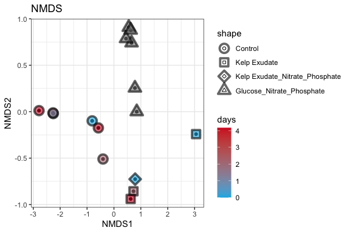
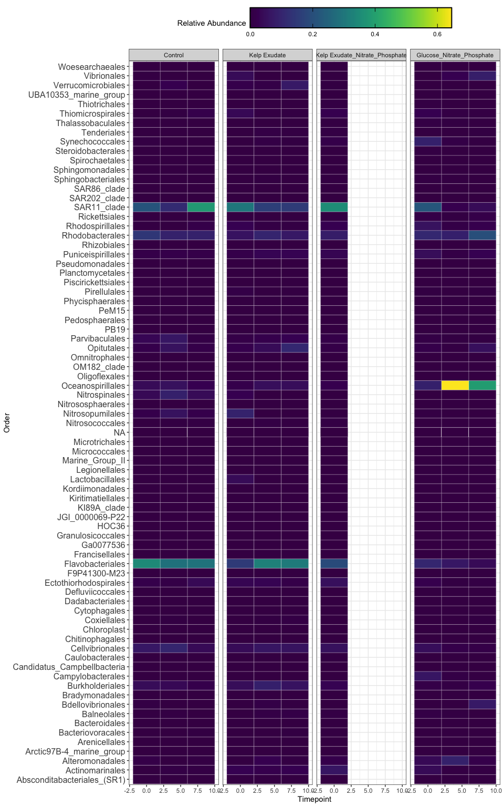

2021 Phyloseq
================
Victor Trandafir
11/22/2021

# Intro

We explore the processed Kelp Remin 16S sequences using
[phyloseq](https://joey711.github.io/phyloseq/)

# Install phyloseq

``` r
#BiocManager::install("phyloseq")
```

``` r
library(tidyverse) 
```

    ## ── Attaching packages ─────────────────────────────────────── tidyverse 1.3.1 ──

    ## ✓ ggplot2 3.3.5     ✓ purrr   0.3.4
    ## ✓ tibble  3.1.6     ✓ dplyr   1.0.7
    ## ✓ tidyr   1.1.4     ✓ stringr 1.4.0
    ## ✓ readr   2.0.2     ✓ forcats 0.5.1

    ## ── Conflicts ────────────────────────────────────────── tidyverse_conflicts() ──
    ## x dplyr::filter() masks stats::filter()
    ## x dplyr::lag()    masks stats::lag()

``` r
library(phyloseq)
library(RColorBrewer)
library(readxl)
library(lubridate)
```

    ## 
    ## Attaching package: 'lubridate'

    ## The following objects are masked from 'package:base':
    ## 
    ##     date, intersect, setdiff, union

``` r
library(vegan)
```

    ## Loading required package: permute

    ## Loading required package: lattice

    ## This is vegan 2.5-7

``` r
library(viridis)
```

    ## Loading required package: viridisLite

``` r
#install.packages("dichromat")
library(dichromat)
library(RColorBrewer)
```

# Import Data

``` r
count.tab <- read_rds("~/Documents/College/Fourth Year/EEMB 144L/Github/144l_students_2021/Input_Data/week9/seqtab-nochimtaxa.rds") #table of counts for each sequence in each sample, update the file path for the .rds file you generated with dada2
tax.tab <- read_rds("~/Documents/College/Fourth Year/EEMB 144L/Github/144l_students_2021/Input_Data/week9/taxa.rds") #table that matches ASV to sequence, update file path to your own file

#you will need to download the Kelp_Exp_Processed_DOC_BGE.rds and the 144L_2021_metadata.xlsx files from the week9 folder on the class Google Drive and put them into your own local Input Data folder
metadata_OG <- read_excel("~//Documents/College/Fourth Year/EEMB 144L/Github/144l_students_2021/Input_Data/week9/144L_2021_metadata.xlsx", sheet = "Metadata")
glimpse(metadata_OG)
```

    ## Rows: 94
    ## Columns: 17
    ## $ Experiment           <chr> "144L_2021", "144L_2021", "144L_2021", "144L_2021…
    ## $ Location             <chr> "Goleta Pier", "Goleta Pier", "Goleta Pier", "Gol…
    ## $ Temperature          <dbl> 19, 19, 19, 19, 19, 19, 19, 19, 19, 19, 19, 19, 1…
    ## $ Depth                <dbl> 1, 1, 1, 1, 1, 1, 1, 1, 1, 1, 1, 1, 1, 1, 1, 1, 1…
    ## $ Bottle               <chr> "A", "A", "A", "A", "A", "A", "A", "A", "A", "A",…
    ## $ Timepoint            <dbl> 0, 1, 2, 3, 4, 5, 6, 7, 8, 9, 0, 1, 2, 3, 4, 5, 6…
    ## $ Treatment            <chr> "Control", "Control", "Control", "Control", "Cont…
    ## $ Target_DOC_Amendment <dbl> 0, 0, 0, 0, 0, 0, 0, 0, 0, 0, 0, 0, 0, 0, 0, 0, 0…
    ## $ Inoculum_L           <dbl> 2, 2, 2, 2, 2, 2, 2, 2, 2, 2, 2, 2, 2, 2, 2, 2, 2…
    ## $ Media_L              <dbl> 5, 5, 5, 5, 5, 5, 5, 5, 5, 5, 5, 5, 5, 5, 5, 5, 5…
    ## $ Datetime             <chr> "2021-10-04T16:00", "2021-10-05T08:00", "2021-10-…
    ## $ TOC_Sample           <lgl> TRUE, FALSE, FALSE, FALSE, TRUE, FALSE, FALSE, FA…
    ## $ Cell_Sample          <lgl> TRUE, TRUE, TRUE, TRUE, TRUE, TRUE, TRUE, TRUE, T…
    ## $ DAPI_Sample          <lgl> TRUE, FALSE, FALSE, FALSE, TRUE, FALSE, FALSE, FA…
    ## $ DNA_Sample           <lgl> TRUE, FALSE, FALSE, FALSE, TRUE, FALSE, FALSE, FA…
    ## $ Nutrient_Sample      <lgl> TRUE, FALSE, FALSE, FALSE, FALSE, FALSE, FALSE, F…
    ## $ DNA_Sample_ID        <chr> "144_A0_S1", NA, NA, NA, "144_A4_S2", NA, NA, NA,…

``` r
metadata <- metadata_OG %>%
  select(-Datetime)
glimpse(metadata)
```

    ## Rows: 94
    ## Columns: 16
    ## $ Experiment           <chr> "144L_2021", "144L_2021", "144L_2021", "144L_2021…
    ## $ Location             <chr> "Goleta Pier", "Goleta Pier", "Goleta Pier", "Gol…
    ## $ Temperature          <dbl> 19, 19, 19, 19, 19, 19, 19, 19, 19, 19, 19, 19, 1…
    ## $ Depth                <dbl> 1, 1, 1, 1, 1, 1, 1, 1, 1, 1, 1, 1, 1, 1, 1, 1, 1…
    ## $ Bottle               <chr> "A", "A", "A", "A", "A", "A", "A", "A", "A", "A",…
    ## $ Timepoint            <dbl> 0, 1, 2, 3, 4, 5, 6, 7, 8, 9, 0, 1, 2, 3, 4, 5, 6…
    ## $ Treatment            <chr> "Control", "Control", "Control", "Control", "Cont…
    ## $ Target_DOC_Amendment <dbl> 0, 0, 0, 0, 0, 0, 0, 0, 0, 0, 0, 0, 0, 0, 0, 0, 0…
    ## $ Inoculum_L           <dbl> 2, 2, 2, 2, 2, 2, 2, 2, 2, 2, 2, 2, 2, 2, 2, 2, 2…
    ## $ Media_L              <dbl> 5, 5, 5, 5, 5, 5, 5, 5, 5, 5, 5, 5, 5, 5, 5, 5, 5…
    ## $ TOC_Sample           <lgl> TRUE, FALSE, FALSE, FALSE, TRUE, FALSE, FALSE, FA…
    ## $ Cell_Sample          <lgl> TRUE, TRUE, TRUE, TRUE, TRUE, TRUE, TRUE, TRUE, T…
    ## $ DAPI_Sample          <lgl> TRUE, FALSE, FALSE, FALSE, TRUE, FALSE, FALSE, FA…
    ## $ DNA_Sample           <lgl> TRUE, FALSE, FALSE, FALSE, TRUE, FALSE, FALSE, FA…
    ## $ Nutrient_Sample      <lgl> TRUE, FALSE, FALSE, FALSE, FALSE, FALSE, FALSE, F…
    ## $ DNA_Sample_ID        <chr> "144_A0_S1", NA, NA, NA, "144_A4_S2", NA, NA, NA,…

``` r
#you can get this file from your own week6 data
metadata_doc <- read_rds("~/Documents/College/Fourth Year/EEMB 144L/Github/144l_students_2021/Output_Data/week6/144L_Exp_Processed_BactAbund.rds")
metadata_doc = subset(metadata_doc, select = -c(ln_cells_exp_start, ln_cells_exp_end, mew, doubling))
glimpse(metadata_doc)
```

    ## Rows: 12
    ## Columns: 41
    ## $ Experiment               <chr> "144L_2021", "144L_2021", "144L_2021", "144L_…
    ## $ Location                 <chr> "Goleta Pier", "Goleta Pier", "Goleta Pier", …
    ## $ Temperature              <dbl> 19, 19, 19, 19, 19, 19, 19, 19, 19, 19, 19, 19
    ## $ Depth                    <dbl> 1, 1, 1, 1, 1, 1, 1, 1, 1, 1, 1, 1
    ## $ Timepoint                <dbl> 0, 4, 8, 0, 4, 8, 0, 4, 8, 0, 4, 8
    ## $ Treatment                <chr> "Control", "Control", "Control", "Kelp Exudat…
    ## $ Target_DOC_Amendment     <dbl> 0, 0, 0, 10, 10, 10, 10, 10, 10, 10, 10, 10
    ## $ Inoculum_L               <dbl> 2, 2, 2, 2, 2, 2, 2, 2, 2, 2, 2, 2
    ## $ Media_L                  <dbl> 5, 5, 5, 5, 5, 5, 5, 5, 5, 5, 5, 5
    ## $ Datetime                 <dttm> 2021-10-04 16:00:00, 2021-10-06 20:00:00, 202…
    ## $ TOC_Sample               <lgl> TRUE, TRUE, TRUE, TRUE, TRUE, TRUE, TRUE, TRU…
    ## $ Cell_Sample              <lgl> TRUE, TRUE, TRUE, TRUE, TRUE, TRUE, TRUE, TRU…
    ## $ DAPI_Sample              <lgl> TRUE, TRUE, TRUE, TRUE, TRUE, TRUE, TRUE, TRU…
    ## $ DNA_Sample               <lgl> TRUE, TRUE, TRUE, TRUE, TRUE, TRUE, TRUE, TRU…
    ## $ Nutrient_Sample          <lgl> TRUE, FALSE, FALSE, TRUE, FALSE, FALSE, TRUE,…
    ## $ Cells_mL                 <dbl> 660667.0, 919405.6, 1133869.7, 663088.1, 104…
    ## $ Cells_mL_Stdev           <dbl> 73217.76, 363326.27, 99930.05, 113546.27, 181…
    ## $ Mean_Biovolume_um3_cell  <dbl> 0.04556209, 0.05080353, 0.04093212, 0.0387149…
    ## $ Biovolume_Stdev_um3_cell <dbl> 0.006054805, 0.011000369, 0.004684495, 0.0054…
    ## $ Cells_L                  <dbl> 660667000, 919405583, 1133869724, 663088109, …
    ## $ Cells_L_Stdev            <dbl> 73217756, 363326274, 99930050, 113546267, 181…
    ## $ interv                   <Interval> 2021-10-04 16:00:00 UTC--2021-10-04 16:00:00 …
    ## $ s                        <dbl> 0, 187200, 360000, 0, 187200, 360000, 0, 1872…
    ## $ hours                    <dbl> 0, 52, 100, 0, 52, 100, 0, 52, 100, 0, 52, 100
    ## $ days                     <dbl> 0.000000, 2.166667, 4.166667, 0.000000, 2.166…
    ## $ ln_cells                 <dbl> 20.30876, 20.63924, 20.84890, 20.31242, 20.76…
    ## $ diff_ln_cells            <dbl> 0.00000000, 0.33047743, 0.20966424, 0.0000000…
    ## $ exp_start                <dbl> 0, 0, 0, 0, 0, 0, 0, 0, 0, 0, 0, 0
    ## $ exp_end                  <dbl> 4, 4, 4, 4, 4, 4, 4, 4, 4, 4, 4, 4
    ## $ cells_exp_start          <dbl> 660667000, 660667000, 660667000, 663088109, 6…
    ## $ cells_exp_end            <dbl> 919405583, 919405583, 919405583, 1043597…
    ## $ days_exp_start           <dbl> 0, 0, 0, 0, 0, 0, 0, 0, 0, 0, 0, 0
    ## $ days_exp_end             <dbl> 2.166667, 2.166667, 2.166667, 2.166667, 2.166…
    ## $ delta_cells              <dbl> 258738583, 258738583, 258738583, 380509719, 3…
    ## $ CCF                      <dbl> 30, 30, 30, 30, 30, 30, 30, 30, 30, 30, 30, 30
    ## $ bc                       <dbl> 1.651667, 2.298514, 2.834674, 1.657720, 2.608…
    ## $ delta_bc                 <dbl> 0.6468465, 0.6468465, 0.6468465, 0.9512743, 0…
    ## $ biovol_CCF               <dbl> 29.97370, 32.29843, 27.84930, 26.80546, 39.49…
    ## $ biovol_bc                <dbl> 1.650220, 2.474613, 2.631457, 1.481199, 3.434…
    ## $ biovol_bc_exp_end        <dbl> 2.474613, 2.474613, 2.474613, 3.434791, 3.434…
    ## $ delta_biovol_bc          <dbl> 0.8243938, 0.8243938, 0.8243938, 1.9535926, 1…

``` r
metadata_mock <- read_csv("~/Documents/College/Fourth Year/EEMB 144L/Github/144l_students_2021/Input_Data/week9/144L_2018_metadata.csv")
metadata_mock = subset(metadata_mock, select = -c(ln_cells_exp_start, ln_cells_exp_end, cells_exp_phase_start, cells_exp_phase_end, days_exp_phase_start, days_exp_phase_end, mew, doubling, delta_cells_exp, bac_carbon_uM, delta_bac_carbon_uM))
glimpse(metadata_mock)
```

    ## Rows: 6
    ## Columns: 41
    ## $ Experiment               <chr> "144L_2018", "144L_2018", "144L_2018", "144L_…
    ## $ Location                 <chr> "Goleta Pier", "Goleta Pier", "Goleta Pier", …
    ## $ Temperature              <lgl> NA, NA, NA, NA, NA, NA
    ## $ Depth                    <lgl> NA, NA, NA, NA, NA, NA
    ## $ Timepoint                <dbl> 0, 4, 8, 0, 4, 8
    ## $ Treatment                <chr> "Glucose_Nitrate_Phosphate", "Glucose_Nitrate…
    ## $ Target_DOC_Amendment     <dbl> 10, 10, 10, 10, 10, 10
    ## $ Inoculum_L               <lgl> NA, NA, NA, NA, NA, NA
    ## $ Media_L                  <lgl> NA, NA, NA, NA, NA, NA
    ## $ Datetime                 <lgl> NA, NA, NA, NA, NA, NA
    ## $ TOC_Sample               <lgl> NA, NA, NA, NA, NA, NA
    ## $ Cell_Sample              <lgl> NA, NA, NA, NA, NA, NA
    ## $ DAPI_Sample              <lgl> NA, NA, NA, NA, NA, NA
    ## $ DNA_Sample               <lgl> TRUE, TRUE, TRUE, TRUE, TRUE, TRUE
    ## $ Nutrient_Sample          <lgl> NA, NA, NA, NA, NA, NA
    ## $ Cells_mL                 <lgl> NA, NA, NA, NA, NA, NA
    ## $ Cells_mL_Stdev           <lgl> NA, NA, NA, NA, NA, NA
    ## $ Mean_Biovolume_um3_cell  <lgl> NA, NA, NA, NA, NA, NA
    ## $ Biovolume_Stdev_um3_cell <lgl> NA, NA, NA, NA, NA, NA
    ## $ Cells_L                  <lgl> NA, NA, NA, NA, NA, NA
    ## $ Cells_L_Stdev            <lgl> NA, NA, NA, NA, NA, NA
    ## $ interv                   <lgl> NA, NA, NA, NA, NA, NA
    ## $ s                        <lgl> NA, NA, NA, NA, NA, NA
    ## $ hours                    <lgl> NA, NA, NA, NA, NA, NA
    ## $ days                     <lgl> NA, NA, NA, NA, NA, NA
    ## $ ln_cells                 <lgl> NA, NA, NA, NA, NA, NA
    ## $ diff_ln_cells            <lgl> NA, NA, NA, NA, NA, NA
    ## $ exp_start                <lgl> NA, NA, NA, NA, NA, NA
    ## $ exp_end                  <lgl> NA, NA, NA, NA, NA, NA
    ## $ cells_exp_start          <lgl> NA, NA, NA, NA, NA, NA
    ## $ cells_exp_end            <lgl> NA, NA, NA, NA, NA, NA
    ## $ days_exp_start           <lgl> NA, NA, NA, NA, NA, NA
    ## $ days_exp_end             <lgl> NA, NA, NA, NA, NA, NA
    ## $ delta_cells              <lgl> NA, NA, NA, NA, NA, NA
    ## $ CCF                      <lgl> NA, NA, NA, NA, NA, NA
    ## $ bc                       <lgl> NA, NA, NA, NA, NA, NA
    ## $ delta_bc                 <lgl> NA, NA, NA, NA, NA, NA
    ## $ biovol_CCF               <lgl> NA, NA, NA, NA, NA, NA
    ## $ biovol_bc                <lgl> NA, NA, NA, NA, NA, NA
    ## $ biovol_bc_exp_end        <lgl> NA, NA, NA, NA, NA, NA
    ## $ delta_biovol_bc          <lgl> NA, NA, NA, NA, NA, NA

``` r
join1 <- rbind(metadata_mock, metadata_doc)
glimpse(join1)
```

    ## Rows: 18
    ## Columns: 41
    ## $ Experiment               <chr> "144L_2018", "144L_2018", "144L_2018", "144L_…
    ## $ Location                 <chr> "Goleta Pier", "Goleta Pier", "Goleta Pier", …
    ## $ Temperature              <dbl> NA, NA, NA, NA, NA, NA, 19, 19, 19, 19, 19, 1…
    ## $ Depth                    <dbl> NA, NA, NA, NA, NA, NA, 1, 1, 1, 1, 1, 1, 1, …
    ## $ Timepoint                <dbl> 0, 4, 8, 0, 4, 8, 0, 4, 8, 0, 4, 8, 0, 4, 8, …
    ## $ Treatment                <chr> "Glucose_Nitrate_Phosphate", "Glucose_Nitrate…
    ## $ Target_DOC_Amendment     <dbl> 10, 10, 10, 10, 10, 10, 0, 0, 0, 10, 10, 10, …
    ## $ Inoculum_L               <dbl> NA, NA, NA, NA, NA, NA, 2, 2, 2, 2, 2, 2, 2, …
    ## $ Media_L                  <dbl> NA, NA, NA, NA, NA, NA, 5, 5, 5, 5, 5, 5, 5, …
    ## $ Datetime                 <dbl> NA, NA, NA, NA, NA, NA, 1633363200, 163355040…
    ## $ TOC_Sample               <lgl> NA, NA, NA, NA, NA, NA, TRUE, TRUE, TRUE, TRU…
    ## $ Cell_Sample              <lgl> NA, NA, NA, NA, NA, NA, TRUE, TRUE, TRUE, TRU…
    ## $ DAPI_Sample              <lgl> NA, NA, NA, NA, NA, NA, TRUE, TRUE, TRUE, TRU…
    ## $ DNA_Sample               <lgl> TRUE, TRUE, TRUE, TRUE, TRUE, TRUE, TRUE, TRU…
    ## $ Nutrient_Sample          <lgl> NA, NA, NA, NA, NA, NA, TRUE, FALSE, FALSE, T…
    ## $ Cells_mL                 <dbl> NA, NA, NA, NA, NA, NA, 660667.0, 919405.6, 1…
    ## $ Cells_mL_Stdev           <dbl> NA, NA, NA, NA, NA, NA, 73217.76, 363326.27, …
    ## $ Mean_Biovolume_um3_cell  <dbl> NA, NA, NA, NA, NA, NA, 0.04556209, 0.0508035…
    ## $ Biovolume_Stdev_um3_cell <dbl> NA, NA, NA, NA, NA, NA, 0.006054805, 0.011000…
    ## $ Cells_L                  <dbl> NA, NA, NA, NA, NA, NA, 660667000, 919405583,…
    ## $ Cells_L_Stdev            <dbl> NA, NA, NA, NA, NA, NA, 73217756, 363326274, …
    ## $ interv                   <dbl> NA, NA, NA, NA, NA, NA, 0, 187200, 360000, 0,…
    ## $ s                        <dbl> NA, NA, NA, NA, NA, NA, 0, 187200, 360000, 0,…
    ## $ hours                    <dbl> NA, NA, NA, NA, NA, NA, 0, 52, 100, 0, 52, 10…
    ## $ days                     <dbl> NA, NA, NA, NA, NA, NA, 0.000000, 2.166667, 4…
    ## $ ln_cells                 <dbl> NA, NA, NA, NA, NA, NA, 20.30876, 20.63924, 2…
    ## $ diff_ln_cells            <dbl> NA, NA, NA, NA, NA, NA, 0.00000000, 0.3304774…
    ## $ exp_start                <dbl> NA, NA, NA, NA, NA, NA, 0, 0, 0, 0, 0, 0, 0, …
    ## $ exp_end                  <dbl> NA, NA, NA, NA, NA, NA, 4, 4, 4, 4, 4, 4, 4, …
    ## $ cells_exp_start          <dbl> NA, NA, NA, NA, NA, NA, 660667000, 660667000,…
    ## $ cells_exp_end            <dbl> NA, NA, NA, NA, NA, NA, 919405583, 919405583,…
    ## $ days_exp_start           <dbl> NA, NA, NA, NA, NA, NA, 0, 0, 0, 0, 0, 0, 0, …
    ## $ days_exp_end             <dbl> NA, NA, NA, NA, NA, NA, 2.166667, 2.166667, 2…
    ## $ delta_cells              <dbl> NA, NA, NA, NA, NA, NA, 258738583, 258738583,…
    ## $ CCF                      <dbl> NA, NA, NA, NA, NA, NA, 30, 30, 30, 30, 30, 3…
    ## $ bc                       <dbl> NA, NA, NA, NA, NA, NA, 1.651667, 2.298514, 2…
    ## $ delta_bc                 <dbl> NA, NA, NA, NA, NA, NA, 0.6468465, 0.6468465,…
    ## $ biovol_CCF               <dbl> NA, NA, NA, NA, NA, NA, 29.97370, 32.29843, 2…
    ## $ biovol_bc                <dbl> NA, NA, NA, NA, NA, NA, 1.650220, 2.474613, 2…
    ## $ biovol_bc_exp_end        <dbl> NA, NA, NA, NA, NA, NA, 2.474613, 2.474613, 2…
    ## $ delta_biovol_bc          <dbl> NA, NA, NA, NA, NA, NA, 0.8243938, 0.8243938,…

``` r
join2 <- join1 %>%
  select(-Datetime)
glimpse(join2)
```

    ## Rows: 18
    ## Columns: 40
    ## $ Experiment               <chr> "144L_2018", "144L_2018", "144L_2018", "144L_…
    ## $ Location                 <chr> "Goleta Pier", "Goleta Pier", "Goleta Pier", …
    ## $ Temperature              <dbl> NA, NA, NA, NA, NA, NA, 19, 19, 19, 19, 19, 1…
    ## $ Depth                    <dbl> NA, NA, NA, NA, NA, NA, 1, 1, 1, 1, 1, 1, 1, …
    ## $ Timepoint                <dbl> 0, 4, 8, 0, 4, 8, 0, 4, 8, 0, 4, 8, 0, 4, 8, …
    ## $ Treatment                <chr> "Glucose_Nitrate_Phosphate", "Glucose_Nitrate…
    ## $ Target_DOC_Amendment     <dbl> 10, 10, 10, 10, 10, 10, 0, 0, 0, 10, 10, 10, …
    ## $ Inoculum_L               <dbl> NA, NA, NA, NA, NA, NA, 2, 2, 2, 2, 2, 2, 2, …
    ## $ Media_L                  <dbl> NA, NA, NA, NA, NA, NA, 5, 5, 5, 5, 5, 5, 5, …
    ## $ TOC_Sample               <lgl> NA, NA, NA, NA, NA, NA, TRUE, TRUE, TRUE, TRU…
    ## $ Cell_Sample              <lgl> NA, NA, NA, NA, NA, NA, TRUE, TRUE, TRUE, TRU…
    ## $ DAPI_Sample              <lgl> NA, NA, NA, NA, NA, NA, TRUE, TRUE, TRUE, TRU…
    ## $ DNA_Sample               <lgl> TRUE, TRUE, TRUE, TRUE, TRUE, TRUE, TRUE, TRU…
    ## $ Nutrient_Sample          <lgl> NA, NA, NA, NA, NA, NA, TRUE, FALSE, FALSE, T…
    ## $ Cells_mL                 <dbl> NA, NA, NA, NA, NA, NA, 660667.0, 919405.6, 1…
    ## $ Cells_mL_Stdev           <dbl> NA, NA, NA, NA, NA, NA, 73217.76, 363326.27, …
    ## $ Mean_Biovolume_um3_cell  <dbl> NA, NA, NA, NA, NA, NA, 0.04556209, 0.0508035…
    ## $ Biovolume_Stdev_um3_cell <dbl> NA, NA, NA, NA, NA, NA, 0.006054805, 0.011000…
    ## $ Cells_L                  <dbl> NA, NA, NA, NA, NA, NA, 660667000, 919405583,…
    ## $ Cells_L_Stdev            <dbl> NA, NA, NA, NA, NA, NA, 73217756, 363326274, …
    ## $ interv                   <dbl> NA, NA, NA, NA, NA, NA, 0, 187200, 360000, 0,…
    ## $ s                        <dbl> NA, NA, NA, NA, NA, NA, 0, 187200, 360000, 0,…
    ## $ hours                    <dbl> NA, NA, NA, NA, NA, NA, 0, 52, 100, 0, 52, 10…
    ## $ days                     <dbl> NA, NA, NA, NA, NA, NA, 0.000000, 2.166667, 4…
    ## $ ln_cells                 <dbl> NA, NA, NA, NA, NA, NA, 20.30876, 20.63924, 2…
    ## $ diff_ln_cells            <dbl> NA, NA, NA, NA, NA, NA, 0.00000000, 0.3304774…
    ## $ exp_start                <dbl> NA, NA, NA, NA, NA, NA, 0, 0, 0, 0, 0, 0, 0, …
    ## $ exp_end                  <dbl> NA, NA, NA, NA, NA, NA, 4, 4, 4, 4, 4, 4, 4, …
    ## $ cells_exp_start          <dbl> NA, NA, NA, NA, NA, NA, 660667000, 660667000,…
    ## $ cells_exp_end            <dbl> NA, NA, NA, NA, NA, NA, 919405583, 919405583,…
    ## $ days_exp_start           <dbl> NA, NA, NA, NA, NA, NA, 0, 0, 0, 0, 0, 0, 0, …
    ## $ days_exp_end             <dbl> NA, NA, NA, NA, NA, NA, 2.166667, 2.166667, 2…
    ## $ delta_cells              <dbl> NA, NA, NA, NA, NA, NA, 258738583, 258738583,…
    ## $ CCF                      <dbl> NA, NA, NA, NA, NA, NA, 30, 30, 30, 30, 30, 3…
    ## $ bc                       <dbl> NA, NA, NA, NA, NA, NA, 1.651667, 2.298514, 2…
    ## $ delta_bc                 <dbl> NA, NA, NA, NA, NA, NA, 0.6468465, 0.6468465,…
    ## $ biovol_CCF               <dbl> NA, NA, NA, NA, NA, NA, 29.97370, 32.29843, 2…
    ## $ biovol_bc                <dbl> NA, NA, NA, NA, NA, NA, 1.650220, 2.474613, 2…
    ## $ biovol_bc_exp_end        <dbl> NA, NA, NA, NA, NA, NA, 2.474613, 2.474613, 2…
    ## $ delta_biovol_bc          <dbl> NA, NA, NA, NA, NA, NA, 0.8243938, 0.8243938,…

``` r
#need to filter out 
join <- left_join(join2, metadata)
sample.tab <- join %>%
  unique() %>%
  drop_na(DNA_Sample_ID) %>% 
  column_to_rownames(var = "DNA_Sample_ID") %>%
  filter(Treatment != "DNA_Blank", Treatment != "PCR_Blank")
```

# Phyloseq Object

We need to create a phyloseq object that merges all three datasets.
Sometimes this doesn’t work beacuse of the format of the data files.
Make sure all the sample names between the sampleinfo.txt and
seqtab-nochimtaxa.txt are the same

``` r
OTU = otu_table(count.tab, taxa_are_rows = TRUE) 
TAX = tax_table(tax.tab)
SAM = sample_data(sample.tab)
ps = phyloseq(OTU,TAX,SAM) 
sample_data(ps)
```

    ##              Experiment    Location Temperature Depth Timepoint
    ## 144_A0_S1     144L_2021 Goleta Pier          19     1         0
    ## 144_A4_S2     144L_2021 Goleta Pier          19     1         4
    ## 144_A8_S3     144L_2021 Goleta Pier          19     1         8
    ## 144_B0_S4     144L_2021 Goleta Pier          19     1         0
    ## 144_B4_S5     144L_2021 Goleta Pier          19     1         4
    ## 144_B8_S6     144L_2021 Goleta Pier          19     1         8
    ## 144_C0_S7     144L_2021 Goleta Pier          19     1         0
    ## 144_C4_2_S33  144L_2021 Goleta Pier          19     1         4
    ## 144_D8_2_S34  144L_2021 Goleta Pier          19     1         8
    ## 144_E0_2_S35  144L_2021 Goleta Pier          19     1         0
    ## 144_G0_S24    144L_2018 Goleta Pier          NA    NA         0
    ## 144_G4_S25    144L_2018 Goleta Pier          NA    NA         4
    ## 144_G8_S26    144L_2018 Goleta Pier          NA    NA         8
    ## 144_H0_S27    144L_2018 Goleta Pier          NA    NA         0
    ## 144_H4_S28    144L_2018 Goleta Pier          NA    NA         4
    ## 144_H8_S29    144L_2018 Goleta Pier          NA    NA         8
    ##                                   Treatment Target_DOC_Amendment Inoculum_L
    ## 144_A0_S1                           Control                    0          2
    ## 144_A4_S2                           Control                    0          2
    ## 144_A8_S3                           Control                    0          2
    ## 144_B0_S4                           Control                    0          2
    ## 144_B4_S5                           Control                    0          2
    ## 144_B8_S6                           Control                    0          2
    ## 144_C0_S7                      Kelp Exudate                   10          2
    ## 144_C4_2_S33                   Kelp Exudate                   10          2
    ## 144_D8_2_S34                   Kelp Exudate                   10          2
    ## 144_E0_2_S35 Kelp Exudate_Nitrate_Phosphate                   10          2
    ## 144_G0_S24        Glucose_Nitrate_Phosphate                   10         NA
    ## 144_G4_S25        Glucose_Nitrate_Phosphate                   10         NA
    ## 144_G8_S26        Glucose_Nitrate_Phosphate                   10         NA
    ## 144_H0_S27        Glucose_Nitrate_Phosphate                   10         NA
    ## 144_H4_S28        Glucose_Nitrate_Phosphate                   10         NA
    ## 144_H8_S29        Glucose_Nitrate_Phosphate                   10         NA
    ##              Media_L TOC_Sample Cell_Sample DAPI_Sample DNA_Sample
    ## 144_A0_S1          5       TRUE        TRUE        TRUE       TRUE
    ## 144_A4_S2          5       TRUE        TRUE        TRUE       TRUE
    ## 144_A8_S3          5       TRUE        TRUE        TRUE       TRUE
    ## 144_B0_S4          5       TRUE        TRUE        TRUE       TRUE
    ## 144_B4_S5          5       TRUE        TRUE        TRUE       TRUE
    ## 144_B8_S6          5       TRUE        TRUE        TRUE       TRUE
    ## 144_C0_S7          5       TRUE        TRUE        TRUE       TRUE
    ## 144_C4_2_S33       5       TRUE        TRUE        TRUE       TRUE
    ## 144_D8_2_S34       5       TRUE        TRUE        TRUE       TRUE
    ## 144_E0_2_S35       5       TRUE        TRUE        TRUE       TRUE
    ## 144_G0_S24        NA         NA          NA          NA       TRUE
    ## 144_G4_S25        NA         NA          NA          NA       TRUE
    ## 144_G8_S26        NA         NA          NA          NA       TRUE
    ## 144_H0_S27        NA         NA          NA          NA       TRUE
    ## 144_H4_S28        NA         NA          NA          NA       TRUE
    ## 144_H8_S29        NA         NA          NA          NA       TRUE
    ##              Nutrient_Sample  Cells_mL Cells_mL_Stdev Mean_Biovolume_um3_cell
    ## 144_A0_S1               TRUE  660667.0       73217.76              0.04556209
    ## 144_A4_S2              FALSE  919405.6      363326.27              0.05080353
    ## 144_A8_S3              FALSE 1133869.7       99930.05              0.04093212
    ## 144_B0_S4               TRUE  660667.0       73217.76              0.04556209
    ## 144_B4_S5              FALSE  919405.6      363326.27              0.05080353
    ## 144_B8_S6              FALSE 1133869.7       99930.05              0.04093212
    ## 144_C0_S7               TRUE  663088.1      113546.27              0.03871499
    ## 144_C4_2_S33           FALSE 1043597.8      181810.62              0.06811629
    ## 144_D8_2_S34           FALSE 1115268.2      149497.95              0.03272025
    ## 144_E0_2_S35            TRUE  672115.3       71870.48              0.03630971
    ## 144_G0_S24                NA        NA             NA                      NA
    ## 144_G4_S25                NA        NA             NA                      NA
    ## 144_G8_S26                NA        NA             NA                      NA
    ## 144_H0_S27                NA        NA             NA                      NA
    ## 144_H4_S28                NA        NA             NA                      NA
    ## 144_H8_S29                NA        NA             NA                      NA
    ##              Biovolume_Stdev_um3_cell    Cells_L Cells_L_Stdev interv      s
    ## 144_A0_S1                 0.006054805  660667000      73217756      0      0
    ## 144_A4_S2                 0.011000369  919405583     363326274 187200 187200
    ## 144_A8_S3                 0.004684495 1133869724      99930050 360000 360000
    ## 144_B0_S4                 0.006054805  660667000      73217756      0      0
    ## 144_B4_S5                 0.011000369  919405583     363326274 187200 187200
    ## 144_B8_S6                 0.004684495 1133869724      99930050 360000 360000
    ## 144_C0_S7                 0.005446485  663088109     113546267      0      0
    ## 144_C4_2_S33              0.013492317 1043597828     181810624 187200 187200
    ## 144_D8_2_S34              0.009697134 1115268242     149497949 360000 360000
    ## 144_E0_2_S35              0.005012492  672115298      71870484      0      0
    ## 144_G0_S24                         NA         NA            NA     NA     NA
    ## 144_G4_S25                         NA         NA            NA     NA     NA
    ## 144_G8_S26                         NA         NA            NA     NA     NA
    ## 144_H0_S27                         NA         NA            NA     NA     NA
    ## 144_H4_S28                         NA         NA            NA     NA     NA
    ## 144_H8_S29                         NA         NA            NA     NA     NA
    ##              hours     days ln_cells diff_ln_cells exp_start exp_end
    ## 144_A0_S1        0 0.000000 20.30876    0.00000000         0       4
    ## 144_A4_S2       52 2.166667 20.63924    0.33047743         0       4
    ## 144_A8_S3      100 4.166667 20.84890    0.20966424         0       4
    ## 144_B0_S4        0 0.000000 20.30876    0.00000000         0       4
    ## 144_B4_S5       52 2.166667 20.63924    0.33047743         0       4
    ## 144_B8_S6      100 4.166667 20.84890    0.20966424         0       4
    ## 144_C0_S7        0 0.000000 20.31242    0.00000000         0       4
    ## 144_C4_2_S33    52 2.166667 20.76594    0.45352160         0       4
    ## 144_D8_2_S34   100 4.166667 20.83236    0.06642076         0       4
    ## 144_E0_2_S35     0 0.000000 20.32594    0.00000000         0       4
    ## 144_G0_S24      NA       NA       NA            NA        NA      NA
    ## 144_G4_S25      NA       NA       NA            NA        NA      NA
    ## 144_G8_S26      NA       NA       NA            NA        NA      NA
    ## 144_H0_S27      NA       NA       NA            NA        NA      NA
    ## 144_H4_S28      NA       NA       NA            NA        NA      NA
    ## 144_H8_S29      NA       NA       NA            NA        NA      NA
    ##              cells_exp_start cells_exp_end days_exp_start days_exp_end
    ## 144_A0_S1          660667000     919405583              0     2.166667
    ## 144_A4_S2          660667000     919405583              0     2.166667
    ## 144_A8_S3          660667000     919405583              0     2.166667
    ## 144_B0_S4          660667000     919405583              0     2.166667
    ## 144_B4_S5          660667000     919405583              0     2.166667
    ## 144_B8_S6          660667000     919405583              0     2.166667
    ## 144_C0_S7          663088109    1043597828              0     2.166667
    ## 144_C4_2_S33       663088109    1043597828              0     2.166667
    ## 144_D8_2_S34       663088109    1043597828              0     2.166667
    ## 144_E0_2_S35       672115298    1226603581              0     2.166667
    ## 144_G0_S24                NA            NA             NA           NA
    ## 144_G4_S25                NA            NA             NA           NA
    ## 144_G8_S26                NA            NA             NA           NA
    ## 144_H0_S27                NA            NA             NA           NA
    ## 144_H4_S28                NA            NA             NA           NA
    ## 144_H8_S29                NA            NA             NA           NA
    ##              delta_cells CCF       bc  delta_bc biovol_CCF biovol_bc
    ## 144_A0_S1      258738583  30 1.651667 0.6468465   29.97370  1.650220
    ## 144_A4_S2      258738583  30 2.298514 0.6468465   32.29843  2.474613
    ## 144_A8_S3      258738583  30 2.834674 0.6468465   27.84930  2.631457
    ## 144_B0_S4      258738583  30 1.651667 0.6468465   29.97370  1.650220
    ## 144_B4_S5      258738583  30 2.298514 0.6468465   32.29843  2.474613
    ## 144_B8_S6      258738583  30 2.834674 0.6468465   27.84930  2.631457
    ## 144_C0_S7      380509719  30 1.657720 0.9512743   26.80546  1.481199
    ## 144_C4_2_S33   380509719  30 2.608995 0.9512743   39.49557  3.434791
    ## 144_D8_2_S34   380509719  30 2.788171 0.9512743   23.88375  2.219732
    ## 144_E0_2_S35   554488282  30 1.680288 1.3862207   25.65156  1.436734
    ## 144_G0_S24            NA  NA       NA        NA         NA        NA
    ## 144_G4_S25            NA  NA       NA        NA         NA        NA
    ## 144_G8_S26            NA  NA       NA        NA         NA        NA
    ## 144_H0_S27            NA  NA       NA        NA         NA        NA
    ## 144_H4_S28            NA  NA       NA        NA         NA        NA
    ## 144_H8_S29            NA  NA       NA        NA         NA        NA
    ##              biovol_bc_exp_end delta_biovol_bc Bottle
    ## 144_A0_S1             2.474613       0.8243938      A
    ## 144_A4_S2             2.474613       0.8243938      A
    ## 144_A8_S3             2.474613       0.8243938      A
    ## 144_B0_S4             2.474613       0.8243938      B
    ## 144_B4_S5             2.474613       0.8243938      B
    ## 144_B8_S6             2.474613       0.8243938      B
    ## 144_C0_S7             3.434791       1.9535926      C
    ## 144_C4_2_S33          3.434791       1.9535926      C
    ## 144_D8_2_S34          3.434791       1.9535926      D
    ## 144_E0_2_S35          5.338759       3.9020253      E
    ## 144_G0_S24                  NA              NA      G
    ## 144_G4_S25                  NA              NA      G
    ## 144_G8_S26                  NA              NA      G
    ## 144_H0_S27                  NA              NA      H
    ## 144_H4_S28                  NA              NA      H
    ## 144_H8_S29                  NA              NA      H

# Filter sequences

We will filter out chloroplasts and mitochondria, because we only
intended to amplify bacterial sequences. It’s good to check you don’t
have anything lurking in the taxonomy table.

``` r
sub_ps <- ps %>%
  # subset_samples(Experiment == "ASH172") %>%  #use this function if you want to only include some subset of your sample set in the subsequent analysis
  subset_taxa(Family  != "mitochondria" & Order  != "Chloroplast")
```

Q1: What did we do in the code chunk above? (What is the difference
between phyloseq object ps and phyloseq object sub_ps?) Why did we do
this?

A1:

# Sample Summary

As a first analysis, we will look at the distribution of read counts
from our samples


Q2: Describe what “sequencing depth” means in your own words.

A2:

Rarefaction Curve - another way to visualize your read depth!

``` r
rarecurve(t(otu_table(sub_ps)), step=50, cex=0.5)
```

<!-- -->

``` r
sample_sums(sub_ps)
```

    ##    144_A0_S1    144_A4_S2    144_A8_S3    144_B0_S4    144_B4_S5    144_B8_S6 
    ##         6583         5549         1600         7666         6352         6136 
    ##    144_C0_S7 144_C4_2_S33 144_D8_2_S34 144_E0_2_S35   144_G0_S24   144_G4_S25 
    ##          466       228386       248687       244074        25855        30908 
    ##   144_G8_S26   144_H0_S27   144_H4_S28   144_H8_S29 
    ##        17277        31077        21403        16027

``` r
# mean, max and min of sample read counts
summary(sample_sum_df)
```

    ##       sum        
    ##  Min.   :   466  
    ##  1st Qu.:  6298  
    ##  Median : 16652  
    ##  Mean   : 56128  
    ##  3rd Qu.: 30950  
    ##  Max.   :248687

# Beta Diversity

Beta diversity involves calculating metrics such as distances or
dissimilarities based on pairwise comparisons of samples – they don’t
exist for a single sample, but rather only as metrics that relate
samples to each other. i.e. beta diversity = patterns in community
structure between samples

Since differences in sampling depths between samples can influence
distance/dissimilarity metrics, we first need to somehow normalize the
read depth across our samples.

## Subsample

We will rarefy (random subsample with replacement) the read depth of the
samples first (scale to the smallest library size).

[Case for not
subsampling](https://journals.plos.org/ploscompbiol/article?id=10.1371/journal.pcbi.1003531)

[Response blog for
subsampling](https://www.polarmicrobes.org/how-i-learned-to-stop-worrying-and-love-subsampling-rarifying/)

Read depth is an artefact of a machine made by a company in San Diego,
not anything about your samples or their biology. It is totally
artifactual, and controlling for artifacts is critical in science.
Subsampling randomly is the simplest way to control for this, and the
question is whether this is the “best” way of controlling for it. See
links above for alternative arguments about what the best way of
controlling for this artefact is.

A strong reason to subsample is to standardize effort. The bottom line
is that in all experimental design you should not be comparing things to
which you devote different effort in resolution. For instance, you don’t
sample one site once a week and another once a month if you want to
compare the dynamics between the sites. You standardize effort.

With that said, the bigger your differential in mean (or median) read
depth (reads/sample) between pre- and post-subsampling, the greater the
“effect” on beta diversity.

Examples:

-   means reads before = 40k, mean reads after = 1k, big effect.
-   mean reads before = 40k, mean reads after = 20k, small effect.
-   mean reads before = 2k, mean reads after = 1k, small effect.

We will subsample to the minimum read depth of all samples and not
subsample. We’ll then compare the mean reads pre- and post-subsampling
and also compare beta diversity patterns

``` r
ps_min <-  rarefy_even_depth(sub_ps, sample.size = min(sample_sums(sub_ps)))
```

    ## You set `rngseed` to FALSE. Make sure you've set & recorded
    ##  the random seed of your session for reproducibility.
    ## See `?set.seed`

    ## ...

    ## 317OTUs were removed because they are no longer 
    ## present in any sample after random subsampling

    ## ...

``` r
mean(sample_sums(sub_ps)) #7686
```

    ## [1] 56127.88

``` r
mean(sample_sums(ps_min)) #6048 this is also the same as min(sample_sums(sub)ps) 
```

    ## [1] 466

Q3: Do you think that the subsampling we did here will have a large
effect on our beta diveristy analyses? why or why not?

A3:

## NMDS

One of the best exploratory analyses for amplicon data is unconstrained
ordinations. Here we will look at non-metric multidimensional scaling
(NMDS) ordinations of our full community samples. For NMDS plots it’s
important to set a seed since the starting positions of samples in the
algorithm is random.

``` r
set.seed(1)
# Ordinate
nmds <- ordinate(sub_ps, method = "NMDS",  distance = "bray") # stress = 0.04
```

    ## Square root transformation
    ## Wisconsin double standardization
    ## Run 0 stress 0.09719803 
    ## Run 1 stress 0.0945357 
    ## ... New best solution
    ## ... Procrustes: rmse 0.1382966  max resid 0.4457982 
    ## Run 2 stress 0.09452558 
    ## ... New best solution
    ## ... Procrustes: rmse 0.004568466  max resid 0.01312818 
    ## Run 3 stress 0.09947416 
    ## Run 4 stress 0.09719803 
    ## Run 5 stress 0.09719803 
    ## Run 6 stress 0.09453575 
    ## ... Procrustes: rmse 0.004556967  max resid 0.0131016 
    ## Run 7 stress 0.09719803 
    ## Run 8 stress 0.0945357 
    ## ... Procrustes: rmse 0.004600926  max resid 0.01313301 
    ## Run 9 stress 0.09453569 
    ## ... Procrustes: rmse 0.004578278  max resid 0.01309969 
    ## Run 10 stress 0.09947416 
    ## Run 11 stress 0.0945358 
    ## ... Procrustes: rmse 0.004550592  max resid 0.01310647 
    ## Run 12 stress 0.09719803 
    ## Run 13 stress 0.09452537 
    ## ... New best solution
    ## ... Procrustes: rmse 0.0004273643  max resid 0.001298553 
    ## ... Similar to previous best
    ## Run 14 stress 0.09453578 
    ## ... Procrustes: rmse 0.004526339  max resid 0.01302231 
    ## Run 15 stress 0.09947416 
    ## Run 16 stress 0.09452551 
    ## ... Procrustes: rmse 0.0001120709  max resid 0.0003323749 
    ## ... Similar to previous best
    ## Run 17 stress 0.09453575 
    ## ... Procrustes: rmse 0.004494438  max resid 0.01297848 
    ## Run 18 stress 0.09947416 
    ## Run 19 stress 0.09947418 
    ## Run 20 stress 0.09947416 
    ## *** Solution reached

``` r
nmds
```

    ## 
    ## Call:
    ## metaMDS(comm = veganifyOTU(physeq), distance = distance) 
    ## 
    ## global Multidimensional Scaling using monoMDS
    ## 
    ## Data:     wisconsin(sqrt(veganifyOTU(physeq))) 
    ## Distance: bray 
    ## 
    ## Dimensions: 2 
    ## Stress:     0.09452537 
    ## Stress type 1, weak ties
    ## Two convergent solutions found after 20 tries
    ## Scaling: centring, PC rotation, halfchange scaling 
    ## Species: expanded scores based on 'wisconsin(sqrt(veganifyOTU(physeq)))'

``` r
set.seed(1)
# Ordinate
nmds_min <- ordinate(ps_min, method = "NMDS",  distance = "bray") # stress = 0.04
```

    ## Square root transformation
    ## Wisconsin double standardization
    ## Run 0 stress 0.07393132 
    ## Run 1 stress 0.07393132 
    ## ... New best solution
    ## ... Procrustes: rmse 5.520266e-06  max resid 1.208619e-05 
    ## ... Similar to previous best
    ## Run 2 stress 0.09564988 
    ## Run 3 stress 0.07393132 
    ## ... Procrustes: rmse 2.904864e-06  max resid 6.189617e-06 
    ## ... Similar to previous best
    ## Run 4 stress 0.07393132 
    ## ... Procrustes: rmse 6.475962e-06  max resid 1.394217e-05 
    ## ... Similar to previous best
    ## Run 5 stress 0.07393132 
    ## ... Procrustes: rmse 1.749332e-06  max resid 4.658794e-06 
    ## ... Similar to previous best
    ## Run 6 stress 0.07393132 
    ## ... Procrustes: rmse 2.122062e-06  max resid 5.570684e-06 
    ## ... Similar to previous best
    ## Run 7 stress 0.07393132 
    ## ... Procrustes: rmse 4.472535e-06  max resid 1.06865e-05 
    ## ... Similar to previous best
    ## Run 8 stress 0.09590011 
    ## Run 9 stress 0.3504346 
    ## Run 10 stress 0.07393132 
    ## ... New best solution
    ## ... Procrustes: rmse 5.32841e-06  max resid 1.169994e-05 
    ## ... Similar to previous best
    ## Run 11 stress 0.07393132 
    ## ... Procrustes: rmse 5.259566e-06  max resid 1.209681e-05 
    ## ... Similar to previous best
    ## Run 12 stress 0.07393132 
    ## ... Procrustes: rmse 1.375113e-05  max resid 3.148131e-05 
    ## ... Similar to previous best
    ## Run 13 stress 0.07393132 
    ## ... Procrustes: rmse 1.122373e-05  max resid 2.628132e-05 
    ## ... Similar to previous best
    ## Run 14 stress 0.07393132 
    ## ... Procrustes: rmse 2.545885e-05  max resid 5.826423e-05 
    ## ... Similar to previous best
    ## Run 15 stress 0.09564932 
    ## Run 16 stress 0.07393132 
    ## ... New best solution
    ## ... Procrustes: rmse 3.588737e-06  max resid 8.728146e-06 
    ## ... Similar to previous best
    ## Run 17 stress 0.07393132 
    ## ... Procrustes: rmse 9.965449e-06  max resid 2.329225e-05 
    ## ... Similar to previous best
    ## Run 18 stress 0.07393132 
    ## ... Procrustes: rmse 8.873233e-06  max resid 1.806245e-05 
    ## ... Similar to previous best
    ## Run 19 stress 0.07393132 
    ## ... Procrustes: rmse 1.66685e-06  max resid 3.275297e-06 
    ## ... Similar to previous best
    ## Run 20 stress 0.07393132 
    ## ... Procrustes: rmse 9.543589e-06  max resid 2.01998e-05 
    ## ... Similar to previous best
    ## *** Solution reached

    ##              Experiment    Location Temperature Depth Timepoint
    ## 144_A0_S1     144L_2021 Goleta Pier          19     1         0
    ## 144_A4_S2     144L_2021 Goleta Pier          19     1         4
    ## 144_A8_S3     144L_2021 Goleta Pier          19     1         8
    ## 144_B0_S4     144L_2021 Goleta Pier          19     1         0
    ## 144_B4_S5     144L_2021 Goleta Pier          19     1         4
    ## 144_B8_S6     144L_2021 Goleta Pier          19     1         8
    ## 144_C0_S7     144L_2021 Goleta Pier          19     1         0
    ## 144_C4_2_S33  144L_2021 Goleta Pier          19     1         4
    ## 144_D8_2_S34  144L_2021 Goleta Pier          19     1         8
    ## 144_E0_2_S35  144L_2021 Goleta Pier          19     1         0
    ## 144_G0_S24    144L_2018 Goleta Pier          NA    NA         0
    ## 144_G4_S25    144L_2018 Goleta Pier          NA    NA         4
    ## 144_G8_S26    144L_2018 Goleta Pier          NA    NA         8
    ## 144_H0_S27    144L_2018 Goleta Pier          NA    NA         0
    ## 144_H4_S28    144L_2018 Goleta Pier          NA    NA         4
    ## 144_H8_S29    144L_2018 Goleta Pier          NA    NA         8
    ##                                   Treatment Target_DOC_Amendment Inoculum_L
    ## 144_A0_S1                           Control                    0          2
    ## 144_A4_S2                           Control                    0          2
    ## 144_A8_S3                           Control                    0          2
    ## 144_B0_S4                           Control                    0          2
    ## 144_B4_S5                           Control                    0          2
    ## 144_B8_S6                           Control                    0          2
    ## 144_C0_S7                      Kelp Exudate                   10          2
    ## 144_C4_2_S33                   Kelp Exudate                   10          2
    ## 144_D8_2_S34                   Kelp Exudate                   10          2
    ## 144_E0_2_S35 Kelp Exudate_Nitrate_Phosphate                   10          2
    ## 144_G0_S24        Glucose_Nitrate_Phosphate                   10         NA
    ## 144_G4_S25        Glucose_Nitrate_Phosphate                   10         NA
    ## 144_G8_S26        Glucose_Nitrate_Phosphate                   10         NA
    ## 144_H0_S27        Glucose_Nitrate_Phosphate                   10         NA
    ## 144_H4_S28        Glucose_Nitrate_Phosphate                   10         NA
    ## 144_H8_S29        Glucose_Nitrate_Phosphate                   10         NA
    ##              Media_L TOC_Sample Cell_Sample DAPI_Sample DNA_Sample
    ## 144_A0_S1          5       TRUE        TRUE        TRUE       TRUE
    ## 144_A4_S2          5       TRUE        TRUE        TRUE       TRUE
    ## 144_A8_S3          5       TRUE        TRUE        TRUE       TRUE
    ## 144_B0_S4          5       TRUE        TRUE        TRUE       TRUE
    ## 144_B4_S5          5       TRUE        TRUE        TRUE       TRUE
    ## 144_B8_S6          5       TRUE        TRUE        TRUE       TRUE
    ## 144_C0_S7          5       TRUE        TRUE        TRUE       TRUE
    ## 144_C4_2_S33       5       TRUE        TRUE        TRUE       TRUE
    ## 144_D8_2_S34       5       TRUE        TRUE        TRUE       TRUE
    ## 144_E0_2_S35       5       TRUE        TRUE        TRUE       TRUE
    ## 144_G0_S24        NA         NA          NA          NA       TRUE
    ## 144_G4_S25        NA         NA          NA          NA       TRUE
    ## 144_G8_S26        NA         NA          NA          NA       TRUE
    ## 144_H0_S27        NA         NA          NA          NA       TRUE
    ## 144_H4_S28        NA         NA          NA          NA       TRUE
    ## 144_H8_S29        NA         NA          NA          NA       TRUE
    ##              Nutrient_Sample  Cells_mL Cells_mL_Stdev Mean_Biovolume_um3_cell
    ## 144_A0_S1               TRUE  660667.0       73217.76              0.04556209
    ## 144_A4_S2              FALSE  919405.6      363326.27              0.05080353
    ## 144_A8_S3              FALSE 1133869.7       99930.05              0.04093212
    ## 144_B0_S4               TRUE  660667.0       73217.76              0.04556209
    ## 144_B4_S5              FALSE  919405.6      363326.27              0.05080353
    ## 144_B8_S6              FALSE 1133869.7       99930.05              0.04093212
    ## 144_C0_S7               TRUE  663088.1      113546.27              0.03871499
    ## 144_C4_2_S33           FALSE 1043597.8      181810.62              0.06811629
    ## 144_D8_2_S34           FALSE 1115268.2      149497.95              0.03272025
    ## 144_E0_2_S35            TRUE  672115.3       71870.48              0.03630971
    ## 144_G0_S24                NA        NA             NA                      NA
    ## 144_G4_S25                NA        NA             NA                      NA
    ## 144_G8_S26                NA        NA             NA                      NA
    ## 144_H0_S27                NA        NA             NA                      NA
    ## 144_H4_S28                NA        NA             NA                      NA
    ## 144_H8_S29                NA        NA             NA                      NA
    ##              Biovolume_Stdev_um3_cell    Cells_L Cells_L_Stdev interv      s
    ## 144_A0_S1                 0.006054805  660667000      73217756      0      0
    ## 144_A4_S2                 0.011000369  919405583     363326274 187200 187200
    ## 144_A8_S3                 0.004684495 1133869724      99930050 360000 360000
    ## 144_B0_S4                 0.006054805  660667000      73217756      0      0
    ## 144_B4_S5                 0.011000369  919405583     363326274 187200 187200
    ## 144_B8_S6                 0.004684495 1133869724      99930050 360000 360000
    ## 144_C0_S7                 0.005446485  663088109     113546267      0      0
    ## 144_C4_2_S33              0.013492317 1043597828     181810624 187200 187200
    ## 144_D8_2_S34              0.009697134 1115268242     149497949 360000 360000
    ## 144_E0_2_S35              0.005012492  672115298      71870484      0      0
    ## 144_G0_S24                         NA         NA            NA     NA     NA
    ## 144_G4_S25                         NA         NA            NA     NA     NA
    ## 144_G8_S26                         NA         NA            NA     NA     NA
    ## 144_H0_S27                         NA         NA            NA     NA     NA
    ## 144_H4_S28                         NA         NA            NA     NA     NA
    ## 144_H8_S29                         NA         NA            NA     NA     NA
    ##              hours     days ln_cells diff_ln_cells exp_start exp_end
    ## 144_A0_S1        0 0.000000 20.30876    0.00000000         0       4
    ## 144_A4_S2       52 2.166667 20.63924    0.33047743         0       4
    ## 144_A8_S3      100 4.166667 20.84890    0.20966424         0       4
    ## 144_B0_S4        0 0.000000 20.30876    0.00000000         0       4
    ## 144_B4_S5       52 2.166667 20.63924    0.33047743         0       4
    ## 144_B8_S6      100 4.166667 20.84890    0.20966424         0       4
    ## 144_C0_S7        0 0.000000 20.31242    0.00000000         0       4
    ## 144_C4_2_S33    52 2.166667 20.76594    0.45352160         0       4
    ## 144_D8_2_S34   100 4.166667 20.83236    0.06642076         0       4
    ## 144_E0_2_S35     0 0.000000 20.32594    0.00000000         0       4
    ## 144_G0_S24      NA       NA       NA            NA        NA      NA
    ## 144_G4_S25      NA       NA       NA            NA        NA      NA
    ## 144_G8_S26      NA       NA       NA            NA        NA      NA
    ## 144_H0_S27      NA       NA       NA            NA        NA      NA
    ## 144_H4_S28      NA       NA       NA            NA        NA      NA
    ## 144_H8_S29      NA       NA       NA            NA        NA      NA
    ##              cells_exp_start cells_exp_end days_exp_start days_exp_end
    ## 144_A0_S1          660667000     919405583              0     2.166667
    ## 144_A4_S2          660667000     919405583              0     2.166667
    ## 144_A8_S3          660667000     919405583              0     2.166667
    ## 144_B0_S4          660667000     919405583              0     2.166667
    ## 144_B4_S5          660667000     919405583              0     2.166667
    ## 144_B8_S6          660667000     919405583              0     2.166667
    ## 144_C0_S7          663088109    1043597828              0     2.166667
    ## 144_C4_2_S33       663088109    1043597828              0     2.166667
    ## 144_D8_2_S34       663088109    1043597828              0     2.166667
    ## 144_E0_2_S35       672115298    1226603581              0     2.166667
    ## 144_G0_S24                NA            NA             NA           NA
    ## 144_G4_S25                NA            NA             NA           NA
    ## 144_G8_S26                NA            NA             NA           NA
    ## 144_H0_S27                NA            NA             NA           NA
    ## 144_H4_S28                NA            NA             NA           NA
    ## 144_H8_S29                NA            NA             NA           NA
    ##              delta_cells CCF       bc  delta_bc biovol_CCF biovol_bc
    ## 144_A0_S1      258738583  30 1.651667 0.6468465   29.97370  1.650220
    ## 144_A4_S2      258738583  30 2.298514 0.6468465   32.29843  2.474613
    ## 144_A8_S3      258738583  30 2.834674 0.6468465   27.84930  2.631457
    ## 144_B0_S4      258738583  30 1.651667 0.6468465   29.97370  1.650220
    ## 144_B4_S5      258738583  30 2.298514 0.6468465   32.29843  2.474613
    ## 144_B8_S6      258738583  30 2.834674 0.6468465   27.84930  2.631457
    ## 144_C0_S7      380509719  30 1.657720 0.9512743   26.80546  1.481199
    ## 144_C4_2_S33   380509719  30 2.608995 0.9512743   39.49557  3.434791
    ## 144_D8_2_S34   380509719  30 2.788171 0.9512743   23.88375  2.219732
    ## 144_E0_2_S35   554488282  30 1.680288 1.3862207   25.65156  1.436734
    ## 144_G0_S24            NA  NA       NA        NA         NA        NA
    ## 144_G4_S25            NA  NA       NA        NA         NA        NA
    ## 144_G8_S26            NA  NA       NA        NA         NA        NA
    ## 144_H0_S27            NA  NA       NA        NA         NA        NA
    ## 144_H4_S28            NA  NA       NA        NA         NA        NA
    ## 144_H8_S29            NA  NA       NA        NA         NA        NA
    ##              biovol_bc_exp_end delta_biovol_bc Bottle
    ## 144_A0_S1             2.474613       0.8243938      A
    ## 144_A4_S2             2.474613       0.8243938      A
    ## 144_A8_S3             2.474613       0.8243938      A
    ## 144_B0_S4             2.474613       0.8243938      B
    ## 144_B4_S5             2.474613       0.8243938      B
    ## 144_B8_S6             2.474613       0.8243938      B
    ## 144_C0_S7             3.434791       1.9535926      C
    ## 144_C4_2_S33          3.434791       1.9535926      C
    ## 144_D8_2_S34          3.434791       1.9535926      D
    ## 144_E0_2_S35          5.338759       3.9020253      E
    ## 144_G0_S24                  NA              NA      G
    ## 144_G4_S25                  NA              NA      G
    ## 144_G8_S26                  NA              NA      G
    ## 144_H0_S27                  NA              NA      H
    ## 144_H4_S28                  NA              NA      H
    ## 144_H8_S29                  NA              NA      H




NMDS plots attempt to show ordinal distances between samples as
accurately as possible in two dimensions. It is important to report the
stress of these plots, because a high stress value means that the
algorithm had a hard time representing the distances between samples in
2 dimensions. The stress of this plot was good - it was .04 (generally
anything below .2 is considered acceptable).

Q4: Which datasets were used to make the two NMDS plots above? Based on
how these two plots look, which dataset are we going to move forward
with and why?

A4:

Q5: Describe in a couple of sentences what patterns you see in the beta
diversity of the communities in the control and Ash Leachate treatments.

A5:

# Alpha Diversity

Estimating alpha diversity of microbial communities is
[problematic](https://www.ncbi.nlm.nih.gov/pmc/articles/PMC93182/) no
matter what you do.

We are going to calculate the Chao1 index for richness and the Shannon
diversity index.

**it is important to note that the alpha diversity values are not
interpretable as “real” numbers of anything (due to the nature of
amplicon data), but they can still be useful as relative metrics of
comparison. If Chao1 richness goes up, but Shannon diversity goes down,
it indicates that the sample may have more ASVs but is dominated by a
few of them.**

We will use the subsampled library, which retains estimates of the
species abundance of the real population while standardizing sampling
effort.

[subsampling and alpha diversity
paper](https://www.frontiersin.org/articles/10.3389/fmicb.2019.02407/full)

[Chao1: nonparametric estimation of minimum community
richness](https://www.jstor.org/stable/4615964?seq=1#metadata_info_tab_contents)

``` r
richness <- estimate_richness(ps_min, measures = c("Chao1", "Shannon")) %>% 
  rownames_to_column(., var = "DNA_ID") %>% 
  mutate_at(vars(DNA_ID), str_replace_all, pattern = "X144_", "144_")
```

Let’s add the sample metadata into this dataframe

``` r
alphadiv <- left_join(richness, sample.tab %>% rownames_to_column(., var = "DNA_ID")) 
```

    ## Joining, by = "DNA_ID"


Boxes represent the 1.5 interquartile range, with the internal solid
line representing the median. Circles represent data points. p-values
are reported the non-parametric two sample Wilcoxon test, which tests
whether the means between two groups are equal (ns: p \> 0.05, \* : p≤
0.05, \*\* : p ≤ 0.01).

Difference in the alpha diversity indexes among conditions were tested
using pairwise Wilcoxon tests; p \< 0.05 was considered the threshold
significance for a difference between conditions.

From this plot we can see within the treatments that the richness (via
Chao index) of our samples significantly changed, while overall
diversity (via Shannon index) did not change. This suggest that while
richness decreased in both the control and ash leachate treatments, the
eveness was similar between the initial and final conditions.


From this plot we can see between the treatments that the richness of
the control samples were higher at the initial condition than the ash
leachate, suggesting that there may have been some quality control
issues as we would expect the initial samples to all have the same
richness. By timepoint 6, it looks like the richness was about the same
between the control and the ash leachate. Overall diversity was similar
between the treatments at the initial condition, but not by the end of
the experiment. The ash leachate samples at timepoint 6 may have been
less even.

Q6: Summarize the major takeaways from the alpha diversity plots you
generated.

A6:

# Who??

Which taxa were important? Which taxa were contributing to the change in
community compositon?

**Note: Recovered 16S rRNA gene copy numbers do not equal organism
abundance.**

That said, we can generate a heat map of our samples showing us how the
relative abundance of different taxonomic groups change…potentially
giving us a visual of which taxa are most important to the alpha and
beta diversity patterns we observed. First, we’re going to generate a
custom table that will be easier to work with than a phyloseq object.

## Generate relative abundances

Our data currently shows number gene copies recovered, so we’ll convert
to percentages (relative abundances)

``` r
sample_data(sub_ps)
```

    ##              Experiment    Location Temperature Depth Timepoint
    ## 144_A0_S1     144L_2021 Goleta Pier          19     1         0
    ## 144_A4_S2     144L_2021 Goleta Pier          19     1         4
    ## 144_A8_S3     144L_2021 Goleta Pier          19     1         8
    ## 144_B0_S4     144L_2021 Goleta Pier          19     1         0
    ## 144_B4_S5     144L_2021 Goleta Pier          19     1         4
    ## 144_B8_S6     144L_2021 Goleta Pier          19     1         8
    ## 144_C0_S7     144L_2021 Goleta Pier          19     1         0
    ## 144_C4_2_S33  144L_2021 Goleta Pier          19     1         4
    ## 144_D8_2_S34  144L_2021 Goleta Pier          19     1         8
    ## 144_E0_2_S35  144L_2021 Goleta Pier          19     1         0
    ## 144_G0_S24    144L_2018 Goleta Pier          NA    NA         0
    ## 144_G4_S25    144L_2018 Goleta Pier          NA    NA         4
    ## 144_G8_S26    144L_2018 Goleta Pier          NA    NA         8
    ## 144_H0_S27    144L_2018 Goleta Pier          NA    NA         0
    ## 144_H4_S28    144L_2018 Goleta Pier          NA    NA         4
    ## 144_H8_S29    144L_2018 Goleta Pier          NA    NA         8
    ##                                   Treatment Target_DOC_Amendment Inoculum_L
    ## 144_A0_S1                           Control                    0          2
    ## 144_A4_S2                           Control                    0          2
    ## 144_A8_S3                           Control                    0          2
    ## 144_B0_S4                           Control                    0          2
    ## 144_B4_S5                           Control                    0          2
    ## 144_B8_S6                           Control                    0          2
    ## 144_C0_S7                      Kelp Exudate                   10          2
    ## 144_C4_2_S33                   Kelp Exudate                   10          2
    ## 144_D8_2_S34                   Kelp Exudate                   10          2
    ## 144_E0_2_S35 Kelp Exudate_Nitrate_Phosphate                   10          2
    ## 144_G0_S24        Glucose_Nitrate_Phosphate                   10         NA
    ## 144_G4_S25        Glucose_Nitrate_Phosphate                   10         NA
    ## 144_G8_S26        Glucose_Nitrate_Phosphate                   10         NA
    ## 144_H0_S27        Glucose_Nitrate_Phosphate                   10         NA
    ## 144_H4_S28        Glucose_Nitrate_Phosphate                   10         NA
    ## 144_H8_S29        Glucose_Nitrate_Phosphate                   10         NA
    ##              Media_L TOC_Sample Cell_Sample DAPI_Sample DNA_Sample
    ## 144_A0_S1          5       TRUE        TRUE        TRUE       TRUE
    ## 144_A4_S2          5       TRUE        TRUE        TRUE       TRUE
    ## 144_A8_S3          5       TRUE        TRUE        TRUE       TRUE
    ## 144_B0_S4          5       TRUE        TRUE        TRUE       TRUE
    ## 144_B4_S5          5       TRUE        TRUE        TRUE       TRUE
    ## 144_B8_S6          5       TRUE        TRUE        TRUE       TRUE
    ## 144_C0_S7          5       TRUE        TRUE        TRUE       TRUE
    ## 144_C4_2_S33       5       TRUE        TRUE        TRUE       TRUE
    ## 144_D8_2_S34       5       TRUE        TRUE        TRUE       TRUE
    ## 144_E0_2_S35       5       TRUE        TRUE        TRUE       TRUE
    ## 144_G0_S24        NA         NA          NA          NA       TRUE
    ## 144_G4_S25        NA         NA          NA          NA       TRUE
    ## 144_G8_S26        NA         NA          NA          NA       TRUE
    ## 144_H0_S27        NA         NA          NA          NA       TRUE
    ## 144_H4_S28        NA         NA          NA          NA       TRUE
    ## 144_H8_S29        NA         NA          NA          NA       TRUE
    ##              Nutrient_Sample  Cells_mL Cells_mL_Stdev Mean_Biovolume_um3_cell
    ## 144_A0_S1               TRUE  660667.0       73217.76              0.04556209
    ## 144_A4_S2              FALSE  919405.6      363326.27              0.05080353
    ## 144_A8_S3              FALSE 1133869.7       99930.05              0.04093212
    ## 144_B0_S4               TRUE  660667.0       73217.76              0.04556209
    ## 144_B4_S5              FALSE  919405.6      363326.27              0.05080353
    ## 144_B8_S6              FALSE 1133869.7       99930.05              0.04093212
    ## 144_C0_S7               TRUE  663088.1      113546.27              0.03871499
    ## 144_C4_2_S33           FALSE 1043597.8      181810.62              0.06811629
    ## 144_D8_2_S34           FALSE 1115268.2      149497.95              0.03272025
    ## 144_E0_2_S35            TRUE  672115.3       71870.48              0.03630971
    ## 144_G0_S24                NA        NA             NA                      NA
    ## 144_G4_S25                NA        NA             NA                      NA
    ## 144_G8_S26                NA        NA             NA                      NA
    ## 144_H0_S27                NA        NA             NA                      NA
    ## 144_H4_S28                NA        NA             NA                      NA
    ## 144_H8_S29                NA        NA             NA                      NA
    ##              Biovolume_Stdev_um3_cell    Cells_L Cells_L_Stdev interv      s
    ## 144_A0_S1                 0.006054805  660667000      73217756      0      0
    ## 144_A4_S2                 0.011000369  919405583     363326274 187200 187200
    ## 144_A8_S3                 0.004684495 1133869724      99930050 360000 360000
    ## 144_B0_S4                 0.006054805  660667000      73217756      0      0
    ## 144_B4_S5                 0.011000369  919405583     363326274 187200 187200
    ## 144_B8_S6                 0.004684495 1133869724      99930050 360000 360000
    ## 144_C0_S7                 0.005446485  663088109     113546267      0      0
    ## 144_C4_2_S33              0.013492317 1043597828     181810624 187200 187200
    ## 144_D8_2_S34              0.009697134 1115268242     149497949 360000 360000
    ## 144_E0_2_S35              0.005012492  672115298      71870484      0      0
    ## 144_G0_S24                         NA         NA            NA     NA     NA
    ## 144_G4_S25                         NA         NA            NA     NA     NA
    ## 144_G8_S26                         NA         NA            NA     NA     NA
    ## 144_H0_S27                         NA         NA            NA     NA     NA
    ## 144_H4_S28                         NA         NA            NA     NA     NA
    ## 144_H8_S29                         NA         NA            NA     NA     NA
    ##              hours     days ln_cells diff_ln_cells exp_start exp_end
    ## 144_A0_S1        0 0.000000 20.30876    0.00000000         0       4
    ## 144_A4_S2       52 2.166667 20.63924    0.33047743         0       4
    ## 144_A8_S3      100 4.166667 20.84890    0.20966424         0       4
    ## 144_B0_S4        0 0.000000 20.30876    0.00000000         0       4
    ## 144_B4_S5       52 2.166667 20.63924    0.33047743         0       4
    ## 144_B8_S6      100 4.166667 20.84890    0.20966424         0       4
    ## 144_C0_S7        0 0.000000 20.31242    0.00000000         0       4
    ## 144_C4_2_S33    52 2.166667 20.76594    0.45352160         0       4
    ## 144_D8_2_S34   100 4.166667 20.83236    0.06642076         0       4
    ## 144_E0_2_S35     0 0.000000 20.32594    0.00000000         0       4
    ## 144_G0_S24      NA       NA       NA            NA        NA      NA
    ## 144_G4_S25      NA       NA       NA            NA        NA      NA
    ## 144_G8_S26      NA       NA       NA            NA        NA      NA
    ## 144_H0_S27      NA       NA       NA            NA        NA      NA
    ## 144_H4_S28      NA       NA       NA            NA        NA      NA
    ## 144_H8_S29      NA       NA       NA            NA        NA      NA
    ##              cells_exp_start cells_exp_end days_exp_start days_exp_end
    ## 144_A0_S1          660667000     919405583              0     2.166667
    ## 144_A4_S2          660667000     919405583              0     2.166667
    ## 144_A8_S3          660667000     919405583              0     2.166667
    ## 144_B0_S4          660667000     919405583              0     2.166667
    ## 144_B4_S5          660667000     919405583              0     2.166667
    ## 144_B8_S6          660667000     919405583              0     2.166667
    ## 144_C0_S7          663088109    1043597828              0     2.166667
    ## 144_C4_2_S33       663088109    1043597828              0     2.166667
    ## 144_D8_2_S34       663088109    1043597828              0     2.166667
    ## 144_E0_2_S35       672115298    1226603581              0     2.166667
    ## 144_G0_S24                NA            NA             NA           NA
    ## 144_G4_S25                NA            NA             NA           NA
    ## 144_G8_S26                NA            NA             NA           NA
    ## 144_H0_S27                NA            NA             NA           NA
    ## 144_H4_S28                NA            NA             NA           NA
    ## 144_H8_S29                NA            NA             NA           NA
    ##              delta_cells CCF       bc  delta_bc biovol_CCF biovol_bc
    ## 144_A0_S1      258738583  30 1.651667 0.6468465   29.97370  1.650220
    ## 144_A4_S2      258738583  30 2.298514 0.6468465   32.29843  2.474613
    ## 144_A8_S3      258738583  30 2.834674 0.6468465   27.84930  2.631457
    ## 144_B0_S4      258738583  30 1.651667 0.6468465   29.97370  1.650220
    ## 144_B4_S5      258738583  30 2.298514 0.6468465   32.29843  2.474613
    ## 144_B8_S6      258738583  30 2.834674 0.6468465   27.84930  2.631457
    ## 144_C0_S7      380509719  30 1.657720 0.9512743   26.80546  1.481199
    ## 144_C4_2_S33   380509719  30 2.608995 0.9512743   39.49557  3.434791
    ## 144_D8_2_S34   380509719  30 2.788171 0.9512743   23.88375  2.219732
    ## 144_E0_2_S35   554488282  30 1.680288 1.3862207   25.65156  1.436734
    ## 144_G0_S24            NA  NA       NA        NA         NA        NA
    ## 144_G4_S25            NA  NA       NA        NA         NA        NA
    ## 144_G8_S26            NA  NA       NA        NA         NA        NA
    ## 144_H0_S27            NA  NA       NA        NA         NA        NA
    ## 144_H4_S28            NA  NA       NA        NA         NA        NA
    ## 144_H8_S29            NA  NA       NA        NA         NA        NA
    ##              biovol_bc_exp_end delta_biovol_bc Bottle
    ## 144_A0_S1             2.474613       0.8243938      A
    ## 144_A4_S2             2.474613       0.8243938      A
    ## 144_A8_S3             2.474613       0.8243938      A
    ## 144_B0_S4             2.474613       0.8243938      B
    ## 144_B4_S5             2.474613       0.8243938      B
    ## 144_B8_S6             2.474613       0.8243938      B
    ## 144_C0_S7             3.434791       1.9535926      C
    ## 144_C4_2_S33          3.434791       1.9535926      C
    ## 144_D8_2_S34          3.434791       1.9535926      D
    ## 144_E0_2_S35          5.338759       3.9020253      E
    ## 144_G0_S24                  NA              NA      G
    ## 144_G4_S25                  NA              NA      G
    ## 144_G8_S26                  NA              NA      G
    ## 144_H0_S27                  NA              NA      H
    ## 144_H4_S28                  NA              NA      H
    ## 144_H8_S29                  NA              NA      H

``` r
ps_std <- transform_sample_counts(sub_ps, function(x) x/sum(x))
#extract the relative abundance table and coerce into dataframe
ps_std.tab <- as(otu_table(ps_std), "matrix")
ps_std.df = as.data.frame(ps_std.tab) 
```

## Make table

``` r
#first coerce the taxa table into a data frame
tax.df <-  as.data.frame(tax.tab) 
#then combine the data frames
custom.tab <- tax.df %>% 
  rownames_to_column(., var = "asv") %>% 
  left_join(., ps_std.df %>% rownames_to_column(., var = "asv")) %>%
  #create a new index of that combines the  class, order, family, and genus values, you can play around here!!
  mutate(#pcofg = paste(Phylum, "_", Class, "_", Order,"_", Family, "_", Genus),
        #pcof = paste(Phylum, "_", Class, "_", Order,"_", Family),
         pco = paste(Phylum, "_", Class, "_", Order)) %>% 
  select(-c(asv:Genus)) %>% 
  #select(pcof,everything()) %>% 
  #group_by(pcof) %>% 
  select(pco,everything()) %>% 
  group_by(pco) %>% 
  #here we are combining the relative abundances based on our grouping
  summarise_at(vars(contains(c("144"))), sum, na.rm = T) %>%
  ungroup()
```

    ## Joining, by = "asv"

``` r
#save the row names and then make them into the column names
colnames <- custom.tab[,1] 

#transpose the dataframe so we can merge with the sample info table
t_custom.tab <-  as.data.frame(t(custom.tab[,-1]))
# colnames(t_custom.tab) <- colnames$pcof
colnames(t_custom.tab) <- colnames$pco

#merge
sweet.tab <- t_custom.tab %>% 
  rownames_to_column(., var = "sample") %>% 
  left_join(., sample.tab %>% rownames_to_column(., var = "sample") %>% select(sample, Experiment, Location, Bottle, Treatment, Timepoint, days, Cells_L)) %>% 
  select(sample, Experiment:Cells_L, everything())
```

    ## Joining, by = "sample"

``` r
relabund <- sweet.tab %>% 
  select(-c(sample:Cells_L)) %>% 
  #remove groups that are completely absent
  #.[ , colSums(.) > 0] %>% 
  #arrange by biggest contributors
  .[, order(colSums(-.))] %>% 
  bind_cols(sweet.tab %>% select(sample:Cells_L), .)
```

## Heatmap



Q7: Who uniquely increased in relative abundance in the ash leachate
treatment that did not in the control? what about decrease?

A7:

Everything shown here is just a snapshot of what you can look at with
your community composition data. There are many other resources you can
use to get ideas of how to look at different aspects of your data,
including the [phyloseq tutorial](https://joey711.github.io/phyloseq/)
and [happy belly bioinformatics](https://astrobiomike.github.io). It’s
up to you and your questions!!

# Save and knit

``` r
saveRDS(sweet.tab, "~/Documents/College/Fourth Year/EEMB 144L/Github/144l_students_2021/Output_Data/week9/Custom_ASV_Table.rds")
saveRDS(sub_ps, "~/Documents/College/Fourth Year/EEMB 144L/Github/144l_students_2021/Output_Data/week9/phyloseq_obj.rds")
saveRDS(ps_min, "~/Documents/College/Fourth Year/EEMB 144L/Github/144l_students_2021/Output_Data/week9/subsampled_phyloseq_obj.rds")
saveRDS(alphadiv, "~/Documents/College/Fourth Year/EEMB 144L/Github/144l_students_2021/Output_Data/week9/alphadiv.rds")
```

# Stacked Barplots


#Another way to make the barplot:

``` r
#transform data to fractional abundance (relative abundance)
i.frac <- transform_sample_counts(sub_ps, function(otu) otu/sum(otu))
head(sample_data(i.frac))

otu_table(i.frac)
tax_table(i.frac)
sample_sums(i.frac)
taxa_sums(i.frac)

#glom (aggregate) taxa by genus. 

i.frac.glomgen <- tax_glom(i.frac, taxrank="Genus") 
tax_table(i.frac.glomgen)
ntaxa(i.frac.glomgen)
sample_data(i.frac.glomgen)
otu_table(i.frac.glomgen)
i.frac.glomgen
```

``` r
gen <- psmelt(i.frac.glomgen)
glimpse(gen)
```

    ## Rows: 2,224
    ## Columns: 50
    ## $ OTU                      <chr> "TACGGAGGGTCCGAGCGTTAATCGGAATTACTGGGCGTAAAGCG…
    ## $ Sample                   <chr> "144_H4_S28", "144_G4_S25", "144_B8_S6", "144…
    ## $ Abundance                <dbl> 0.5408120, 0.4716255, 0.4028683, 0.2993750, 0…
    ## $ Experiment               <chr> "144L_2018", "144L_2018", "144L_2021", "144L_…
    ## $ Location                 <chr> "Goleta Pier", "Goleta Pier", "Goleta Pier", …
    ## $ Temperature              <dbl> NA, NA, 19, 19, 19, NA, NA, NA, 19, 19, 19, 1…
    ## $ Depth                    <dbl> NA, NA, 1, 1, 1, NA, NA, NA, 1, 1, 1, 1, 1, 1…
    ## $ Timepoint                <dbl> 4, 4, 8, 8, 0, 8, 0, 8, 0, 8, 0, 0, 4, 8, 0, …
    ## $ Treatment                <chr> "Glucose_Nitrate_Phosphate", "Glucose_Nitrate…
    ## $ Target_DOC_Amendment     <dbl> 10, 10, 0, 0, 10, 10, 10, 10, 10, 0, 0, 0, 0,…
    ## $ Inoculum_L               <dbl> NA, NA, 2, 2, 2, NA, NA, NA, 2, 2, 2, 2, 2, 2…
    ## $ Media_L                  <dbl> NA, NA, 5, 5, 5, NA, NA, NA, 5, 5, 5, 5, 5, 5…
    ## $ TOC_Sample               <lgl> NA, NA, TRUE, TRUE, TRUE, NA, NA, NA, TRUE, T…
    ## $ Cell_Sample              <lgl> NA, NA, TRUE, TRUE, TRUE, NA, NA, NA, TRUE, T…
    ## $ DAPI_Sample              <lgl> NA, NA, TRUE, TRUE, TRUE, NA, NA, NA, TRUE, T…
    ## $ DNA_Sample               <lgl> TRUE, TRUE, TRUE, TRUE, TRUE, TRUE, TRUE, TRU…
    ## $ Nutrient_Sample          <lgl> NA, NA, FALSE, FALSE, TRUE, NA, NA, NA, TRUE,…
    ## $ Cells_mL                 <dbl> NA, NA, 1133869.7, 1133869.7, 672115.3, NA, N…
    ## $ Cells_mL_Stdev           <dbl> NA, NA, 99930.05, 99930.05, 71870.48, NA, NA,…
    ## $ Mean_Biovolume_um3_cell  <dbl> NA, NA, 0.04093212, 0.04093212, 0.03630971, N…
    ## $ Biovolume_Stdev_um3_cell <dbl> NA, NA, 0.004684495, 0.004684495, 0.005012492…
    ## $ Cells_L                  <dbl> NA, NA, 1133869724, 1133869724, 672115298, NA…
    ## $ Cells_L_Stdev            <dbl> NA, NA, 99930050, 99930050, 71870484, NA, NA,…
    ## $ interv                   <dbl> NA, NA, 360000, 360000, 0, NA, NA, NA, 0, 360…
    ## $ s                        <dbl> NA, NA, 360000, 360000, 0, NA, NA, NA, 0, 360…
    ## $ hours                    <dbl> NA, NA, 100, 100, 0, NA, NA, NA, 0, 100, 0, 0…
    ## $ days                     <dbl> NA, NA, 4.166667, 4.166667, 0.000000, NA, NA,…
    ## $ ln_cells                 <dbl> NA, NA, 20.84890, 20.84890, 20.32594, NA, NA,…
    ## $ diff_ln_cells            <dbl> NA, NA, 0.20966424, 0.20966424, 0.00000000, N…
    ## $ exp_start                <dbl> NA, NA, 0, 0, 0, NA, NA, NA, 0, 0, 0, 0, 0, 0…
    ## $ exp_end                  <dbl> NA, NA, 4, 4, 4, NA, NA, NA, 4, 4, 4, 4, 4, 4…
    ## $ cells_exp_start          <dbl> NA, NA, 660667000, 660667000, 672115298, NA, …
    ## $ cells_exp_end            <dbl> NA, NA, 919405583, 919405583, 1226603581, NA,…
    ## $ days_exp_start           <dbl> NA, NA, 0, 0, 0, NA, NA, NA, 0, 0, 0, 0, 0, 0…
    ## $ days_exp_end             <dbl> NA, NA, 2.166667, 2.166667, 2.166667, NA, NA,…
    ## $ delta_cells              <dbl> NA, NA, 258738583, 258738583, 554488282, NA, …
    ## $ CCF                      <dbl> NA, NA, 30, 30, 30, NA, NA, NA, 30, 30, 30, 3…
    ## $ bc                       <dbl> NA, NA, 2.834674, 2.834674, 1.680288, NA, NA,…
    ## $ delta_bc                 <dbl> NA, NA, 0.6468465, 0.6468465, 1.3862207, NA, …
    ## $ biovol_CCF               <dbl> NA, NA, 27.84930, 27.84930, 25.65156, NA, NA,…
    ## $ biovol_bc                <dbl> NA, NA, 2.631457, 2.631457, 1.436734, NA, NA,…
    ## $ biovol_bc_exp_end        <dbl> NA, NA, 2.474613, 2.474613, 5.338759, NA, NA,…
    ## $ delta_biovol_bc          <dbl> NA, NA, 0.8243938, 0.8243938, 3.9020253, NA, …
    ## $ Bottle                   <chr> "H", "G", "B", "A", "E", "G", "H", "H", "C", …
    ## $ Kingdom                  <chr> "Bacteria", "Bacteria", "Bacteria", "Bacteria…
    ## $ Phylum                   <chr> "Proteobacteria", "Proteobacteria", "Proteoba…
    ## $ Class                    <chr> "Gammaproteobacteria", "Gammaproteobacteria",…
    ## $ Order                    <chr> "Oceanospirillales", "Oceanospirillales", "SA…
    ## $ Family                   <chr> "Nitrincolaceae", "Nitrincolaceae", "Clade_I"…
    ## $ Genus                    <chr> "Marinobacterium", "Marinobacterium", "Clade_…

``` r
#get the top _ taxa from each sample
order <- gen[order(-gen$Abundance), ]
top <- by(order, order["Sample"], head, n=10)
gen.top <- Reduce(rbind, top)
```

``` r
HowManydivision <- length(unique(gen.top[[49]]))
getPalette = colorRampPalette(brewer.pal(8, "Set2")) 
PhylaPalette = getPalette(HowManydivision)
#PhylaPalette = getPalette(2)
PhylaPalette
```

    ##  [1] "#66C2A5" "#9AAF8D" "#CF9C76" "#F68D67" "#CF948C" "#A89BB0" "#969DCA"
    ##  [8] "#B596C7" "#D58EC4" "#DD95B2" "#C6B18B" "#AFCC64" "#B7D84C" "#D6D83F"
    ## [15] "#F6D832" "#F8D348" "#EFCC6B" "#E6C58E" "#D5BE9D" "#C4B8A8" "#B3B3B3"

``` r
ggplot(data= gen.top, aes(x= Sample, y= Abundance, fill=Family)) +
  geom_bar(stat="identity", position = "stack", width = 0.5) +
  facet_wrap(~ Treatment, scales="free_x", nrow=1) +
  scale_fill_manual(values=PhylaPalette)+
  scale_y_continuous(expand = expansion(mult = c(0, .1)))+
  labs(x="", y="Proportion of 16S rRNA gene copies recovered", title="RA of Top Ten Taxa per Sample : 144L 2021 Remin Experiment") +
  theme_classic()+
  theme(axis.text.x=element_text(margin = margin(t = 5, r = 0, b = 3, l = 0),angle =20, size=10),
        axis.text.y=element_text(margin = margin(t = 0, r = 0, b = 0, l = 10), angle=0,size=10),
        legend.title=element_text(size=0),  
        legend.text = element_text(size=5),
        legend.direction = "vertical",
        legend.key.size = unit(0.5,"line"),
        panel.border = element_blank(),
        panel.grid.major = element_blank(),
        panel.grid.minor = element_blank(),)+
  guides(fill=guide_legend(ncol=1))
```

<!-- -->
