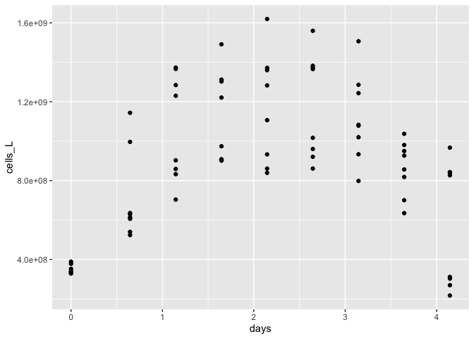
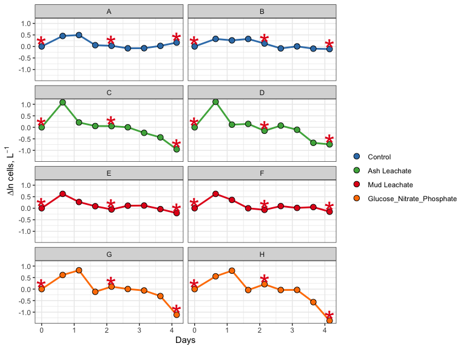
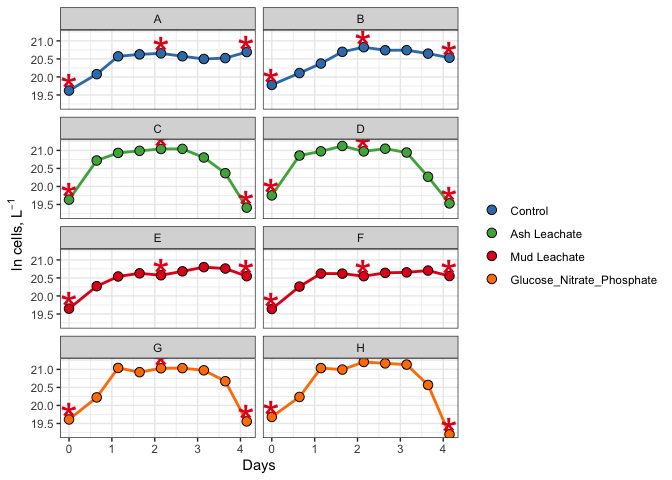

211012_2018_abundance_demo
================
Justine Albers
10/12/2021

# Goal

This document shows how **individual bottle** bacterial abundance data
from 2018 remineralization experiments were processed, QC’d and
analyzed. It also provides an intro to data processing and analysis with
Rstudio and R Markdown.

#Intro to R Markdown

Create a new code chunk: Mac - Cmd + option + i, PC - Ctrl + alt + i

Load packages that we’ll need to analyze our data.

``` r
library(tidyverse)
library(readxl)
library(lubridate)
```

We can toggle on/off warnings in chunks if we don’t want them in our
final markdown file.

# Import Data

``` r
excel_sheets("~/Documents/144l_students_2021/Input_Data/week3/144L_2018_BactAbund.xlsx")
```

    ## [1] "Metadata" "Data"

``` r
#Mac: to make an arrow, use Option + - 

metadata <- read_excel("~/Documents/144l_students_2021/Input_Data/week3/144L_2018_BactAbund.xlsx", sheet = "Metadata")

glimpse(metadata)
```

    ## Rows: 80
    ## Columns: 16
    ## $ Experiment           <chr> "144L_2018", "144L_2018", "144L_2018", "144L_2018…
    ## $ Location             <chr> "Campus Point", "Campus Point", "Campus Point", "…
    ## $ Temperature          <dbl> 20, 20, 20, 20, 20, 20, 20, 20, 20, 20, 20, 20, 2…
    ## $ Depth                <dbl> 1, 1, 1, 1, 1, 1, 1, 1, 1, 1, 1, 1, 1, 1, 1, 1, 1…
    ## $ Bottle               <chr> "A", "A", "A", "A", "A", "A", "A", "A", "A", "A",…
    ## $ Timepoint            <dbl> 0, 1, 2, 3, 4, 5, 6, 7, 8, 9, 0, 1, 2, 3, 4, 5, 6…
    ## $ Treatment            <chr> "Control", "Control", "Control", "Control", "Cont…
    ## $ Target_DOC_Amendment <dbl> 0, 0, 0, 0, 0, 0, 0, 0, 0, 0, 0, 0, 0, 0, 0, 0, 0…
    ## $ Inoculum_L           <dbl> 1.5, 1.5, 1.5, 1.5, 1.5, 1.5, 1.5, 1.5, 1.5, 1.5,…
    ## $ Media_L              <dbl> 3.5, 3.5, 3.5, 3.5, 3.5, 3.5, 3.5, 3.5, 3.5, 3.5,…
    ## $ Datetime             <chr> "2018-10-15T16:30", "2018-10-16T08:00", "2018-10-…
    ## $ TOC_Sample           <lgl> TRUE, FALSE, FALSE, FALSE, TRUE, FALSE, FALSE, FA…
    ## $ Parallel_Sample      <lgl> TRUE, FALSE, FALSE, FALSE, TRUE, FALSE, FALSE, FA…
    ## $ Cell_Sample          <lgl> TRUE, TRUE, TRUE, TRUE, TRUE, TRUE, TRUE, TRUE, T…
    ## $ DNA_Sample           <lgl> TRUE, FALSE, FALSE, FALSE, TRUE, FALSE, FALSE, FA…
    ## $ DNA_SampleID         <chr> "144_A0_S6", NA, NA, NA, "144_A4_S7", NA, NA, NA,…

``` r
#unique(metadata$Bottle)
#unique(metadata$Treatment)

data <- read_excel("~/Documents/144l_students_2021/Input_Data/week3/144L_2018_BactAbund.xlsx", sheet = "Data")
glimpse(data)
```

    ## Rows: 72
    ## Columns: 3
    ## $ Bottle    <chr> "A", "A", "A", "A", "A", "A", "A", "A", "A", "B", "B", "B", …
    ## $ Timepoint <dbl> 0, 1, 2, 3, 4, 5, 6, 7, 8, 0, 1, 2, 3, 4, 5, 6, 7, 8, 0, 1, …
    ## $ Cells_ml  <dbl> 332531.5, 523943.1, 859019.9, 906998.9, 933025.2, 861129.1, …

``` r
joined <-  left_join(metadata, data) #attach data to metadata
```

    ## Joining, by = c("Bottle", "Timepoint")

``` r
#joins right dataset to the left one by using variables that are the same across the two dataframes
glimpse(joined)
```

    ## Rows: 80
    ## Columns: 17
    ## $ Experiment           <chr> "144L_2018", "144L_2018", "144L_2018", "144L_2018…
    ## $ Location             <chr> "Campus Point", "Campus Point", "Campus Point", "…
    ## $ Temperature          <dbl> 20, 20, 20, 20, 20, 20, 20, 20, 20, 20, 20, 20, 2…
    ## $ Depth                <dbl> 1, 1, 1, 1, 1, 1, 1, 1, 1, 1, 1, 1, 1, 1, 1, 1, 1…
    ## $ Bottle               <chr> "A", "A", "A", "A", "A", "A", "A", "A", "A", "A",…
    ## $ Timepoint            <dbl> 0, 1, 2, 3, 4, 5, 6, 7, 8, 9, 0, 1, 2, 3, 4, 5, 6…
    ## $ Treatment            <chr> "Control", "Control", "Control", "Control", "Cont…
    ## $ Target_DOC_Amendment <dbl> 0, 0, 0, 0, 0, 0, 0, 0, 0, 0, 0, 0, 0, 0, 0, 0, 0…
    ## $ Inoculum_L           <dbl> 1.5, 1.5, 1.5, 1.5, 1.5, 1.5, 1.5, 1.5, 1.5, 1.5,…
    ## $ Media_L              <dbl> 3.5, 3.5, 3.5, 3.5, 3.5, 3.5, 3.5, 3.5, 3.5, 3.5,…
    ## $ Datetime             <chr> "2018-10-15T16:30", "2018-10-16T08:00", "2018-10-…
    ## $ TOC_Sample           <lgl> TRUE, FALSE, FALSE, FALSE, TRUE, FALSE, FALSE, FA…
    ## $ Parallel_Sample      <lgl> TRUE, FALSE, FALSE, FALSE, TRUE, FALSE, FALSE, FA…
    ## $ Cell_Sample          <lgl> TRUE, TRUE, TRUE, TRUE, TRUE, TRUE, TRUE, TRUE, T…
    ## $ DNA_Sample           <lgl> TRUE, FALSE, FALSE, FALSE, TRUE, FALSE, FALSE, FA…
    ## $ DNA_SampleID         <chr> "144_A0_S6", NA, NA, NA, "144_A4_S7", NA, NA, NA,…
    ## $ Cells_ml             <dbl> 332531.5, 523943.1, 859019.9, 906998.9, 933025.2,…

# Prepare Data

We will convert the Date and Time column values from characters to
dates, add columns with time elapsed for each treatment, and convert to
cells/L because it will help us match up with the TOC data later. We
will then subset the data for variables of interest and drop NA values.

To do this, we are going to using **piping**. Piping is an operation
that allows us to write more efficient code. The way that we’ll use it
here is to manipulate our data sequentially. The pipe operator “%>%”,
which basically says like “first do one thing to the data. THEN, do this
other thing.” (with the %>% operator taking the place of the word THEN
in this scenario). Every call that we invoke with an additional pipe is
going to take place on the variable (dataframe) that we specify at the
beginning.

``` r
cells <- joined %>%
  mutate(Datetime = ymd_hm(Datetime), #splits apart Datetime as specified
  cells_L = Cells_ml * 1000) %>%
  group_by(Treatment, Bottle) %>%
#group our dataset so that we can calculate the time elapsed properly 
  mutate(interv = interval(first(Datetime), Datetime), 
         s = as.numeric(interv), 
         hours = s/3600, 
         days = hours/24) %>%
  ungroup() %>%
  select(Experiment:DNA_Sample, cells_L, hours, days) %>%
  drop_na(cells_L)
glimpse(cells)
```

    ## Rows: 72
    ## Columns: 18
    ## $ Experiment           <chr> "144L_2018", "144L_2018", "144L_2018", "144L_2018…
    ## $ Location             <chr> "Campus Point", "Campus Point", "Campus Point", "…
    ## $ Temperature          <dbl> 20, 20, 20, 20, 20, 20, 20, 20, 20, 20, 20, 20, 2…
    ## $ Depth                <dbl> 1, 1, 1, 1, 1, 1, 1, 1, 1, 1, 1, 1, 1, 1, 1, 1, 1…
    ## $ Bottle               <chr> "A", "A", "A", "A", "A", "A", "A", "A", "A", "B",…
    ## $ Timepoint            <dbl> 0, 1, 2, 3, 4, 5, 6, 7, 8, 0, 1, 2, 3, 4, 5, 6, 7…
    ## $ Treatment            <chr> "Control", "Control", "Control", "Control", "Cont…
    ## $ Target_DOC_Amendment <dbl> 0, 0, 0, 0, 0, 0, 0, 0, 0, 0, 0, 0, 0, 0, 0, 0, 0…
    ## $ Inoculum_L           <dbl> 1.5, 1.5, 1.5, 1.5, 1.5, 1.5, 1.5, 1.5, 1.5, 1.5,…
    ## $ Media_L              <dbl> 3.5, 3.5, 3.5, 3.5, 3.5, 3.5, 3.5, 3.5, 3.5, 3.5,…
    ## $ Datetime             <dttm> 2018-10-15 16:30:00, 2018-10-16 08:00:00, 2018-1…
    ## $ TOC_Sample           <lgl> TRUE, FALSE, FALSE, FALSE, TRUE, FALSE, FALSE, FA…
    ## $ Parallel_Sample      <lgl> TRUE, FALSE, FALSE, FALSE, TRUE, FALSE, FALSE, FA…
    ## $ Cell_Sample          <lgl> TRUE, TRUE, TRUE, TRUE, TRUE, TRUE, TRUE, TRUE, T…
    ## $ DNA_Sample           <lgl> TRUE, FALSE, FALSE, FALSE, TRUE, FALSE, FALSE, FA…
    ## $ cells_L              <dbl> 332531522, 523943125, 859019934, 906998856, 93302…
    ## $ hours                <dbl> 0.0, 15.5, 27.5, 39.5, 51.5, 63.5, 75.5, 87.5, 99…
    ## $ days                 <dbl> 0.0000000, 0.6458333, 1.1458333, 1.6458333, 2.145…

# Plot Growth Curves

We will plot growth curve for each bottle. Need cell abundance and days
data.

First, let’s set some aesthetics for our plot.

``` r
#assign hex colors to our different treatments
custom.colors <- c("Control" = "#377EB8", "Ash Leachate" = "#4DAF4A", "Mud Leachate" = "#E41A1C", "Glucose_Nitrate_Phosphate" = "#FF7F00")

#assign levels to control what order things appear in the legend
levels <- c("Control", "Ash Leachate", "Mud Leachate", "Glucose_Nitrate_Phosphate")

#now let's use a handy package, ggplot to visualize our data. 

cells %>%
  mutate(dna = ifelse(DNA_Sample == T, "*", NA)) %>%
  ggplot(aes(x=days, y=cells_L, group = interaction(Treatment, Bottle))) +
  geom_line(aes(color = factor(Treatment, levels = levels)), size =1) +
  geom_point(aes(fill = factor(Treatment, levels = levels)), size = 3, color = "black", shape = 21) + 
  geom_text(aes(label = dna), size = 12, color = "#E41A1C") +
  labs(x = "Days", y = expression(paste("Cells, L"^-1)), fill = "") + 
  guides(color = "none") + 
  scale_color_manual(values = custom.colors) +
  scale_fill_manual(values = custom.colors) +
  #facet_grid(rows = "Treatment")
  theme_bw()
```

    ## Warning: Removed 48 rows containing missing values (geom_text).

<!-- -->

``` r
glimpse(cells)
```

    ## Rows: 72
    ## Columns: 18
    ## $ Experiment           <chr> "144L_2018", "144L_2018", "144L_2018", "144L_2018…
    ## $ Location             <chr> "Campus Point", "Campus Point", "Campus Point", "…
    ## $ Temperature          <dbl> 20, 20, 20, 20, 20, 20, 20, 20, 20, 20, 20, 20, 2…
    ## $ Depth                <dbl> 1, 1, 1, 1, 1, 1, 1, 1, 1, 1, 1, 1, 1, 1, 1, 1, 1…
    ## $ Bottle               <chr> "A", "A", "A", "A", "A", "A", "A", "A", "A", "B",…
    ## $ Timepoint            <dbl> 0, 1, 2, 3, 4, 5, 6, 7, 8, 0, 1, 2, 3, 4, 5, 6, 7…
    ## $ Treatment            <chr> "Control", "Control", "Control", "Control", "Cont…
    ## $ Target_DOC_Amendment <dbl> 0, 0, 0, 0, 0, 0, 0, 0, 0, 0, 0, 0, 0, 0, 0, 0, 0…
    ## $ Inoculum_L           <dbl> 1.5, 1.5, 1.5, 1.5, 1.5, 1.5, 1.5, 1.5, 1.5, 1.5,…
    ## $ Media_L              <dbl> 3.5, 3.5, 3.5, 3.5, 3.5, 3.5, 3.5, 3.5, 3.5, 3.5,…
    ## $ Datetime             <dttm> 2018-10-15 16:30:00, 2018-10-16 08:00:00, 2018-1…
    ## $ TOC_Sample           <lgl> TRUE, FALSE, FALSE, FALSE, TRUE, FALSE, FALSE, FA…
    ## $ Parallel_Sample      <lgl> TRUE, FALSE, FALSE, FALSE, TRUE, FALSE, FALSE, FA…
    ## $ Cell_Sample          <lgl> TRUE, TRUE, TRUE, TRUE, TRUE, TRUE, TRUE, TRUE, T…
    ## $ DNA_Sample           <lgl> TRUE, FALSE, FALSE, FALSE, TRUE, FALSE, FALSE, FA…
    ## $ cells_L              <dbl> 332531522, 523943125, 859019934, 906998856, 93302…
    ## $ hours                <dbl> 0.0, 15.5, 27.5, 39.5, 51.5, 63.5, 75.5, 87.5, 99…
    ## $ days                 <dbl> 0.0000000, 0.6458333, 1.1458333, 1.6458333, 2.145…

# Next Steps

We can calculate:

-   total change in cells from initial condition to the end of the
    experiment.
-   specific growth rate as the slope of ln(abundance) v time during
    exponential growth phase
-   doubling time as ln(2) divided by the specific growth rate
-   mean of each of these parameters across each treatment

1st, we need to determine **where** exponential growth is ocurring in
each of our bottles, if it does. To do this, we ’ll plot ln(abundance)
vs time.

# Identify exponential phase of growth in our remin experiments

**NOTE about logarithms in R**

log(x) gives the natural log of x, not log base 10 log10(x) gives the
log base 10 log2(x) gives log base 2

``` r
ln_cells <- cells %>%
  group_by(Treatment, Bottle) %>%
  mutate(ln_cells = log(cells_L), 
         diff_ln_cells = ln_cells - lag(ln_cells, default = first(ln_cells)))
```

Now, let’s plot our newly calculated data!

``` r
ln_cells %>%
  mutate(dna = ifelse(DNA_Sample == T, "*", NA)) %>%
  ggplot(aes(x=days, y=diff_ln_cells, group = interaction(Treatment, Bottle))) +
  geom_line(aes(color = factor(Treatment, levels = levels)), size =1) +
  geom_point(aes(fill = factor(Treatment, levels = levels)), size = 3, color = "black", shape = 21) + 
  geom_text(aes(label = dna), size = 12, color = "#E41A1C") +
  labs(x = "Days", y = expression(paste("∆ln cells, L"^-1)), fill = "") + 
  guides(color = "none") + 
  scale_color_manual(values = custom.colors) +
  scale_fill_manual(values = custom.colors) +
  facet_wrap("Bottle", ncol =2) +
  theme_bw()
```

    ## Warning: Removed 48 rows containing missing values (geom_text).

<!-- -->
Exponential growth seems to be occurring right at the beginning of the
experiment between 0-1 days for the most of the bottles.

Let’s try plotting ln_cells to see if that can help us identify
exponential growth in the control a little better.

``` r
ln_cells %>%
  mutate(dna = ifelse(DNA_Sample == T, "*", NA)) %>%
  ggplot(aes(x=days, y=ln_cells, group = interaction(Treatment, Bottle))) +
  geom_line(aes(color = factor(Treatment, levels = levels)), size =1) +
  geom_point(aes(fill = factor(Treatment, levels = levels)), size = 3, color = "black", shape = 21) + 
  geom_text(aes(label = dna), size = 12, color = "#E41A1C") +
  labs(x = "Days", y = expression(paste("ln cells, L"^-1)), fill = "") + 
  guides(color = "none") + 
  scale_color_manual(values = custom.colors) +
  scale_fill_manual(values = custom.colors) +
  facet_wrap("Bottle", ncol =2) +
  theme_bw()
```

    ## Warning: Removed 48 rows containing missing values (geom_text).

<!-- -->
