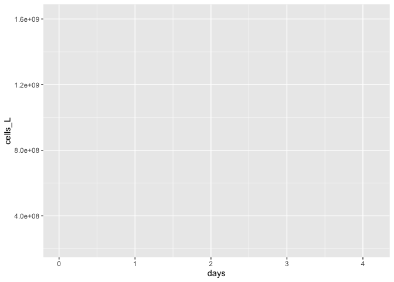

test\_2018\_abundance
================
Justine Albers

# Goal:

# title

## title

### title

This document shows how **individual bottle** bacterial abundance data
from 2018 remineralization experiments were processed, QC’d and
analyzed. It also provides an introduction to data processing and
analysis with RStudio and RMarkdown.

# Intro to R Markdown

We will use R Markdown to make our science reproducible and easily
understood by someone who is not familar with R.

To create a new code chunk, press the green “C” button and click “R”
from the dropdown menu in the toolbar above OR for Mac: type Cmd +
option + i and for PC: Ctrl + alt + i.

Let’s first load the packages that we’ll need to analyze our data.

``` r
library(tidyverse)
library(readxl)
library(lubridate)
```

We can toggle on/off messages and warnings based on what we want to
appear in our final R markdown output.

# Import Data

``` r
excel_sheets("Input_Data/week3/144L_2018_BactAbund.xlsx")
```

    ## [1] "Metadata" "Data"

``` r
metadata <- read_excel("Input_Data/week3/144L_2018_BactAbund.xlsx", sheet = "Metadata")

glimpse(metadata)
```

    ## Rows: 80
    ## Columns: 16
    ## $ Experiment           <chr> "144L_2018", "144L_2018", "144L_2018", "144L_2018…
    ## $ Location             <chr> "Campus Point", "Campus Point", "Campus Point", "…
    ## $ Temperature          <dbl> 20, 20, 20, 20, 20, 20, 20, 20, 20, 20, 20, 20, 2…
    ## $ Depth                <dbl> 1, 1, 1, 1, 1, 1, 1, 1, 1, 1, 1, 1, 1, 1, 1, 1, 1…
    ## $ Bottle               <chr> "A", "A", "A", "A", "A", "A", "A", "A", "A", "A",…
    ## $ Timepoint            <dbl> 0, 1, 2, 3, 4, 5, 6, 7, 8, 9, 0, 1, 2, 3, 4, 5, 6…
    ## $ Treatment            <chr> "Control", "Control", "Control", "Control", "Cont…
    ## $ Target_DOC_Amendment <dbl> 0, 0, 0, 0, 0, 0, 0, 0, 0, 0, 0, 0, 0, 0, 0, 0, 0…
    ## $ Inoculum_L           <dbl> 1.5, 1.5, 1.5, 1.5, 1.5, 1.5, 1.5, 1.5, 1.5, 1.5,…
    ## $ Media_L              <dbl> 3.5, 3.5, 3.5, 3.5, 3.5, 3.5, 3.5, 3.5, 3.5, 3.5,…
    ## $ Datetime             <chr> "2018-10-15T16:30", "2018-10-16T08:00", "2018-10-…
    ## $ TOC_Sample           <lgl> TRUE, FALSE, FALSE, FALSE, TRUE, FALSE, FALSE, FA…
    ## $ Parallel_Sample      <lgl> TRUE, FALSE, FALSE, FALSE, TRUE, FALSE, FALSE, FA…
    ## $ Cell_Sample          <lgl> TRUE, TRUE, TRUE, TRUE, TRUE, TRUE, TRUE, TRUE, T…
    ## $ DNA_Sample           <lgl> TRUE, FALSE, FALSE, FALSE, TRUE, FALSE, FALSE, FA…
    ## $ DNA_SampleID         <chr> "144_A0_S6", NA, NA, NA, "144_A4_S7", NA, NA, NA,…

``` r
#unique(metadata$Bottle)

data <- read_excel("Input_Data/week3/144L_2018_BactAbund.xlsx", sheet = "Data")
glimpse(data)
```

    ## Rows: 72
    ## Columns: 3
    ## $ Bottle    <chr> "A", "A", "A", "A", "A", "A", "A", "A", "A", "B", "B", "B", …
    ## $ Timepoint <dbl> 0, 1, 2, 3, 4, 5, 6, 7, 8, 0, 1, 2, 3, 4, 5, 6, 7, 8, 0, 1, …
    ## $ Cells_ml  <dbl> 332531.5, 523943.1, 859019.9, 906998.9, 933025.2, 861129.1, …

``` r
joined <- left_join(metadata, data) 
```

    ## Joining, by = c("Bottle", "Timepoint")

``` r
#joins the right dataset to the left one by variables that are the same
glimpse(joined)
```

    ## Rows: 80
    ## Columns: 17
    ## $ Experiment           <chr> "144L_2018", "144L_2018", "144L_2018", "144L_2018…
    ## $ Location             <chr> "Campus Point", "Campus Point", "Campus Point", "…
    ## $ Temperature          <dbl> 20, 20, 20, 20, 20, 20, 20, 20, 20, 20, 20, 20, 2…
    ## $ Depth                <dbl> 1, 1, 1, 1, 1, 1, 1, 1, 1, 1, 1, 1, 1, 1, 1, 1, 1…
    ## $ Bottle               <chr> "A", "A", "A", "A", "A", "A", "A", "A", "A", "A",…
    ## $ Timepoint            <dbl> 0, 1, 2, 3, 4, 5, 6, 7, 8, 9, 0, 1, 2, 3, 4, 5, 6…
    ## $ Treatment            <chr> "Control", "Control", "Control", "Control", "Cont…
    ## $ Target_DOC_Amendment <dbl> 0, 0, 0, 0, 0, 0, 0, 0, 0, 0, 0, 0, 0, 0, 0, 0, 0…
    ## $ Inoculum_L           <dbl> 1.5, 1.5, 1.5, 1.5, 1.5, 1.5, 1.5, 1.5, 1.5, 1.5,…
    ## $ Media_L              <dbl> 3.5, 3.5, 3.5, 3.5, 3.5, 3.5, 3.5, 3.5, 3.5, 3.5,…
    ## $ Datetime             <chr> "2018-10-15T16:30", "2018-10-16T08:00", "2018-10-…
    ## $ TOC_Sample           <lgl> TRUE, FALSE, FALSE, FALSE, TRUE, FALSE, FALSE, FA…
    ## $ Parallel_Sample      <lgl> TRUE, FALSE, FALSE, FALSE, TRUE, FALSE, FALSE, FA…
    ## $ Cell_Sample          <lgl> TRUE, TRUE, TRUE, TRUE, TRUE, TRUE, TRUE, TRUE, T…
    ## $ DNA_Sample           <lgl> TRUE, FALSE, FALSE, FALSE, TRUE, FALSE, FALSE, FA…
    ## $ DNA_SampleID         <chr> "144_A0_S6", NA, NA, NA, "144_A4_S7", NA, NA, NA,…
    ## $ Cells_ml             <dbl> 332531.5, 523943.1, 859019.9, 906998.9, 933025.2,…

## Prepare Data

Here we will convert the DAte and Time column values from characters to
dates, add columns with time elapsed for each experiment, and convert to
cells/L because it will help us match the abundance data with the TOC
data. We will also subset the variables of interest and drop NA values.

To do this, we will use something called **piping**. Piping is an
operation which allows us to write more efficient code. The way we will
use it here is to perform a series of manipulations on our dataset
sequentially. The pipe operator “%&gt;%” sort of says “first, do this.
**THEN** do this.” (with the %&gt;% operator taking the place of the
word THEN). Every call that we invoke with an additional pipe will take
place on the variable specified at the beginning.

``` r
cells <- joined %>% 
  mutate(Datetime = ymd_hm(Datetime), #splits apart the Datetime as specified
  cells = Cells_ml * 1000) %>% #creates a new column called cells
  group_by(Treatment, Bottle) %>%
  #we need to group our dataset so we can calculate time elapsed properly within each treatment and bottle. 
  mutate(interv = interval(first(Datetime), Datetime), 
         s = as.numeric(interv), 
         hours = s/3600, 
         days = hours/24) %>%
  ungroup() %>%
  select(Experiment:DNA_Sample, cells, hours, days) %>%
  drop_na(cells)
glimpse(cells)
```

    ## Rows: 72
    ## Columns: 18
    ## $ Experiment           <chr> "144L_2018", "144L_2018", "144L_2018", "144L_2018…
    ## $ Location             <chr> "Campus Point", "Campus Point", "Campus Point", "…
    ## $ Temperature          <dbl> 20, 20, 20, 20, 20, 20, 20, 20, 20, 20, 20, 20, 2…
    ## $ Depth                <dbl> 1, 1, 1, 1, 1, 1, 1, 1, 1, 1, 1, 1, 1, 1, 1, 1, 1…
    ## $ Bottle               <chr> "A", "A", "A", "A", "A", "A", "A", "A", "A", "B",…
    ## $ Timepoint            <dbl> 0, 1, 2, 3, 4, 5, 6, 7, 8, 0, 1, 2, 3, 4, 5, 6, 7…
    ## $ Treatment            <chr> "Control", "Control", "Control", "Control", "Cont…
    ## $ Target_DOC_Amendment <dbl> 0, 0, 0, 0, 0, 0, 0, 0, 0, 0, 0, 0, 0, 0, 0, 0, 0…
    ## $ Inoculum_L           <dbl> 1.5, 1.5, 1.5, 1.5, 1.5, 1.5, 1.5, 1.5, 1.5, 1.5,…
    ## $ Media_L              <dbl> 3.5, 3.5, 3.5, 3.5, 3.5, 3.5, 3.5, 3.5, 3.5, 3.5,…
    ## $ Datetime             <dttm> 2018-10-15 16:30:00, 2018-10-16 08:00:00, 2018-1…
    ## $ TOC_Sample           <lgl> TRUE, FALSE, FALSE, FALSE, TRUE, FALSE, FALSE, FA…
    ## $ Parallel_Sample      <lgl> TRUE, FALSE, FALSE, FALSE, TRUE, FALSE, FALSE, FA…
    ## $ Cell_Sample          <lgl> TRUE, TRUE, TRUE, TRUE, TRUE, TRUE, TRUE, TRUE, T…
    ## $ DNA_Sample           <lgl> TRUE, FALSE, FALSE, FALSE, TRUE, FALSE, FALSE, FA…
    ## $ cells                <dbl> 332531522, 523943125, 859019934, 906998856, 93302…
    ## $ hours                <dbl> 0.0, 15.5, 27.5, 39.5, 51.5, 63.5, 75.5, 87.5, 99…
    ## $ days                 <dbl> 0.0000000, 0.6458333, 1.1458333, 1.6458333, 2.145…

# Plot growth curves

We will plot a growth curve for each bottle.

First let’s set up some aesthetics for our plot.

``` r
custom.colors <- c("Control" = "#377EB8", "Ash Leachate" = "#4DAF4A", "Mud Leachate" = "#E41A1C", "Glucose_Nitrate_Phosphate" = "#FF7F00")
levels <- c("Control", "Ash Leachate", "Mud Leachate", "Glucose_Nitrate_Phosphate") #gives ggplot an order to show things in the plot legend. 
#c() combines the elements listed in parentheses into a vector, a sort of list which you can see on the right. 
```

Now, we will generate the plot using a handy package called ggplot.

``` r
cells %>% 
  #mutate(dna = ifelse(DNA_Sample == T, "*", NA)) %>%
  ggplot(aes(x=days, y=cells, group = interaction(Treatment, Bottle))) + 
  geom_point()
```

<!-- -->
