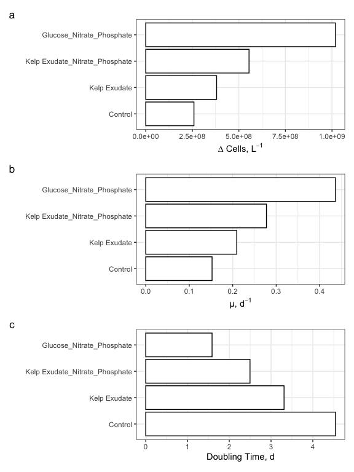

2021 Bacterial Abundance Data (DAPI) & TOC Data Analysis
================
Your Name
11/03/2021

# Goal

This document shows how **individual bottle** bacterial abundance & TOC
data from 2021 remineralization experiments were processed, QC’d and
analyzed.

Load packages that we’ll need to analyze our data.

# Import Data

``` r
#make sure to update the filepaths for your own locally-stored repository! 

excel_sheets("~/Documents/144l_students_2021/Input_Data/week4/144L_2021_BactAbund.xlsx")
```

    ## [1] "Metadata"  "FCM_Data"  "DAPI_Data" "TOC_Data"

``` r
#Mac: to make an arrow, use Option + - 

metadata <- read_excel("~/Documents/144l_students_2021/Input_Data/week4/144L_2021_BactAbund.xlsx", sheet = "Metadata")

glimpse(metadata)
```

    ## Rows: 80
    ## Columns: 16
    ## $ Experiment           <chr> "144L_2021", "144L_2021", "144L_2021", "144L_2021…
    ## $ Location             <chr> "Goleta Pier", "Goleta Pier", "Goleta Pier", "Gol…
    ## $ Temperature          <dbl> 19, 19, 19, 19, 19, 19, 19, 19, 19, 19, 19, 19, 1…
    ## $ Depth                <dbl> 1, 1, 1, 1, 1, 1, 1, 1, 1, 1, 1, 1, 1, 1, 1, 1, 1…
    ## $ Bottle               <chr> "A", "A", "A", "A", "A", "A", "A", "A", "A", "A",…
    ## $ Timepoint            <dbl> 0, 1, 2, 3, 4, 5, 6, 7, 8, 9, 0, 1, 2, 3, 4, 5, 6…
    ## $ Treatment            <chr> "Control", "Control", "Control", "Control", "Cont…
    ## $ Target_DOC_Amendment <dbl> 0, 0, 0, 0, 0, 0, 0, 0, 0, 0, 0, 0, 0, 0, 0, 0, 0…
    ## $ Inoculum_L           <dbl> 2, 2, 2, 2, 2, 2, 2, 2, 2, 2, 2, 2, 2, 2, 2, 2, 2…
    ## $ Media_L              <dbl> 5, 5, 5, 5, 5, 5, 5, 5, 5, 5, 5, 5, 5, 5, 5, 5, 5…
    ## $ Datetime             <chr> "2021-10-04T16:00", "2021-10-05T08:00", "2021-10-…
    ## $ TOC_Sample           <lgl> TRUE, FALSE, FALSE, FALSE, TRUE, FALSE, FALSE, FA…
    ## $ Cell_Sample          <lgl> TRUE, TRUE, TRUE, TRUE, TRUE, TRUE, TRUE, TRUE, T…
    ## $ DAPI_Sample          <lgl> TRUE, FALSE, FALSE, FALSE, TRUE, FALSE, FALSE, FA…
    ## $ DNA_Sample           <lgl> TRUE, FALSE, FALSE, FALSE, TRUE, FALSE, FALSE, FA…
    ## $ Nutrient_Sample      <lgl> TRUE, FALSE, FALSE, FALSE, FALSE, FALSE, FALSE, F…

``` r
#unique(metadata$Bottle)
#unique(metadata$Treatment)

dapi_data <- read_excel("~/Documents/144l_students_2021/Input_Data/week4/144L_2021_BactAbund.xlsx", sheet = "DAPI_Data")
glimpse(dapi_data)
```

    ## Rows: 12
    ## Columns: 17
    ## $ Treatment                <chr> "Control", "Control", "Control", "Kelp Exudat…
    ## $ Timepoint                <dbl> 0, 4, 8, 0, 4, 8, 0, 4, 8, 0, 4, 8
    ## $ Cells_mL                 <dbl> 660667.0, 919405.6, 1133869.7, 663088.1, 1043…
    ## $ Cells_mL_Stdev           <dbl> 73217.76, 363326.27, 99930.05, 113546.27, 181…
    ## $ Mean_Biovolume_um3_cell  <dbl> 0.04556209, 0.05080353, 0.04093212, 0.0387149…
    ## $ Biovolume_Stdev_um3_cell <dbl> 0.006054805, 0.011000369, 0.004684495, 0.0054…
    ## $ ln_cells_exp_start       <dbl> 20.30876, 20.30876, 20.30876, 20.31242, 20.31…
    ## $ ln_cells_exp_end         <dbl> 20.63924, 20.63924, 20.63924, 20.76594, 20.76…
    ## $ cells_exp_phase_start    <dbl> 660667000, 660667000, 660667000, 663088109, 6…
    ## $ cells_exp_phase_end      <dbl> 919405583, 919405583, 919405583, 1043597828, …
    ## $ days_exp_phase_start     <dbl> 0, 0, 0, 0, 0, 0, 0, 0, 0, 0, 0, 0
    ## $ days_exp_phase_end       <dbl> 2.166667, 2.166667, 2.166667, 2.166667, 2.166…
    ## $ mew                      <lgl> NA, NA, NA, NA, NA, NA, NA, NA, NA, NA, NA, NA
    ## $ doubling                 <lgl> NA, NA, NA, NA, NA, NA, NA, NA, NA, NA, NA, NA
    ## $ delta_cells_exp          <lgl> NA, NA, NA, NA, NA, NA, NA, NA, NA, NA, NA, NA
    ## $ bac_carbon_uM            <dbl> 1.651668, 2.298514, 2.834674, 1.657720, 2.608…
    ## $ delta_bac_carbon_uM      <lgl> NA, NA, NA, NA, NA, NA, NA, NA, NA, NA, NA, NA

``` r
toc_data <- read_excel("~/Documents/144l_students_2021/Input_Data/week4/144L_2021_BactAbund.xlsx", sheet = "TOC_Data")
glimpse(toc_data)
```

    ## Rows: 16
    ## Columns: 8
    ## $ Treatment     <chr> "Control", "Control", "Control", "Control", "Kelp Exudat…
    ## $ Timepoint     <dbl> 0, 4, 8, 9, 0, 4, 8, 9, 0, 4, 8, 9, 0, 4, 8, 9
    ## $ Mean_uMC      <dbl> 91.70646, 89.13506, 87.79890, 84.82951, 94.82839, 89.170…
    ## $ Stdev_uMC     <dbl> 0.28298816, 0.19207804, 0.29282962, 0.04865985, 0.308884…
    ## $ DOC_uMC       <lgl> NA, NA, NA, NA, NA, NA, NA, NA, NA, NA, NA, NA, NA, NA, …
    ## $ `Bioav_DOC_%` <lgl> NA, NA, NA, NA, NA, NA, NA, NA, NA, NA, NA, NA, NA, NA, …
    ## $ Delta_DOC_uMC <lgl> NA, NA, NA, NA, NA, NA, NA, NA, NA, NA, NA, NA, NA, NA, …
    ## $ BGE           <lgl> NA, NA, NA, NA, NA, NA, NA, NA, NA, NA, NA, NA, NA, NA, …

``` r
dapi_metadata <- metadata %>%
  select(-Bottle) %>%
  unique()


joined <-  left_join(dapi_metadata, dapi_data) #attach data to metadata
```

    ## Joining, by = c("Timepoint", "Treatment")

``` r
#joins right dataset to the left one by using variables that are the same across the two dataframes
glimpse(joined)
```

    ## Rows: 40
    ## Columns: 30
    ## $ Experiment               <chr> "144L_2021", "144L_2021", "144L_2021", "144L_…
    ## $ Location                 <chr> "Goleta Pier", "Goleta Pier", "Goleta Pier", …
    ## $ Temperature              <dbl> 19, 19, 19, 19, 19, 19, 19, 19, 19, 19, 19, 1…
    ## $ Depth                    <dbl> 1, 1, 1, 1, 1, 1, 1, 1, 1, 1, 1, 1, 1, 1, 1, …
    ## $ Timepoint                <dbl> 0, 1, 2, 3, 4, 5, 6, 7, 8, 9, 0, 1, 2, 3, 4, …
    ## $ Treatment                <chr> "Control", "Control", "Control", "Control", "…
    ## $ Target_DOC_Amendment     <dbl> 0, 0, 0, 0, 0, 0, 0, 0, 0, 0, 10, 10, 10, 10,…
    ## $ Inoculum_L               <dbl> 2, 2, 2, 2, 2, 2, 2, 2, 2, 2, 2, 2, 2, 2, 2, …
    ## $ Media_L                  <dbl> 5, 5, 5, 5, 5, 5, 5, 5, 5, 5, 5, 5, 5, 5, 5, …
    ## $ Datetime                 <chr> "2021-10-04T16:00", "2021-10-05T08:00", "2021…
    ## $ TOC_Sample               <lgl> TRUE, FALSE, FALSE, FALSE, TRUE, FALSE, FALSE…
    ## $ Cell_Sample              <lgl> TRUE, TRUE, TRUE, TRUE, TRUE, TRUE, TRUE, TRU…
    ## $ DAPI_Sample              <lgl> TRUE, FALSE, FALSE, FALSE, TRUE, FALSE, FALSE…
    ## $ DNA_Sample               <lgl> TRUE, FALSE, FALSE, FALSE, TRUE, FALSE, FALSE…
    ## $ Nutrient_Sample          <lgl> TRUE, FALSE, FALSE, FALSE, FALSE, FALSE, FALS…
    ## $ Cells_mL                 <dbl> 660667.0, NA, NA, NA, 919405.6, NA, NA, NA, 1…
    ## $ Cells_mL_Stdev           <dbl> 73217.76, NA, NA, NA, 363326.27, NA, NA, NA, …
    ## $ Mean_Biovolume_um3_cell  <dbl> 0.04556209, NA, NA, NA, 0.05080353, NA, NA, N…
    ## $ Biovolume_Stdev_um3_cell <dbl> 0.006054805, NA, NA, NA, 0.011000369, NA, NA,…
    ## $ ln_cells_exp_start       <dbl> 20.30876, NA, NA, NA, 20.30876, NA, NA, NA, 2…
    ## $ ln_cells_exp_end         <dbl> 20.63924, NA, NA, NA, 20.63924, NA, NA, NA, 2…
    ## $ cells_exp_phase_start    <dbl> 660667000, NA, NA, NA, 660667000, NA, NA, NA,…
    ## $ cells_exp_phase_end      <dbl> 919405583, NA, NA, NA, 919405583, NA, NA, NA,…
    ## $ days_exp_phase_start     <dbl> 0, NA, NA, NA, 0, NA, NA, NA, 0, NA, 0, NA, N…
    ## $ days_exp_phase_end       <dbl> 2.166667, NA, NA, NA, 2.166667, NA, NA, NA, 2…
    ## $ mew                      <lgl> NA, NA, NA, NA, NA, NA, NA, NA, NA, NA, NA, N…
    ## $ doubling                 <lgl> NA, NA, NA, NA, NA, NA, NA, NA, NA, NA, NA, N…
    ## $ delta_cells_exp          <lgl> NA, NA, NA, NA, NA, NA, NA, NA, NA, NA, NA, N…
    ## $ bac_carbon_uM            <dbl> 1.651668, NA, NA, NA, 2.298514, NA, NA, NA, 2…
    ## $ delta_bac_carbon_uM      <lgl> NA, NA, NA, NA, NA, NA, NA, NA, NA, NA, NA, N…

# Prepare Data

We will convert the Date and Time column values from characters to
dates, add columns with time elapsed for each treatment, and convert to
cells/L because it will help us match up with the TOC data later. We
will then subset the data for variables of interest and drop NA values.

``` r
cells <- joined %>%
  mutate(Datetime = ymd_hm(Datetime), #splits apart Datetime as specified
  Cells_L = as.numeric(Cells_mL)*1000,  
  Cells_L_Stdev = as.numeric(Cells_mL_Stdev)*1000) %>%
  drop_na(Cells_L) %>%
  group_by(Treatment) %>%
#group our dataset so that we can calculate the time elapsed properly 
  mutate(interv = interval(first(Datetime), Datetime), 
         s = as.numeric(interv), 
         hours = s/3600, 
         days = hours/24) %>%
  ungroup()
glimpse(cells)
```

    ## Rows: 12
    ## Columns: 36
    ## $ Experiment               <chr> "144L_2021", "144L_2021", "144L_2021", "144L_…
    ## $ Location                 <chr> "Goleta Pier", "Goleta Pier", "Goleta Pier", …
    ## $ Temperature              <dbl> 19, 19, 19, 19, 19, 19, 19, 19, 19, 19, 19, 19
    ## $ Depth                    <dbl> 1, 1, 1, 1, 1, 1, 1, 1, 1, 1, 1, 1
    ## $ Timepoint                <dbl> 0, 4, 8, 0, 4, 8, 0, 4, 8, 0, 4, 8
    ## $ Treatment                <chr> "Control", "Control", "Control", "Kelp Exudat…
    ## $ Target_DOC_Amendment     <dbl> 0, 0, 0, 10, 10, 10, 10, 10, 10, 10, 10, 10
    ## $ Inoculum_L               <dbl> 2, 2, 2, 2, 2, 2, 2, 2, 2, 2, 2, 2
    ## $ Media_L                  <dbl> 5, 5, 5, 5, 5, 5, 5, 5, 5, 5, 5, 5
    ## $ Datetime                 <dttm> 2021-10-04 16:00:00, 2021-10-06 20:00:00, 202…
    ## $ TOC_Sample               <lgl> TRUE, TRUE, TRUE, TRUE, TRUE, TRUE, TRUE, TRU…
    ## $ Cell_Sample              <lgl> TRUE, TRUE, TRUE, TRUE, TRUE, TRUE, TRUE, TRU…
    ## $ DAPI_Sample              <lgl> TRUE, TRUE, TRUE, TRUE, TRUE, TRUE, TRUE, TRU…
    ## $ DNA_Sample               <lgl> TRUE, TRUE, TRUE, TRUE, TRUE, TRUE, TRUE, TRU…
    ## $ Nutrient_Sample          <lgl> TRUE, FALSE, FALSE, TRUE, FALSE, FALSE, TRUE,…
    ## $ Cells_mL                 <dbl> 660667.0, 919405.6, 1133869.7, 663088.1, 104…
    ## $ Cells_mL_Stdev           <dbl> 73217.76, 363326.27, 99930.05, 113546.27, 181…
    ## $ Mean_Biovolume_um3_cell  <dbl> 0.04556209, 0.05080353, 0.04093212, 0.0387149…
    ## $ Biovolume_Stdev_um3_cell <dbl> 0.006054805, 0.011000369, 0.004684495, 0.0054…
    ## $ ln_cells_exp_start       <dbl> 20.30876, 20.30876, 20.30876, 20.31242, 20.31…
    ## $ ln_cells_exp_end         <dbl> 20.63924, 20.63924, 20.63924, 20.76594, 20.76…
    ## $ cells_exp_phase_start    <dbl> 660667000, 660667000, 660667000, 663088109, 6…
    ## $ cells_exp_phase_end      <dbl> 919405583, 919405583, 919405583, 1043597828, …
    ## $ days_exp_phase_start     <dbl> 0, 0, 0, 0, 0, 0, 0, 0, 0, 0, 0, 0
    ## $ days_exp_phase_end       <dbl> 2.166667, 2.166667, 2.166667, 2.166667, 2.166…
    ## $ mew                      <lgl> NA, NA, NA, NA, NA, NA, NA, NA, NA, NA, NA, NA
    ## $ doubling                 <lgl> NA, NA, NA, NA, NA, NA, NA, NA, NA, NA, NA, NA
    ## $ delta_cells_exp          <lgl> NA, NA, NA, NA, NA, NA, NA, NA, NA, NA, NA, NA
    ## $ bac_carbon_uM            <dbl> 1.651668, 2.298514, 2.834674, 1.657720, 2.608…
    ## $ delta_bac_carbon_uM      <lgl> NA, NA, NA, NA, NA, NA, NA, NA, NA, NA, NA, NA
    ## $ Cells_L                  <dbl> 660667000, 919405583, 1133869724, 663088109, …
    ## $ Cells_L_Stdev            <dbl> 73217756, 363326274, 99930050, 113546267, 181…
    ## $ interv                   <Interval> 2021-10-04 16:00:00 UTC--2021-10-04 16:00:00 …
    ## $ s                        <dbl> 0, 187200, 360000, 0, 187200, 360000, 0, 1872…
    ## $ hours                    <dbl> 0, 52, 100, 0, 52, 100, 0, 52, 100, 0, 52, 100
    ## $ days                     <dbl> 0.000000, 2.166667, 4.166667, 0.000000, 2.166…

# Plot Growth Curves

We will plot growth curves for each treament with DAPI cell abundance
and biovolume data.

## Cell Abundance:

``` r
#assign hex colors to our different treatments, example below:
# <- c("Control" = "#377EB8", "Ash Leachate" = "#4DAF4A", "Mud Leachate" = "#E41A1C", "Glucose_Nitrate_Phosphate" = "#FF7F00")

#assign levels to control what order things appear in the legend
levels <- c("Control", "Kelp Exudate", "Kelp Exudate_Nitrate_Phosphate", "Glucose_Nitrate_Phosphate")

#now let's use a handy package, ggplot to visualize our data. 

cells %>%
  mutate(dna = ifelse(DNA_Sample == T, "*", NA)) %>%
  ggplot(aes(x=days, y=Cells_L, group = Treatment)) +
  geom_errorbar(aes(ymin = Cells_L - Cells_L_Stdev, ymax = Cells_L + Cells_L_Stdev, color =factor(Treatment, levels = levels)), width = 0.1) +
  geom_line(aes(color = factor(Treatment, levels = levels)), size =1) +
  geom_point(aes(fill = factor(Treatment, levels = levels)), size = 3, color = "black", shape = 21) + 
  #geom_text(aes(label = dna), size = 12, color = "#E41A1C") +
  labs(x = "Days", y = expression(paste("Cells, L"^-1)), fill = "") + 
  guides(color = "none") + 
  #scale_color_manual(values = custom.colors) +
  #scale_fill_manual(values = custom.colors) +
  #facet_grid(rows = "Treatment")
  theme_bw()
```

<!-- -->

``` r
glimpse(cells)
```

    ## Rows: 12
    ## Columns: 36
    ## $ Experiment               <chr> "144L_2021", "144L_2021", "144L_2021", "144L_…
    ## $ Location                 <chr> "Goleta Pier", "Goleta Pier", "Goleta Pier", …
    ## $ Temperature              <dbl> 19, 19, 19, 19, 19, 19, 19, 19, 19, 19, 19, 19
    ## $ Depth                    <dbl> 1, 1, 1, 1, 1, 1, 1, 1, 1, 1, 1, 1
    ## $ Timepoint                <dbl> 0, 4, 8, 0, 4, 8, 0, 4, 8, 0, 4, 8
    ## $ Treatment                <chr> "Control", "Control", "Control", "Kelp Exudat…
    ## $ Target_DOC_Amendment     <dbl> 0, 0, 0, 10, 10, 10, 10, 10, 10, 10, 10, 10
    ## $ Inoculum_L               <dbl> 2, 2, 2, 2, 2, 2, 2, 2, 2, 2, 2, 2
    ## $ Media_L                  <dbl> 5, 5, 5, 5, 5, 5, 5, 5, 5, 5, 5, 5
    ## $ Datetime                 <dttm> 2021-10-04 16:00:00, 2021-10-06 20:00:00, 202…
    ## $ TOC_Sample               <lgl> TRUE, TRUE, TRUE, TRUE, TRUE, TRUE, TRUE, TRU…
    ## $ Cell_Sample              <lgl> TRUE, TRUE, TRUE, TRUE, TRUE, TRUE, TRUE, TRU…
    ## $ DAPI_Sample              <lgl> TRUE, TRUE, TRUE, TRUE, TRUE, TRUE, TRUE, TRU…
    ## $ DNA_Sample               <lgl> TRUE, TRUE, TRUE, TRUE, TRUE, TRUE, TRUE, TRU…
    ## $ Nutrient_Sample          <lgl> TRUE, FALSE, FALSE, TRUE, FALSE, FALSE, TRUE,…
    ## $ Cells_mL                 <dbl> 660667.0, 919405.6, 1133869.7, 663088.1, 104…
    ## $ Cells_mL_Stdev           <dbl> 73217.76, 363326.27, 99930.05, 113546.27, 181…
    ## $ Mean_Biovolume_um3_cell  <dbl> 0.04556209, 0.05080353, 0.04093212, 0.0387149…
    ## $ Biovolume_Stdev_um3_cell <dbl> 0.006054805, 0.011000369, 0.004684495, 0.0054…
    ## $ ln_cells_exp_start       <dbl> 20.30876, 20.30876, 20.30876, 20.31242, 20.31…
    ## $ ln_cells_exp_end         <dbl> 20.63924, 20.63924, 20.63924, 20.76594, 20.76…
    ## $ cells_exp_phase_start    <dbl> 660667000, 660667000, 660667000, 663088109, 6…
    ## $ cells_exp_phase_end      <dbl> 919405583, 919405583, 919405583, 1043597828, …
    ## $ days_exp_phase_start     <dbl> 0, 0, 0, 0, 0, 0, 0, 0, 0, 0, 0, 0
    ## $ days_exp_phase_end       <dbl> 2.166667, 2.166667, 2.166667, 2.166667, 2.166…
    ## $ mew                      <lgl> NA, NA, NA, NA, NA, NA, NA, NA, NA, NA, NA, NA
    ## $ doubling                 <lgl> NA, NA, NA, NA, NA, NA, NA, NA, NA, NA, NA, NA
    ## $ delta_cells_exp          <lgl> NA, NA, NA, NA, NA, NA, NA, NA, NA, NA, NA, NA
    ## $ bac_carbon_uM            <dbl> 1.651668, 2.298514, 2.834674, 1.657720, 2.608…
    ## $ delta_bac_carbon_uM      <lgl> NA, NA, NA, NA, NA, NA, NA, NA, NA, NA, NA, NA
    ## $ Cells_L                  <dbl> 660667000, 919405583, 1133869724, 663088109, …
    ## $ Cells_L_Stdev            <dbl> 73217756, 363326274, 99930050, 113546267, 181…
    ## $ interv                   <Interval> 2021-10-04 16:00:00 UTC--2021-10-04 16:00:00 …
    ## $ s                        <dbl> 0, 187200, 360000, 0, 187200, 360000, 0, 1872…
    ## $ hours                    <dbl> 0, 52, 100, 0, 52, 100, 0, 52, 100, 0, 52, 100
    ## $ days                     <dbl> 0.000000, 2.166667, 4.166667, 0.000000, 2.166…

Q1: What differences between the treatments do you observe? Does this
make sense in the context of the oxygen drawdown data (pictured below)?

A1:

Oxygen Drawdown: 

## Cell Biovolume

``` r
#assign levels to control what order things appear in the legend
levels <- c("Control", "Kelp Exudate", "Kelp Exudate_Nitrate_Phosphate", "Glucose_Nitrate_Phosphate")

cells %>%
  mutate(dna = ifelse(DNA_Sample == T, "*", NA)) %>%
  ggplot(aes(x=days, y=Mean_Biovolume_um3_cell, group = Treatment)) +
  geom_errorbar(aes(ymin = Mean_Biovolume_um3_cell - Biovolume_Stdev_um3_cell, ymax = Mean_Biovolume_um3_cell + Biovolume_Stdev_um3_cell, color =factor(Treatment, levels = levels)), width = 0.1) +
  geom_line(aes(color = factor(Treatment, levels = levels)), size =1) +
  geom_point(aes(fill = factor(Treatment, levels = levels)), size = 3, color = "black", shape = 21) + 
  #geom_text(aes(label = dna), size = 12, color = "#E41A1C") +
  labs(x = "Days", y = expression(paste("Mean Biovolume, um"^3,"/cell")), fill = "") + 
  guides(color = "none") + 
  #scale_color_manual(values = custom.colors) +
  #scale_fill_manual(values = custom.colors) +
  #facet_grid(rows = "Treatment")
  theme_bw()
```

<!-- -->

``` r
glimpse(cells)
```

    ## Rows: 12
    ## Columns: 36
    ## $ Experiment               <chr> "144L_2021", "144L_2021", "144L_2021", "144L_…
    ## $ Location                 <chr> "Goleta Pier", "Goleta Pier", "Goleta Pier", …
    ## $ Temperature              <dbl> 19, 19, 19, 19, 19, 19, 19, 19, 19, 19, 19, 19
    ## $ Depth                    <dbl> 1, 1, 1, 1, 1, 1, 1, 1, 1, 1, 1, 1
    ## $ Timepoint                <dbl> 0, 4, 8, 0, 4, 8, 0, 4, 8, 0, 4, 8
    ## $ Treatment                <chr> "Control", "Control", "Control", "Kelp Exudat…
    ## $ Target_DOC_Amendment     <dbl> 0, 0, 0, 10, 10, 10, 10, 10, 10, 10, 10, 10
    ## $ Inoculum_L               <dbl> 2, 2, 2, 2, 2, 2, 2, 2, 2, 2, 2, 2
    ## $ Media_L                  <dbl> 5, 5, 5, 5, 5, 5, 5, 5, 5, 5, 5, 5
    ## $ Datetime                 <dttm> 2021-10-04 16:00:00, 2021-10-06 20:00:00, 202…
    ## $ TOC_Sample               <lgl> TRUE, TRUE, TRUE, TRUE, TRUE, TRUE, TRUE, TRU…
    ## $ Cell_Sample              <lgl> TRUE, TRUE, TRUE, TRUE, TRUE, TRUE, TRUE, TRU…
    ## $ DAPI_Sample              <lgl> TRUE, TRUE, TRUE, TRUE, TRUE, TRUE, TRUE, TRU…
    ## $ DNA_Sample               <lgl> TRUE, TRUE, TRUE, TRUE, TRUE, TRUE, TRUE, TRU…
    ## $ Nutrient_Sample          <lgl> TRUE, FALSE, FALSE, TRUE, FALSE, FALSE, TRUE,…
    ## $ Cells_mL                 <dbl> 660667.0, 919405.6, 1133869.7, 663088.1, 104…
    ## $ Cells_mL_Stdev           <dbl> 73217.76, 363326.27, 99930.05, 113546.27, 181…
    ## $ Mean_Biovolume_um3_cell  <dbl> 0.04556209, 0.05080353, 0.04093212, 0.0387149…
    ## $ Biovolume_Stdev_um3_cell <dbl> 0.006054805, 0.011000369, 0.004684495, 0.0054…
    ## $ ln_cells_exp_start       <dbl> 20.30876, 20.30876, 20.30876, 20.31242, 20.31…
    ## $ ln_cells_exp_end         <dbl> 20.63924, 20.63924, 20.63924, 20.76594, 20.76…
    ## $ cells_exp_phase_start    <dbl> 660667000, 660667000, 660667000, 663088109, 6…
    ## $ cells_exp_phase_end      <dbl> 919405583, 919405583, 919405583, 1043597828, …
    ## $ days_exp_phase_start     <dbl> 0, 0, 0, 0, 0, 0, 0, 0, 0, 0, 0, 0
    ## $ days_exp_phase_end       <dbl> 2.166667, 2.166667, 2.166667, 2.166667, 2.166…
    ## $ mew                      <lgl> NA, NA, NA, NA, NA, NA, NA, NA, NA, NA, NA, NA
    ## $ doubling                 <lgl> NA, NA, NA, NA, NA, NA, NA, NA, NA, NA, NA, NA
    ## $ delta_cells_exp          <lgl> NA, NA, NA, NA, NA, NA, NA, NA, NA, NA, NA, NA
    ## $ bac_carbon_uM            <dbl> 1.651668, 2.298514, 2.834674, 1.657720, 2.608…
    ## $ delta_bac_carbon_uM      <lgl> NA, NA, NA, NA, NA, NA, NA, NA, NA, NA, NA, NA
    ## $ Cells_L                  <dbl> 660667000, 919405583, 1133869724, 663088109, …
    ## $ Cells_L_Stdev            <dbl> 73217756, 363326274, 99930050, 113546267, 181…
    ## $ interv                   <Interval> 2021-10-04 16:00:00 UTC--2021-10-04 16:00:00 …
    ## $ s                        <dbl> 0, 187200, 360000, 0, 187200, 360000, 0, 1872…
    ## $ hours                    <dbl> 0, 52, 100, 0, 52, 100, 0, 52, 100, 0, 52, 100
    ## $ days                     <dbl> 0.000000, 2.166667, 4.166667, 0.000000, 2.166…

Q2: What differences do you notice between the cell abundance data and
the cell biovolume data across each treatment?

A2:

# Next Steps

We can calculate:

-   total change in cells from inital condition to the end of the
    experiment
-   specific growth rates as the slope of ln(abundance) v time during
    exponential growth phase
-   doubling time as ln(2) divided by the specific growth rate

1st, we’ll have to determine **where** exponential growth is occurring
in each of the bottles, if it does. To do this, we’ll plot ln(abundance)
vs time.

# Identify exponential phase of growth

**NOTE about logarithms in R**

log(x) gives the natural log of x, not log base 10 log10(x) gives the
log base 10 log2(x) gives log base 2

``` r
ln_cells <- cells %>%
  group_by(Treatment) %>%
  mutate(ln_cells = log(Cells_L),
         diff_ln_cells = ln_cells - lag(ln_cells, default = first(ln_cells))) %>%
  ungroup()
#ln_cells is a column name here, not the df
#subtracting the previous row from the one below it 
#can add/remove the default line and re-make the df to show what it does 
```

Now let’s plot our new calculated data:

``` r
ln_cells %>%
  #mutate(dna = ifelse(DNA_Sample == T, "*", NA)) %>%
  ggplot(aes(x=days, y=diff_ln_cells, group = Treatment)) +
  geom_line(aes(color = factor(Treatment, levels = levels)), size = 1) +
  geom_point(aes(fill = factor(Treatment, levels = levels)), size = 3, color = "black",shape = 21) + 
  #geom_text(aes(label = dna), size = 12, color = "#E41A1C")+
  labs(x = "Days", y = expression(paste("∆ln cells, L"^-1)), fill = "") + #delta is Option + j 
  guides(color = "none") + 
  #scale_color_manual(values = custom.colors) +
  #scale_fill_manual(values = custom.colors) +
  #we will want to see each plot by itself, so add a facet
  #facet_wrap("Bottle", nrow = 1) +
  theme_bw()
```

<!-- -->

Q: Where is exponential growth occurring?

A: Between 0-2 days for all bottles. (T0 - T4)

Q3: What are the limitations of using the DAPI data (only 3 timepoints)
instead of the FCM data? Hint: Think about this question in terms of
bacterial growth curves, and which phase of growth we need in order to
calculate specific growth rates.

A3:

## Calculate growth rates, doubling times, and ∆cell abundances using cell abundance data (cells/L)

``` r
growth <- ln_cells %>% 
  mutate(exp_start = 0, #create two new columns with start & end of exponential
         exp_end = 4) %>% 
  group_by(Treatment) %>% 
  mutate(ln_cells_exp_start = ifelse(Timepoint == exp_start, ln_cells, NA), 
         ln_cells_exp_end = ifelse(Timepoint == exp_end, ln_cells, NA), 
         cells_exp_start = ifelse(Timepoint == exp_start, Cells_L, NA), 
         cells_exp_end = ifelse(Timepoint == exp_end, Cells_L, NA), 
         days_exp_start = ifelse(Timepoint == exp_start, days, NA), 
         days_exp_end = ifelse(Timepoint == exp_end, days, NA), ) %>% 
  fill(ln_cells_exp_start:days_exp_end, .direction = "updown") %>% #fill values into the na's for each bottle, data is grouped so it won't fill into next treatment
  mutate(mew = (ln_cells_exp_end - ln_cells_exp_start)/(days_exp_end - days_exp_start), #calculate specific growth rate ((end - start)/timeperiod)
         doubling = log(2)/mew,
         delta_cells = cells_exp_end - first(Cells_L)) %>% 
  ungroup()

glimpse(growth)
```

    ## Rows: 12
    ## Columns: 45
    ## $ Experiment               <chr> "144L_2021", "144L_2021", "144L_2021", "144L_…
    ## $ Location                 <chr> "Goleta Pier", "Goleta Pier", "Goleta Pier", …
    ## $ Temperature              <dbl> 19, 19, 19, 19, 19, 19, 19, 19, 19, 19, 19, 19
    ## $ Depth                    <dbl> 1, 1, 1, 1, 1, 1, 1, 1, 1, 1, 1, 1
    ## $ Timepoint                <dbl> 0, 4, 8, 0, 4, 8, 0, 4, 8, 0, 4, 8
    ## $ Treatment                <chr> "Control", "Control", "Control", "Kelp Exudat…
    ## $ Target_DOC_Amendment     <dbl> 0, 0, 0, 10, 10, 10, 10, 10, 10, 10, 10, 10
    ## $ Inoculum_L               <dbl> 2, 2, 2, 2, 2, 2, 2, 2, 2, 2, 2, 2
    ## $ Media_L                  <dbl> 5, 5, 5, 5, 5, 5, 5, 5, 5, 5, 5, 5
    ## $ Datetime                 <dttm> 2021-10-04 16:00:00, 2021-10-06 20:00:00, 202…
    ## $ TOC_Sample               <lgl> TRUE, TRUE, TRUE, TRUE, TRUE, TRUE, TRUE, TRU…
    ## $ Cell_Sample              <lgl> TRUE, TRUE, TRUE, TRUE, TRUE, TRUE, TRUE, TRU…
    ## $ DAPI_Sample              <lgl> TRUE, TRUE, TRUE, TRUE, TRUE, TRUE, TRUE, TRU…
    ## $ DNA_Sample               <lgl> TRUE, TRUE, TRUE, TRUE, TRUE, TRUE, TRUE, TRU…
    ## $ Nutrient_Sample          <lgl> TRUE, FALSE, FALSE, TRUE, FALSE, FALSE, TRUE,…
    ## $ Cells_mL                 <dbl> 660667.0, 919405.6, 1133869.7, 663088.1, 104…
    ## $ Cells_mL_Stdev           <dbl> 73217.76, 363326.27, 99930.05, 113546.27, 181…
    ## $ Mean_Biovolume_um3_cell  <dbl> 0.04556209, 0.05080353, 0.04093212, 0.0387149…
    ## $ Biovolume_Stdev_um3_cell <dbl> 0.006054805, 0.011000369, 0.004684495, 0.0054…
    ## $ ln_cells_exp_start       <dbl> 20.30876, 20.30876, 20.30876, 20.31242, 20.31…
    ## $ ln_cells_exp_end         <dbl> 20.63924, 20.63924, 20.63924, 20.76594, 20.76…
    ## $ cells_exp_phase_start    <dbl> 660667000, 660667000, 660667000, 663088109, 6…
    ## $ cells_exp_phase_end      <dbl> 919405583, 919405583, 919405583, 1043597828, …
    ## $ days_exp_phase_start     <dbl> 0, 0, 0, 0, 0, 0, 0, 0, 0, 0, 0, 0
    ## $ days_exp_phase_end       <dbl> 2.166667, 2.166667, 2.166667, 2.166667, 2.166…
    ## $ mew                      <dbl> 0.1525280, 0.1525280, 0.1525280, 0.2093177, 0…
    ## $ doubling                 <dbl> 4.544392, 4.544392, 4.544392, 3.311461, 3.311…
    ## $ delta_cells_exp          <lgl> NA, NA, NA, NA, NA, NA, NA, NA, NA, NA, NA, NA
    ## $ bac_carbon_uM            <dbl> 1.651668, 2.298514, 2.834674, 1.657720, 2.608…
    ## $ delta_bac_carbon_uM      <lgl> NA, NA, NA, NA, NA, NA, NA, NA, NA, NA, NA, NA
    ## $ Cells_L                  <dbl> 660667000, 919405583, 1133869724, 663088109, …
    ## $ Cells_L_Stdev            <dbl> 73217756, 363326274, 99930050, 113546267, 181…
    ## $ interv                   <Interval> 2021-10-04 16:00:00 UTC--2021-10-04 16:00:00 …
    ## $ s                        <dbl> 0, 187200, 360000, 0, 187200, 360000, 0, 1872…
    ## $ hours                    <dbl> 0, 52, 100, 0, 52, 100, 0, 52, 100, 0, 52, 100
    ## $ days                     <dbl> 0.000000, 2.166667, 4.166667, 0.000000, 2.166…
    ## $ ln_cells                 <dbl> 20.30876, 20.63924, 20.84890, 20.31242, 20.76…
    ## $ diff_ln_cells            <dbl> 0.00000000, 0.33047743, 0.20966424, 0.0000000…
    ## $ exp_start                <dbl> 0, 0, 0, 0, 0, 0, 0, 0, 0, 0, 0, 0
    ## $ exp_end                  <dbl> 4, 4, 4, 4, 4, 4, 4, 4, 4, 4, 4, 4
    ## $ cells_exp_start          <dbl> 660667000, 660667000, 660667000, 663088109, 6…
    ## $ cells_exp_end            <dbl> 919405583, 919405583, 919405583, 1043597828, …
    ## $ days_exp_start           <dbl> 0, 0, 0, 0, 0, 0, 0, 0, 0, 0, 0, 0
    ## $ days_exp_end             <dbl> 2.166667, 2.166667, 2.166667, 2.166667, 2.166…
    ## $ delta_cells              <dbl> 258738583, 258738583, 258738583, 380509719, 3…

``` r
#check <- growth %>%
  #select(Treatment, Timepoint, exp_start, exp_end, ln_cells, ln_cells_exp_start:days_exp_end)
```

## Convert bacterial abundance & change in bacterial abundance to carbon units

Apply a carbon conversion factor (CCF) to bacterial abundances (cells
L<sup>-1</sup>) to generate bacterial carbon (µmol C L<sup>-1</sup>)

We’ll apply the average carbon content of bacterioplankton cells from
Coastal Japan (\~30 fg C cell<sup>-1</sup>), reported by [Fukuda et al.,
1998](https://aem.asm.org/content/64/9/3352). This CCF was used in
previous experiments conducted in the SBC: [James et al.,
2017](https://journals.plos.org/plosone/article?id=10.1371/journal.pone.0173145)

We will also generate our own CCFs using the biovolume data and the
equation provided by Prof. Carlson in class:

    fg C / cell = 91.7(um^3)^0.686*2.72

And use these biovolume-derived CCFs to calculate bacterial carbon, DOC
& BGEs for comparison with the same metrics calculated using a CCF of 30
fg C / cell.

``` r
#convert the fg to umol to C/L, create our own CCF's using cell biovolume
bactcarbon <- growth %>% 
  mutate(CCF = 30, 
        bc = Cells_L * CCF * (1/12 * 10^-9), 
        delta_bc = delta_cells * CCF * (1/12 * 10^-9), 
        biovol_CCF = 91.7*(Mean_Biovolume_um3_cell)^0.686 * 2.72, 
        biovol_bc = Cells_L * biovol_CCF * (1/12 * 10^-9), 
        biovol_bc_exp_end = ifelse(Timepoint == exp_end, biovol_bc, NA), 
        delta_biovol_bc = delta_cells * CCF * (1/12 * 10^-9)) %>% 
  group_by(Treatment) %>%
  mutate(delta_biovol_bc = biovol_bc_exp_end - first(biovol_bc)) %>%
  fill(biovol_bc_exp_end:delta_biovol_bc, .direction = "updown") %>%
  ungroup()
    

glimpse(bactcarbon)
```

    ## Rows: 12
    ## Columns: 52
    ## $ Experiment               <chr> "144L_2021", "144L_2021", "144L_2021", "144L_…
    ## $ Location                 <chr> "Goleta Pier", "Goleta Pier", "Goleta Pier", …
    ## $ Temperature              <dbl> 19, 19, 19, 19, 19, 19, 19, 19, 19, 19, 19, 19
    ## $ Depth                    <dbl> 1, 1, 1, 1, 1, 1, 1, 1, 1, 1, 1, 1
    ## $ Timepoint                <dbl> 0, 4, 8, 0, 4, 8, 0, 4, 8, 0, 4, 8
    ## $ Treatment                <chr> "Control", "Control", "Control", "Kelp Exudat…
    ## $ Target_DOC_Amendment     <dbl> 0, 0, 0, 10, 10, 10, 10, 10, 10, 10, 10, 10
    ## $ Inoculum_L               <dbl> 2, 2, 2, 2, 2, 2, 2, 2, 2, 2, 2, 2
    ## $ Media_L                  <dbl> 5, 5, 5, 5, 5, 5, 5, 5, 5, 5, 5, 5
    ## $ Datetime                 <dttm> 2021-10-04 16:00:00, 2021-10-06 20:00:00, 202…
    ## $ TOC_Sample               <lgl> TRUE, TRUE, TRUE, TRUE, TRUE, TRUE, TRUE, TRU…
    ## $ Cell_Sample              <lgl> TRUE, TRUE, TRUE, TRUE, TRUE, TRUE, TRUE, TRU…
    ## $ DAPI_Sample              <lgl> TRUE, TRUE, TRUE, TRUE, TRUE, TRUE, TRUE, TRU…
    ## $ DNA_Sample               <lgl> TRUE, TRUE, TRUE, TRUE, TRUE, TRUE, TRUE, TRU…
    ## $ Nutrient_Sample          <lgl> TRUE, FALSE, FALSE, TRUE, FALSE, FALSE, TRUE,…
    ## $ Cells_mL                 <dbl> 660667.0, 919405.6, 1133869.7, 663088.1, 104…
    ## $ Cells_mL_Stdev           <dbl> 73217.76, 363326.27, 99930.05, 113546.27, 181…
    ## $ Mean_Biovolume_um3_cell  <dbl> 0.04556209, 0.05080353, 0.04093212, 0.0387149…
    ## $ Biovolume_Stdev_um3_cell <dbl> 0.006054805, 0.011000369, 0.004684495, 0.0054…
    ## $ ln_cells_exp_start       <dbl> 20.30876, 20.30876, 20.30876, 20.31242, 20.31…
    ## $ ln_cells_exp_end         <dbl> 20.63924, 20.63924, 20.63924, 20.76594, 20.76…
    ## $ cells_exp_phase_start    <dbl> 660667000, 660667000, 660667000, 663088109, 6…
    ## $ cells_exp_phase_end      <dbl> 919405583, 919405583, 919405583, 1043597828, …
    ## $ days_exp_phase_start     <dbl> 0, 0, 0, 0, 0, 0, 0, 0, 0, 0, 0, 0
    ## $ days_exp_phase_end       <dbl> 2.166667, 2.166667, 2.166667, 2.166667, 2.166…
    ## $ mew                      <dbl> 0.1525280, 0.1525280, 0.1525280, 0.2093177, 0…
    ## $ doubling                 <dbl> 4.544392, 4.544392, 4.544392, 3.311461, 3.311…
    ## $ delta_cells_exp          <lgl> NA, NA, NA, NA, NA, NA, NA, NA, NA, NA, NA, NA
    ## $ bac_carbon_uM            <dbl> 1.651668, 2.298514, 2.834674, 1.657720, 2.608…
    ## $ delta_bac_carbon_uM      <lgl> NA, NA, NA, NA, NA, NA, NA, NA, NA, NA, NA, NA
    ## $ Cells_L                  <dbl> 660667000, 919405583, 1133869724, 663088109, …
    ## $ Cells_L_Stdev            <dbl> 73217756, 363326274, 99930050, 113546267, 181…
    ## $ interv                   <Interval> 2021-10-04 16:00:00 UTC--2021-10-04 16:00:00 …
    ## $ s                        <dbl> 0, 187200, 360000, 0, 187200, 360000, 0, 1872…
    ## $ hours                    <dbl> 0, 52, 100, 0, 52, 100, 0, 52, 100, 0, 52, 100
    ## $ days                     <dbl> 0.000000, 2.166667, 4.166667, 0.000000, 2.166…
    ## $ ln_cells                 <dbl> 20.30876, 20.63924, 20.84890, 20.31242, 20.76…
    ## $ diff_ln_cells            <dbl> 0.00000000, 0.33047743, 0.20966424, 0.0000000…
    ## $ exp_start                <dbl> 0, 0, 0, 0, 0, 0, 0, 0, 0, 0, 0, 0
    ## $ exp_end                  <dbl> 4, 4, 4, 4, 4, 4, 4, 4, 4, 4, 4, 4
    ## $ cells_exp_start          <dbl> 660667000, 660667000, 660667000, 663088109, 6…
    ## $ cells_exp_end            <dbl> 919405583, 919405583, 919405583, 1043597828, …
    ## $ days_exp_start           <dbl> 0, 0, 0, 0, 0, 0, 0, 0, 0, 0, 0, 0
    ## $ days_exp_end             <dbl> 2.166667, 2.166667, 2.166667, 2.166667, 2.166…
    ## $ delta_cells              <dbl> 258738583, 258738583, 258738583, 380509719, 3…
    ## $ CCF                      <dbl> 30, 30, 30, 30, 30, 30, 30, 30, 30, 30, 30, 30
    ## $ bc                       <dbl> 1.651667, 2.298514, 2.834674, 1.657720, …
    ## $ delta_bc                 <dbl> 0.6468465, 0.6468465, 0.6468465, 0.9512743, 0…
    ## $ biovol_CCF               <dbl> 29.97370, 32.29843, 27.84930, 26.80546, 39.49…
    ## $ biovol_bc                <dbl> 1.650220, 2.474613, 2.631457, 1.481199, 3.434…
    ## $ biovol_bc_exp_end        <dbl> 2.474613, 2.474613, 2.474613, 3.434791, 3.434…
    ## $ delta_biovol_bc          <dbl> 0.8243938, 0.8243938, 0.8243938, 1.9535926, 1…

``` r
#update this filepath to match your own repository 
#save your data to a .csv 
write.csv(bactcarbon, "~/Documents/144l_students_2021/Output_Data/week6/211101_dapi_data_calculations.csv")

#normally we would do this for the individual bottles and then calculate averages, but can't do that here since we have data from combined bottles 
```

# Plot

``` r
trt_ba <- bactcarbon %>% 
  ggplot(aes(x = days, y = bc), group = Treatment) +
  #geom_errorbar(aes(ymin = ave_bc - sd_bc, ymax = ave_bc + sd_bc, color = factor(Treatment, levels = levels)), width = 0.1) +
  geom_line(aes(color = factor(Treatment, levels = levels)), size = 1) +
  geom_point(aes(fill = factor(Treatment, levels = levels)), color = "black", shape = 21, size = 3) +
  labs(x = "Days", y = expression("Bacterial Carbon, µmol C L"^-1), fill = "", color = "") +
  guides(scale = "none") +
  theme_bw()

trt_ba
```

<!-- -->

``` r
saveRDS(trt_ba, "~/Documents/144l_students_2021/Output_Data/week6/144L_trt_ba_plot.rds")
```

``` r
trt_ba_biovol <- bactcarbon %>% 
  ggplot(aes(x = days, y = biovol_bc), group = Treatment) +
  #geom_errorbar(aes(ymin = ave_bc - sd_bc, ymax = ave_bc + sd_bc, color = factor(Treatment, levels = levels)), width = 0.1) +
  geom_line(aes(color = factor(Treatment, levels = levels)), size = 1) +
  geom_point(aes(fill = factor(Treatment, levels = levels)), color = "black", shape = 21, size = 3) +
  labs(x = "Days", y = expression("Biovolume-Derived Bacterial Carbon, µmol C L"^-1), fill = "", color = "") +
  guides(scale = "none") +
  theme_bw()

trt_ba_biovol
```

<!-- -->

``` r
saveRDS(trt_ba_biovol, "~/Documents/144l_students_2021/Output_Data/week6/144L_trt_ba_biovol_plot.rds")
```

Q4: How do the bacterial carbon values change when we account for
changes in cell biovolume as the experiment progresses?

A4:

## Barplots

``` r
bar.data <- bactcarbon %>% 
  select(Treatment, mew, doubling, delta_cells) %>%
  unique()
```

``` r
mew <- bar.data %>% 
  ggplot(aes(x = factor(Treatment, levels = levels), y = mew), group = Treatment) +
  geom_col(color = "black", fill = "white") +
  #geom_errorbar(aes(ymin = ave_mew - sd_mew, ymax = ave_mew + sd_mew), width = 0.1) +
  labs(x = "", y = expression("µ, d"^-1)) +
  guides(scale = "none")+
  coord_flip()+
  theme_bw()

mew 
```

<!-- -->

``` r
#store each plot as an object
```

``` r
doubling <- bar.data %>% 
  ggplot(aes(x = factor(Treatment, levels = levels), y = doubling), group = Treatment) +
  geom_col(color = "black", fill = "white") +
  #geom_errorbar(aes(ymin = ave_doubling - sd_doubling, ymax = ave_doubling + sd_doubling), width = 0.1) +
  labs(x = "", y = expression("Doubling Time, d")) +
  coord_flip()+
  theme_bw()

doubling
```

<!-- -->

``` r
delta_cells <- bar.data %>% 
  ggplot(aes(x = factor(Treatment, levels = levels), y = delta_cells), group = Treatment) +
  geom_col(color = "black", fill = "white") +
  #geom_errorbar(aes(ymin = ave_delta_bc - sd_delta_bc, ymax = ave_delta_bc + sd_delta_bc), width = 0.1) +
  labs(x = "", y = expression("∆ Cells, L"^-1)) +
  coord_flip() +
  theme_bw()
delta_cells
```

<!-- -->

``` r
#uncomment the next line below if you need to install the package "patchwork" (remove the #)
# install.packages("patchwork")
library(patchwork)
```

``` r
#we can add our plots together to make a nice composite figure

delta_cells + mew + doubling + plot_annotation(tag_levels = "a") +plot_layout(ncol =1)
```

<!-- -->

Q5: Do the patterns you see in the ∆Cells, specific growth rate (u), and
doubling time line up with our previous observations of cell abundance?
How about with the oxygen drawdown data?

A5:

# Save Data

``` r
saveRDS(bactcarbon, "~/Documents/144l_students_2021/Output_Data/week6/144L_Exp_Processed_BactAbund.rds")
```

# Incorporate TOC data

``` r
toc <- left_join(bactcarbon, toc_data)
```

    ## Joining, by = c("Timepoint", "Treatment")

``` r
glimpse(toc)
```

    ## Rows: 12
    ## Columns: 58
    ## $ Experiment               <chr> "144L_2021", "144L_2021", "144L_2021", "144L_…
    ## $ Location                 <chr> "Goleta Pier", "Goleta Pier", "Goleta Pier", …
    ## $ Temperature              <dbl> 19, 19, 19, 19, 19, 19, 19, 19, 19, 19, 19, 19
    ## $ Depth                    <dbl> 1, 1, 1, 1, 1, 1, 1, 1, 1, 1, 1, 1
    ## $ Timepoint                <dbl> 0, 4, 8, 0, 4, 8, 0, 4, 8, 0, 4, 8
    ## $ Treatment                <chr> "Control", "Control", "Control", "Kelp Exudat…
    ## $ Target_DOC_Amendment     <dbl> 0, 0, 0, 10, 10, 10, 10, 10, 10, 10, 10, 10
    ## $ Inoculum_L               <dbl> 2, 2, 2, 2, 2, 2, 2, 2, 2, 2, 2, 2
    ## $ Media_L                  <dbl> 5, 5, 5, 5, 5, 5, 5, 5, 5, 5, 5, 5
    ## $ Datetime                 <dttm> 2021-10-04 16:00:00, 2021-10-06 20:00:00, 202…
    ## $ TOC_Sample               <lgl> TRUE, TRUE, TRUE, TRUE, TRUE, TRUE, TRUE, TRU…
    ## $ Cell_Sample              <lgl> TRUE, TRUE, TRUE, TRUE, TRUE, TRUE, TRUE, TRU…
    ## $ DAPI_Sample              <lgl> TRUE, TRUE, TRUE, TRUE, TRUE, TRUE, TRUE, TRU…
    ## $ DNA_Sample               <lgl> TRUE, TRUE, TRUE, TRUE, TRUE, TRUE, TRUE, TRU…
    ## $ Nutrient_Sample          <lgl> TRUE, FALSE, FALSE, TRUE, FALSE, FALSE, TRUE,…
    ## $ Cells_mL                 <dbl> 660667.0, 919405.6, 1133869.7, 663088.1, 104…
    ## $ Cells_mL_Stdev           <dbl> 73217.76, 363326.27, 99930.05, 113546.27, 181…
    ## $ Mean_Biovolume_um3_cell  <dbl> 0.04556209, 0.05080353, 0.04093212, 0.0387149…
    ## $ Biovolume_Stdev_um3_cell <dbl> 0.006054805, 0.011000369, 0.004684495, 0.0054…
    ## $ ln_cells_exp_start       <dbl> 20.30876, 20.30876, 20.30876, 20.31242, 20.31…
    ## $ ln_cells_exp_end         <dbl> 20.63924, 20.63924, 20.63924, 20.76594, 20.76…
    ## $ cells_exp_phase_start    <dbl> 660667000, 660667000, 660667000, 663088109, 6…
    ## $ cells_exp_phase_end      <dbl> 919405583, 919405583, 919405583, 1043597828, …
    ## $ days_exp_phase_start     <dbl> 0, 0, 0, 0, 0, 0, 0, 0, 0, 0, 0, 0
    ## $ days_exp_phase_end       <dbl> 2.166667, 2.166667, 2.166667, 2.166667, 2.166…
    ## $ mew                      <dbl> 0.1525280, 0.1525280, 0.1525280, 0.2093177, 0…
    ## $ doubling                 <dbl> 4.544392, 4.544392, 4.544392, 3.311461, 3.311…
    ## $ delta_cells_exp          <lgl> NA, NA, NA, NA, NA, NA, NA, NA, NA, NA, NA, NA
    ## $ bac_carbon_uM            <dbl> 1.651668, 2.298514, 2.834674, 1.657720, 2.608…
    ## $ delta_bac_carbon_uM      <lgl> NA, NA, NA, NA, NA, NA, NA, NA, NA, NA, NA, NA
    ## $ Cells_L                  <dbl> 660667000, 919405583, 1133869724, 663088109, …
    ## $ Cells_L_Stdev            <dbl> 73217756, 363326274, 99930050, 113546267, 181…
    ## $ interv                   <Interval> 2021-10-04 16:00:00 UTC--2021-10-04 16:00:00 …
    ## $ s                        <dbl> 0, 187200, 360000, 0, 187200, 360000, 0, 1872…
    ## $ hours                    <dbl> 0, 52, 100, 0, 52, 100, 0, 52, 100, 0, 52, 100
    ## $ days                     <dbl> 0.000000, 2.166667, 4.166667, 0.000000, 2.166…
    ## $ ln_cells                 <dbl> 20.30876, 20.63924, 20.84890, 20.31242, 20.76…
    ## $ diff_ln_cells            <dbl> 0.00000000, 0.33047743, 0.20966424, 0.0000000…
    ## $ exp_start                <dbl> 0, 0, 0, 0, 0, 0, 0, 0, 0, 0, 0, 0
    ## $ exp_end                  <dbl> 4, 4, 4, 4, 4, 4, 4, 4, 4, 4, 4, 4
    ## $ cells_exp_start          <dbl> 660667000, 660667000, 660667000, 663088109, 6…
    ## $ cells_exp_end            <dbl> 919405583, 919405583, 919405583, 1043597828, …
    ## $ days_exp_start           <dbl> 0, 0, 0, 0, 0, 0, 0, 0, 0, 0, 0, 0
    ## $ days_exp_end             <dbl> 2.166667, 2.166667, 2.166667, 2.166667, 2.166…
    ## $ delta_cells              <dbl> 258738583, 258738583, 258738583, 380509719, 3…
    ## $ CCF                      <dbl> 30, 30, 30, 30, 30, 30, 30, 30, 30, 30, 30, 30
    ## $ bc                       <dbl> 1.651667, 2.298514, 2.834674, 1.657720, …
    ## $ delta_bc                 <dbl> 0.6468465, 0.6468465, 0.6468465, 0.9512743, 0…
    ## $ biovol_CCF               <dbl> 29.97370, 32.29843, 27.84930, 26.80546, 39.49…
    ## $ biovol_bc                <dbl> 1.650220, 2.474613, 2.631457, 1.481199, 3.434…
    ## $ biovol_bc_exp_end        <dbl> 2.474613, 2.474613, 2.474613, 3.434791, 3.434…
    ## $ delta_biovol_bc          <dbl> 0.8243938, 0.8243938, 0.8243938, 1.9535926, 1…
    ## $ Mean_uMC                 <dbl> 91.70646, 89.13506, 87.79890, 94.82839, 89.17…
    ## $ Stdev_uMC                <dbl> 0.2829882, 0.1920780, 0.2928296, 0.3088847, 0…
    ## $ DOC_uMC                  <lgl> NA, NA, NA, NA, NA, NA, NA, NA, NA, NA, NA, NA
    ## $ `Bioav_DOC_%`            <lgl> NA, NA, NA, NA, NA, NA, NA, NA, NA, NA, NA, NA
    ## $ Delta_DOC_uMC            <lgl> NA, NA, NA, NA, NA, NA, NA, NA, NA, NA, NA, NA
    ## $ BGE                      <lgl> NA, NA, NA, NA, NA, NA, NA, NA, NA, NA, NA, NA

``` r
toc %>% 
  ggplot(aes(x = days, y = Mean_uMC, group = Treatment) ) + 
  geom_errorbar(aes(ymin = Mean_uMC - Stdev_uMC, ymax = Mean_uMC + Stdev_uMC, color = factor(Treatment, levels = levels)), width = 0.4) +
  geom_point(aes(fill = factor(Treatment, levels = levels)), size = 3, shape = 21, alpha = 0.7 ) +
  geom_line(aes(color = factor(Treatment, levels = levels)), size = 1, alpha = 0.7 ) +
  #scale_color_manual(values = custom.colors) +
  #scale_fill_manual(values = custom.colors) +
  labs(x = "Days", y = expression(paste("Total Organic Carbon, µmol C L"^-1))) +
  theme_classic() +
  #comment out the facet_wrap if you want to view all the treatments on top of eachother 
  facet_wrap(~factor(Treatment, levels = levels), nrow=1) +
  theme(legend.title = element_blank()) +
  guides(scale = "none")
```

<!-- -->

Q6: a) What was our target concentration of carbon to add to each
treatment? b) Did we hit our target in each treatment? c) What does this
imply about our ability to assess the effect of the **type** of DOC
added? d) What happens to TOC over time in the incubations and does this
align with our other data?

A6: a) b) c) d)

## Calculate DOC, ∆DOC, Bioavailable DOC Fraction, and Bacterial Growth Efficiency (BGE)

``` r
doc <- toc %>% 
  mutate(doc = Mean_uMC - bc, 
         doc_bv = Mean_uMC - biovol_bc) %>% 
  group_by(Treatment) %>%
  mutate(doc_exp_end = ifelse(Timepoint == exp_end, doc, NA),
         bioav_doc = (first(doc) - doc_exp_end) / first(doc),
         delta_doc = first(doc) - doc_exp_end,
         bge = ifelse(delta_doc > 1.5, delta_bc/delta_doc, NA), 
         doc_bv_exp_end = ifelse(Timepoint == exp_end, doc_bv, NA),
         bioav_doc_bv = (first(doc_bv) - doc_bv_exp_end) / first(doc_bv),
         delta_doc_bv = first(doc_bv) - doc_bv_exp_end,
         bge_bv = ifelse(delta_doc_bv > 1.5, delta_biovol_bc/delta_doc_bv, NA)) %>% 
  fill(doc_exp_end:bge_bv, .direction = "downup") %>% 
  ungroup()
```

``` r
bioav <- doc %>% 
ggplot(aes(x = factor(Treatment, levels = levels), y =  bioav_doc, group =Treatment))  + 
  geom_bar(position = position_dodge(), stat = "identity", color = "black", fill = "white", alpha = 1) +
  #geom_errorbar(aes(ymin = ave_bioav_doc - sd_bioav_doc, ymax = ave_bioav_doc + sd_bioav_doc), position = position_dodge(width = 0.9), stat = "identity", width = 0.1, size = 0.5) +
  labs(x = "", y = expression(paste("Bioavailable DOC Fraction")), color = "") +
  theme_classic() +
  coord_flip()+
  #facet_grid(~factor(Location, levels = levels), scales = "free") +
  guides(scale = "none") 

bioav
```

<!-- -->

``` r
bioav_bv <- doc %>% 
ggplot(aes(x = factor(Treatment, levels = levels), y =  bioav_doc_bv, group =Treatment))  + 
  geom_bar(position = position_dodge(), stat = "identity", color = "black", fill = "white", alpha = 1) +
  #geom_errorbar(aes(ymin = ave_bioav_doc - sd_bioav_doc, ymax = ave_bioav_doc + sd_bioav_doc), position = position_dodge(width = 0.9), stat = "identity", width = 0.1, size = 0.5) +
  labs(x = "", y = expression(paste("Biovolume-Derived Bioavailable DOC Fraction")), color = "") +
  theme_classic() +
  coord_flip()+
  #facet_grid(~factor(Location, levels = levels), scales = "free") +
  guides(scale = "none") 

bioav_bv
```

<!-- -->

``` r
deldoc <- doc %>% 
ggplot(aes(x = factor(Treatment, levels = levels), y =  delta_doc, group =Treatment))  + 
  geom_bar(position = position_dodge(), stat = "identity", color = "black", fill = "white", alpha = 1) +
  #geom_errorbar(aes(ymin = ave_delta_doc - sd_delta_doc, ymax = ave_delta_doc + sd_delta_doc), position = position_dodge(width = 0.9), stat = "identity", width = 0.1, size = 0.5) +
  labs(x = "", y = expression(paste("∆ DOC, µmol C L"^-1)), color = "") +
  theme_classic() +
  coord_flip()+
  #facet_grid(~factor(Location, levels = levels), scales = "free") +
  guides(scale = "none") 
deldoc
```

<!-- -->

``` r
deldoc_bv <- doc %>% 
ggplot(aes(x = factor(Treatment, levels = levels), y =  delta_doc_bv, group =Treatment))  + 
  geom_bar(position = position_dodge(), stat = "identity", color = "black", fill = "white", alpha = 1) +
  #geom_errorbar(aes(ymin = ave_delta_doc - sd_delta_doc, ymax = ave_delta_doc + sd_delta_doc), position = position_dodge(width = 0.9), stat = "identity", width = 0.1, size = 0.5) +
  labs(x = "", y = expression(paste("Biovolume-Derived ∆ DOC, µmol C L"^-1)), color = "") +
  theme_classic() +
  coord_flip()+
  #facet_grid(~factor(Location, levels = levels), scales = "free") +
  guides(scale = "none") 
deldoc_bv
```

<!-- -->

``` r
bge <- doc %>% 
ggplot(aes(x = factor(Treatment, levels = levels), y =  bge, group =Treatment))  + 
  geom_bar(position = position_dodge(), stat = "identity", color = "black", fill = "white", alpha = 1) +
  #geom_errorbar(aes(ymin = ave_bge - sd_bge, ymax = ave_bge + sd_bge), position = position_dodge(width = 0.9), stat = "identity", width = 0.1, size = 0.5) +
  labs(x = "", y = expression(paste("Bacterial Growth Efficiency")), color = "") +
  theme_classic() +
  coord_flip()+
  #facet_grid(~factor(Location, levels = levels), scales = "free") +
   guides(scale = "none") 
bge
```

<!-- -->

``` r
bge_bv <- doc %>% 
ggplot(aes(x = factor(Treatment, levels = levels), y =  bge_bv, group =Treatment))  + 
  geom_bar(position = position_dodge(), stat = "identity", color = "black", fill = "white", alpha = 1) +
  #geom_errorbar(aes(ymin = ave_bge - sd_bge, ymax = ave_bge + sd_bge), position = position_dodge(width = 0.9), stat = "identity", width = 0.1, size = 0.5) +
  labs(x = "", y = expression(paste("Biovolume-Derived Bacterial Growth Efficiency")), color = "") +
  theme_classic() +
  coord_flip()+
  #facet_grid(~factor(Location, levels = levels), scales = "free") +
  guides(scale = "none") 
bge_bv
```

<!-- -->

``` r
deldoc / deldoc_bv / bioav / bioav_bv / bge / bge_bv + plot_annotation(tag_levels = "a") + plot_layout(ncol = 2)
```

<!-- -->
Q7: How does incorporating biovolume change (or not change) your
interpretation of the ∆DOC, Bioavaliable DOC, and BGE values? Provide
1-2 sentences for each comparison (a vs. b,c vs. d & e vs. f)

A7:
