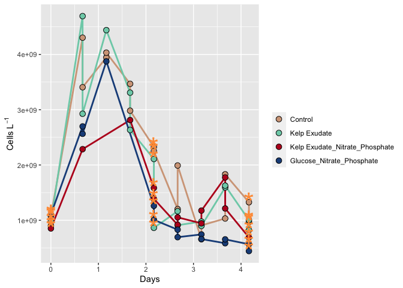
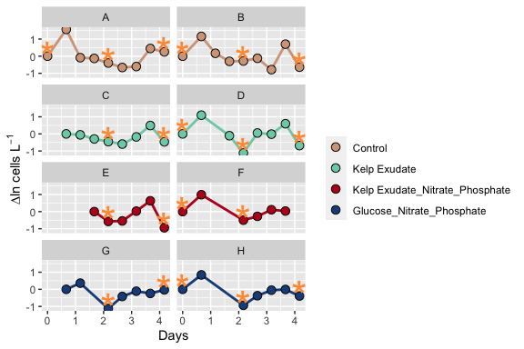
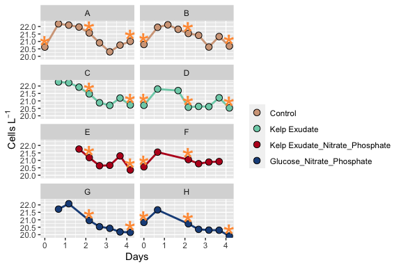

Bacterial Abundance 2021
================
Victor Trandafir
10/13/2021

# Goal

This document shows how **individual bottle** bacterial abundance data
from 2018 remineralization experiments were processed, QC’d, and
analyzed. It also provides an intro to RStudio and R Markdown.

## Intro to R Markdown

### Load packages needed to analyze our data.

``` r
library(tidyverse)
```

    ## ── Attaching packages ─────────────────────────────────────── tidyverse 1.3.1 ──

    ## ✓ ggplot2 3.3.3     ✓ purrr   0.3.4
    ## ✓ tibble  3.1.4     ✓ dplyr   1.0.7
    ## ✓ tidyr   1.1.3     ✓ stringr 1.4.0
    ## ✓ readr   1.4.0     ✓ forcats 0.5.1

    ## ── Conflicts ────────────────────────────────────────── tidyverse_conflicts() ──
    ## x dplyr::filter() masks stats::filter()
    ## x dplyr::lag()    masks stats::lag()

``` r
library(readxl)
library(lubridate)
```

    ## 
    ## Attaching package: 'lubridate'

    ## The following objects are masked from 'package:base':
    ## 
    ##     date, intersect, setdiff, union

### Import Data

``` r
excel_sheets("~/Documents/College/Fourth Year/EEMB 144L/Github/144l_students_2021/Input_Data/week4/144L_2021_BactAbund.xlsx")
```

    ## [1] "Metadata"  "FCM_Data"  "DAPI_Data"

``` r
metadata <- read_excel("~/Documents/College/Fourth Year/EEMB 144L/Github/144l_students_2021/Input_Data/week4/144L_2021_BactAbund.xlsx", sheet = "Metadata")

glimpse(metadata)
```

    ## Rows: 80
    ## Columns: 16
    ## $ Experiment           <chr> "144L_2021", "144L_2021", "144L_2021", "144L_2021…
    ## $ Location             <chr> "Goleta Pier", "Goleta Pier", "Goleta Pier", "Gol…
    ## $ Temperature          <dbl> 19, 19, 19, 19, 19, 19, 19, 19, 19, 19, 19, 19, 1…
    ## $ Depth                <dbl> 1, 1, 1, 1, 1, 1, 1, 1, 1, 1, 1, 1, 1, 1, 1, 1, 1…
    ## $ Bottle               <chr> "A", "A", "A", "A", "A", "A", "A", "A", "A", "A",…
    ## $ Timepoint            <dbl> 0, 1, 2, 3, 4, 5, 6, 7, 8, 9, 0, 1, 2, 3, 4, 5, 6…
    ## $ Treatment            <chr> "Control", "Control", "Control", "Control", "Cont…
    ## $ Target_DOC_Amendment <dbl> 0, 0, 0, 0, 0, 0, 0, 0, 0, 0, 0, 0, 0, 0, 0, 0, 0…
    ## $ Inoculum_L           <dbl> 2, 2, 2, 2, 2, 2, 2, 2, 2, 2, 2, 2, 2, 2, 2, 2, 2…
    ## $ Media_L              <dbl> 5, 5, 5, 5, 5, 5, 5, 5, 5, 5, 5, 5, 5, 5, 5, 5, 5…
    ## $ Datetime             <chr> "2021-10-04T16:00", "2021-10-05T08:00", "2021-10-…
    ## $ TOC_Sample           <lgl> TRUE, FALSE, FALSE, FALSE, TRUE, FALSE, FALSE, FA…
    ## $ Cell_Sample          <lgl> TRUE, TRUE, TRUE, TRUE, TRUE, TRUE, TRUE, TRUE, T…
    ## $ DAPI_Sample          <lgl> TRUE, FALSE, FALSE, FALSE, TRUE, FALSE, FALSE, FA…
    ## $ DNA_Sample           <lgl> TRUE, FALSE, FALSE, FALSE, TRUE, FALSE, FALSE, FA…
    ## $ Nutrient_Sample      <lgl> TRUE, FALSE, FALSE, FALSE, FALSE, FALSE, FALSE, F…

``` r
data <-  read_excel("~/Documents/College/Fourth Year/EEMB 144L/Github/144l_students_2021/Input_Data/week4/144L_2021_BactAbund.xlsx", sheet = "FCM_Data")

glimpse(data)
```

    ## Rows: 72
    ## Columns: 5
    ## $ Bottle       <chr> "A", "A", "A", "A", "A", "A", "A", "A", "A", "B", "B", "B…
    ## $ Timepoint    <dbl> 0, 1, 2, 3, 4, 5, 6, 7, 8, 0, 1, 2, 3, 4, 5, 6, 7, 8, 0, …
    ## $ all_cells_uL <chr> "901.48904752420799", "4302.9300548457404", "3944.9457004…
    ## $ LNA_cells_uL <chr> "653.047184033284", "768.27893058466896", "937.2441189022…
    ## $ HNA_cells_uL <chr> "248.441863490923", "3534.65112426107", "3007.70158156820…

``` r
joined <- left_join(metadata, data)
```

    ## Joining, by = c("Bottle", "Timepoint")

``` r
glimpse(joined)
```

    ## Rows: 80
    ## Columns: 19
    ## $ Experiment           <chr> "144L_2021", "144L_2021", "144L_2021", "144L_2021…
    ## $ Location             <chr> "Goleta Pier", "Goleta Pier", "Goleta Pier", "Gol…
    ## $ Temperature          <dbl> 19, 19, 19, 19, 19, 19, 19, 19, 19, 19, 19, 19, 1…
    ## $ Depth                <dbl> 1, 1, 1, 1, 1, 1, 1, 1, 1, 1, 1, 1, 1, 1, 1, 1, 1…
    ## $ Bottle               <chr> "A", "A", "A", "A", "A", "A", "A", "A", "A", "A",…
    ## $ Timepoint            <dbl> 0, 1, 2, 3, 4, 5, 6, 7, 8, 9, 0, 1, 2, 3, 4, 5, 6…
    ## $ Treatment            <chr> "Control", "Control", "Control", "Control", "Cont…
    ## $ Target_DOC_Amendment <dbl> 0, 0, 0, 0, 0, 0, 0, 0, 0, 0, 0, 0, 0, 0, 0, 0, 0…
    ## $ Inoculum_L           <dbl> 2, 2, 2, 2, 2, 2, 2, 2, 2, 2, 2, 2, 2, 2, 2, 2, 2…
    ## $ Media_L              <dbl> 5, 5, 5, 5, 5, 5, 5, 5, 5, 5, 5, 5, 5, 5, 5, 5, 5…
    ## $ Datetime             <chr> "2021-10-04T16:00", "2021-10-05T08:00", "2021-10-…
    ## $ TOC_Sample           <lgl> TRUE, FALSE, FALSE, FALSE, TRUE, FALSE, FALSE, FA…
    ## $ Cell_Sample          <lgl> TRUE, TRUE, TRUE, TRUE, TRUE, TRUE, TRUE, TRUE, T…
    ## $ DAPI_Sample          <lgl> TRUE, FALSE, FALSE, FALSE, TRUE, FALSE, FALSE, FA…
    ## $ DNA_Sample           <lgl> TRUE, FALSE, FALSE, FALSE, TRUE, FALSE, FALSE, FA…
    ## $ Nutrient_Sample      <lgl> TRUE, FALSE, FALSE, FALSE, FALSE, FALSE, FALSE, F…
    ## $ all_cells_uL         <chr> "901.48904752420799", "4302.9300548457404", "3944…
    ## $ LNA_cells_uL         <chr> "653.047184033284", "768.27893058466896", "937.24…
    ## $ HNA_cells_uL         <chr> "248.441863490923", "3534.65112426107", "3007.701…

### Prepare Data

Convert the ‘Datetime’ column values from characters to dates, add
columns with time elapsed for each treatment, and convert data to
cells/L to have it match with TOC data. Then, we will subset the data
for variables of interest and drop ‘NA’ values. We will use piping to
achieve this in order to write more efficient code and sequentially
manipulate data. The pipe operator ‘%\>%’ will be used.

``` r
joined$all_cells_uL <- as.numeric(joined$all_cells_uL) #Convert all_cells_uL from chr to num.
```

    ## Warning: NAs introduced by coercion

``` r
cells <- joined %>%
  mutate(Datetime = ymd_hm(Datetime),
  cells_L = all_cells_uL * 1000000) %>%
  group_by(Treatment, Bottle) %>%
  mutate(interv = interval(first(Datetime), Datetime),
         s = as.numeric(interv),
         hours = s/3600,
         days = hours/24) %>%
  ungroup() %>%
  select(Experiment:DNA_Sample, cells_L, hours, days) %>%
  drop_na(cells_L)

glimpse(cells)
```

    ## Rows: 60
    ## Columns: 18
    ## $ Experiment           <chr> "144L_2021", "144L_2021", "144L_2021", "144L_2021…
    ## $ Location             <chr> "Goleta Pier", "Goleta Pier", "Goleta Pier", "Gol…
    ## $ Temperature          <dbl> 19, 19, 19, 19, 19, 19, 19, 19, 19, 19, 19, 19, 1…
    ## $ Depth                <dbl> 1, 1, 1, 1, 1, 1, 1, 1, 1, 1, 1, 1, 1, 1, 1, 1, 1…
    ## $ Bottle               <chr> "A", "A", "A", "A", "A", "A", "A", "A", "A", "B",…
    ## $ Timepoint            <dbl> 0, 1, 2, 3, 4, 5, 6, 7, 8, 0, 1, 2, 3, 4, 5, 6, 7…
    ## $ Treatment            <chr> "Control", "Control", "Control", "Control", "Cont…
    ## $ Target_DOC_Amendment <dbl> 0, 0, 0, 0, 0, 0, 0, 0, 0, 0, 0, 0, 0, 0, 0, 0, 0…
    ## $ Inoculum_L           <dbl> 2, 2, 2, 2, 2, 2, 2, 2, 2, 2, 2, 2, 2, 2, 2, 2, 2…
    ## $ Media_L              <dbl> 5, 5, 5, 5, 5, 5, 5, 5, 5, 5, 5, 5, 5, 5, 5, 5, 5…
    ## $ Datetime             <dttm> 2021-10-04 16:00:00, 2021-10-05 08:00:00, 2021-1…
    ## $ TOC_Sample           <lgl> TRUE, FALSE, FALSE, FALSE, TRUE, FALSE, FALSE, FA…
    ## $ Cell_Sample          <lgl> TRUE, TRUE, TRUE, TRUE, TRUE, TRUE, TRUE, TRUE, T…
    ## $ DAPI_Sample          <lgl> TRUE, FALSE, FALSE, FALSE, TRUE, FALSE, FALSE, FA…
    ## $ DNA_Sample           <lgl> TRUE, FALSE, FALSE, FALSE, TRUE, FALSE, FALSE, FA…
    ## $ cells_L              <dbl> 901489048, 4302930055, 3944945700, 3467546844, 23…
    ## $ hours                <dbl> 0, 16, 28, 40, 52, 64, 76, 88, 100, 0, 16, 28, 40…
    ## $ days                 <dbl> 0.0000000, 0.6666667, 1.1666667, 1.6666667, 2.166…

\#\#\#Plot Growth Curves

Plot growth curves for each bottle using cell abundance and days data.

``` r
custom.colors <- c("Control" = "#D3A588", "Kelp Exudate" = "#7DCFB6", "Kelp Exudate_Nitrate_Phosphate" = "#BB0A21", "Glucose_Nitrate_Phosphate" = "#1D4E89")

levels <- c("Control", "Kelp Exudate", "Kelp Exudate_Nitrate_Phosphate", "Glucose_Nitrate_Phosphate")

cells %>%
  mutate(dna = ifelse(DNA_Sample == T, "*", NA)) %>%
  ggplot(aes(x = days, y = cells_L, interaction(Treatment, Bottles))) +
  geom_line(aes(color = factor(Treatment, levels = levels)), size = 1) +
  geom_point(aes(fill = factor(Treatment, levels = levels)), size = 3, color = "black", shape = 21) +
  geom_text(aes(label = dna), size = 12, color = "#FF9B42") +
  labs(x = "Days", y = expression(paste("Cells L"^-1)), fill = "") +
  guides(color = "none") +
  scale_color_manual(values = custom.colors) +
  scale_fill_manual(values = custom.colors)
```

    ## Warning: Removed 40 rows containing missing values (geom_text).

<!-- -->

### Calculations

The following values will be calculated: • Total change in cells from
initial condition to the end of the experiment. • Specific growth rate
as the slope of ln(abundance) vs time during exponential growth phase. •
Doubling time as ln(2) divided by the specific growth rate. • Mean of
each of these parameters across each treatment.

#### Identify Exponential Phase of Growth in Our Remineralization Experiment

``` r
ln_cells <- cells %>%
  group_by(Treatment, Bottle) %>%
  mutate(ln_cells = log(cells_L),
         diff_ln_cells = ln_cells - lag(ln_cells, default = first(ln_cells)))
```

#### Plot Log Transformed Data

``` r
ln_cells %>%
  mutate(dna = ifelse(DNA_Sample == T, "*", NA)) %>%
  ggplot(aes(x = days, y = diff_ln_cells, interaction(Treatment, Bottles))) +
  geom_line(aes(color = factor(Treatment, levels = levels)), size = 1) +
  geom_point(aes(fill = factor(Treatment, levels = levels)), size = 3, color = "black", shape = 21) +
  geom_text(aes(label = dna), size = 12, color = "#FF9B42") +
  labs(x = "Days", y = expression(paste("∆ln cells L"^-1)), fill = "") +
  guides(color = "none") +
  scale_color_manual(values = custom.colors) +
  scale_fill_manual(values = custom.colors) +
  facet_wrap("Bottle", ncol = 2)
```

    ## Warning: Removed 40 rows containing missing values (geom_text).

<!-- -->

For treatments A and B, exponential growth seems to be occurring between
T0-T1 and T6-T7. For C, exponential growth is seen at T6-T7. For D,
exponential growth is occurring at T0-T1 and T3-T4. For E, exponential
growth occurs between the third and fifth time points. For F,
exponential growth occurs between the first and second time points. For
G, exponential growth occurs between the third and fourth time points.
For H, exponential growth occurs between the first and second time
points.

``` r
ln_cells %>%
  mutate(dna = ifelse(DNA_Sample == T, "*", NA)) %>%
  ggplot(aes(x = days, y = ln_cells, interaction(Treatment, Bottles))) +
  geom_line(aes(color = factor(Treatment, levels = levels)), size = 1) +
  geom_point(aes(fill = factor(Treatment, levels = levels)), size = 3, color = "black", shape = 21) +
  geom_text(aes(label = dna), size = 12, color = "#FF9B42") +
  labs(x = "Days", y = expression(paste("Cells L"^-1)), fill = "") +
  guides(color = "none") +
  scale_color_manual(values = custom.colors) +
  scale_fill_manual(values = custom.colors) +
  facet_wrap("Bottle", ncol = 2)
```

    ## Warning: Removed 40 rows containing missing values (geom_text).

<!-- -->
