Abundance Data (DAPI) and TOC Custom Plots
================
Victor Trandafir
12/07/2021

# Goal

This document shows custom plots for DAPI and TOC data for my final
report.

# Import Data

``` r
#Import and re-arrange data files.

excel_sheets("~/Documents/College/Fourth Year/EEMB 144L/Github/144l_students_2021/Input_Data/week2/144L_2021_BactAbund.xlsx")
```

    ## [1] "Metadata"  "FCM_Data"  "DAPI_Data" "TOC_Data"

``` r
metadata <- read_excel("~/Documents/College/Fourth Year/EEMB 144L/Github/144l_students_2021/Input_Data/week2/144L_2021_BactAbund.xlsx", sheet = "Metadata")

glimpse(metadata)
```

    ## Rows: 80
    ## Columns: 16
    ## $ Experiment           <chr> "144L_2021", "144L_2021", "144L_2021", "144L_2021…
    ## $ Location             <chr> "Goleta Pier", "Goleta Pier", "Goleta Pier", "Gol…
    ## $ Temperature          <dbl> 19, 19, 19, 19, 19, 19, 19, 19, 19, 19, 19, 19, 1…
    ## $ Depth                <dbl> 1, 1, 1, 1, 1, 1, 1, 1, 1, 1, 1, 1, 1, 1, 1, 1, 1…
    ## $ Bottle               <chr> "A", "A", "A", "A", "A", "A", "A", "A", "A", "A",…
    ## $ Timepoint            <dbl> 0, 1, 2, 3, 4, 5, 6, 7, 8, 9, 0, 1, 2, 3, 4, 5, 6…
    ## $ Treatment            <chr> "Control", "Control", "Control", "Control", "Cont…
    ## $ Target_DOC_Amendment <dbl> 0, 0, 0, 0, 0, 0, 0, 0, 0, 0, 0, 0, 0, 0, 0, 0, 0…
    ## $ Inoculum_L           <dbl> 2, 2, 2, 2, 2, 2, 2, 2, 2, 2, 2, 2, 2, 2, 2, 2, 2…
    ## $ Media_L              <dbl> 5, 5, 5, 5, 5, 5, 5, 5, 5, 5, 5, 5, 5, 5, 5, 5, 5…
    ## $ Datetime             <chr> "2021-10-04T16:00", "2021-10-05T08:00", "2021-10-…
    ## $ TOC_Sample           <lgl> TRUE, FALSE, FALSE, FALSE, TRUE, FALSE, FALSE, FA…
    ## $ Cell_Sample          <lgl> TRUE, TRUE, TRUE, TRUE, TRUE, TRUE, TRUE, TRUE, T…
    ## $ DAPI_Sample          <lgl> TRUE, FALSE, FALSE, FALSE, TRUE, FALSE, FALSE, FA…
    ## $ DNA_Sample           <lgl> TRUE, FALSE, FALSE, FALSE, TRUE, FALSE, FALSE, FA…
    ## $ Nutrient_Sample      <lgl> TRUE, FALSE, FALSE, FALSE, FALSE, FALSE, FALSE, F…

``` r
dapi_data <- read_excel("~/Documents/College/Fourth Year/EEMB 144L/Github/144l_students_2021/Input_Data/week2/144L_2021_BactAbund.xlsx", sheet = "DAPI_Data")
glimpse(dapi_data)
```

    ## Rows: 12
    ## Columns: 6
    ## $ Treatment                <chr> "Control", "Control", "Control", "Kelp Exudat…
    ## $ Timepoint                <dbl> 0, 4, 8, 0, 4, 8, 0, 4, 8, 0, 4, 8
    ## $ Cells_mL                 <dbl> 660667.0, 919405.6, 1133869.7, 663088.1, 1043…
    ## $ Cells_mL_Stdev           <dbl> 73217.76, 363326.27, 99930.05, 113546.27, 181…
    ## $ Mean_Biovolume_um3_cell  <dbl> 0.04556209, 0.05080353, 0.04093212, 0.0387149…
    ## $ Biovolume_Stdev_um3_cell <dbl> 0.006054805, 0.011000369, 0.004684495, 0.0054…

``` r
toc_data <- read_excel("~/Documents/College/Fourth Year/EEMB 144L/Github/144l_students_2021/Input_Data/week2/144L_2021_BactAbund.xlsx", sheet = "TOC_Data")
glimpse(toc_data)
```

    ## Rows: 16
    ## Columns: 4
    ## $ Treatment <chr> "Control", "Control", "Control", "Control", "Kelp Exudate", …
    ## $ Timepoint <dbl> 0, 4, 8, 9, 0, 4, 8, 9, 0, 4, 8, 9, 0, 4, 8, 9
    ## $ Mean_uMC  <dbl> 91.70646, 89.13506, 87.79890, 84.82951, 94.82839, 89.17062, …
    ## $ Stdev_uMC <dbl> 0.28298816, 0.19207804, 0.29282962, 0.04865985, 0.30888466, …

``` r
dapi_metadata <- metadata %>%
  select(-Bottle) %>%
  unique()

joined <-  left_join(dapi_metadata, dapi_data)
```

    ## Joining, by = c("Timepoint", "Treatment")

# Prepare Data

``` r
#Transform data for analysis.

cells <- joined %>%
  mutate(Datetime = ymd_hm(Datetime),
  Cells_L = as.numeric(Cells_mL)*1000,  
  Cells_L_Stdev = as.numeric(Cells_mL_Stdev)*1000) %>%
  drop_na(Cells_L) %>%
  group_by(Treatment) %>%
  mutate(interv = interval(first(Datetime), Datetime), 
         s = as.numeric(interv), 
         hours = s/3600, 
         days = hours/24) %>%
  ungroup()
```

# Plot Growth Curves

``` r
# Set Custom Colors and Levels for plots.

trial <- c("A", "B", "C", "D", "E", "F", "G", "H")

treatment <- c("Control", "Kelp Exudate", "Kelp Exudate_Nitrate_Phosphate", "Glucose_Nitrate_Phosphate")

treatment_names <- as_labeller(c(
  "Control" = "Control",
  "Kelp Exudate" = "Kelp Exudate",
  "Kelp Exudate_Nitrate_Phosphate" = "Kelp Exudate, Nitrate, & Phosphate",
  "Glucose_Nitrate_Phosphate" = "Glucose, Nitrate, & Phosphate"
))

myColors <- brewer.pal(4, "Set2")

names(myColors) <- levels(treatment)

custom_colors <- scale_color_manual(name = "", values = myColors, labels = c("Control", "Kelp Exudate", "Kelp Exudate, Nitrate, & Phosphate", "Glucose, Nitrate, & Phosphate"))

custom_legend <- scale_fill_discrete(labels = c("Control", "Kelp Exudate", "Kelp Exudate, Nitrate, & Phosphate", "Glucose, Nitrate, & Phosphate"))

custom_fill <- scale_fill_manual(name = "", values = myColors, labels = c("Control", "Kelp Exudate", "Kelp Exudate, Nitrate, & Phosphate", "Glucose, Nitrate, & Phosphate"))
```

## Cell Abundance

``` r
#Plot cell abundance.

cells %>%
  mutate(dna = ifelse(DNA_Sample == T, "*", NA)) %>%
  ggplot(aes(x = days, y = Cells_L, color = Treatment)) +
  geom_errorbar(aes(ymin = Cells_L - Cells_L_Stdev, ymax = Cells_L + Cells_L_Stdev), width = 0.1) +
  geom_line(size = 1) +
  geom_point(size = 3) +
  labs(x = "Days", y = expression(paste("cells ", L^-1)), fill = "") +
  guides() +
  theme_classic() +
  custom_colors +
  custom_legend +
  theme(legend.position = c(0.2, 0.82))
```

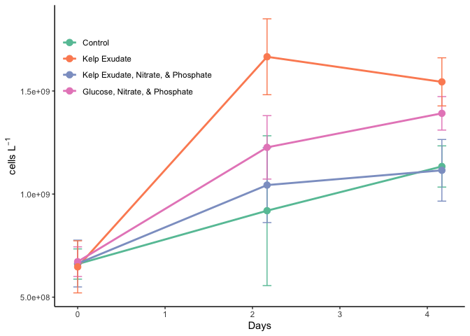<!-- -->

## Cell Biovolume

``` r
#Plot changes in cell biovolume.

cells %>%
  mutate(dna = ifelse(DNA_Sample == T, "*", NA)) %>%
  ggplot(aes(x=days, y=Mean_Biovolume_um3_cell, color = Treatment, group = Treatment)) +
  geom_errorbar(aes(ymin = Mean_Biovolume_um3_cell - Biovolume_Stdev_um3_cell, ymax = Mean_Biovolume_um3_cell + Biovolume_Stdev_um3_cell, width = 0.1)) +
  geom_line(size = 1) +
  geom_point(size = 3) +
  labs(x = "Days", y = expression(paste(mu, m^3 , cells^-1, ")")), fill = "") +
  guides() +
  theme_classic() +
  custom_colors +
  custom_legend +
  theme(legend.position = c(0.2, 0.82))
```

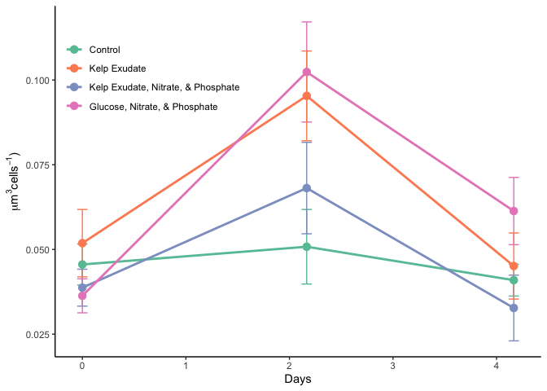<!-- -->

# Identify exponential phase of growth.

``` r
#Transform data.

ln_cells <- cells %>%
  group_by(Treatment) %>%
  mutate(ln_cells = log(Cells_L),
         diff_ln_cells = ln_cells - lag(ln_cells, default = first(ln_cells))) %>%
  ungroup()
```

``` r
#Plot transformed data.

ln_cells %>%
  ggplot(aes(x = days, y = diff_ln_cells, color = Treatment, group = Treatment)) +
  geom_line(size = 1) +
  geom_point(size = 3) +
  labs(x = "Days", y = expression(paste("∆ln(cells) ", L^-1)), fill = "") +
  guides() +
  theme_classic() +
  custom_colors +
  custom_legend +
  theme(legend.position = c(0.2, 0.9))
```

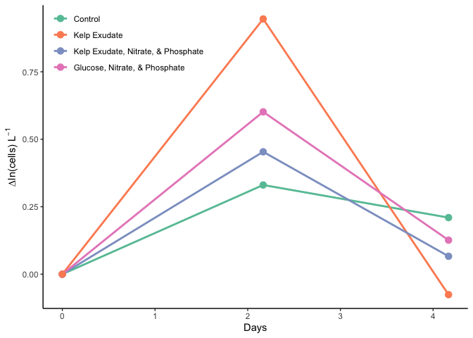<!-- -->

## Calculate growth rates, doubling times, and ∆cell abundances using cell abundance data (cells/L).

``` r
growth <- ln_cells %>% 
  mutate(exp_start = 0,
         exp_end = 4) %>% 
  group_by(Treatment) %>% 
  mutate(ln_cells_exp_start = ifelse(Timepoint == exp_start, ln_cells, NA), 
         ln_cells_exp_end = ifelse(Timepoint == exp_end, ln_cells, NA), 
         cells_exp_start = ifelse(Timepoint == exp_start, Cells_L, NA), 
         cells_exp_end = ifelse(Timepoint == exp_end, Cells_L, NA), 
         days_exp_start = ifelse(Timepoint == exp_start, days, NA), 
         days_exp_end = ifelse(Timepoint == exp_end, days, NA), ) %>% 
  fill(ln_cells_exp_start:days_exp_end, .direction = "updown") %>%
  mutate(mew = (ln_cells_exp_end - ln_cells_exp_start)/(days_exp_end - days_exp_start),
         doubling = log(2)/mew,
         delta_cells = cells_exp_end - first(Cells_L)) %>% 
  ungroup()
```

## Convert bacterial abundance & change in bacterial abundance to carbon units

Apply a carbon conversion factor (CCF) to bacterial abundances (cells
L<sup>-1</sup>) to generate bacterial carbon (µmol C L<sup>-1</sup>)

We’ll apply the average carbon content of bacterioplankton cells from
Coastal Japan (\~30 fg C cell<sup>-1</sup>), reported by [Fukuda et al.,
1998](https://aem.asm.org/content/64/9/3352). This CCF was used in
previous experiments conducted in the SBC: [James et al.,
2017](https://journals.plos.org/plosone/article?id=10.1371/journal.pone.0173145)

We will also generate our own CCFs using the biovolume data and the
equation provided by Prof. Carlson in class:

    fg C / cell = 91.7(um^3)^0.686*2.72

And use these biovolume-derived CCFs to calculate bacterial carbon, DOC
& BGEs for comparison with the same metrics calculated using a CCF of 30
fg C / cell.

``` r
#Convert the fg to umol to C/L and create our own CCF's using cell biovolume.

bactcarbon <- growth %>% 
  mutate(CCF = 30, 
        bc = Cells_L * CCF * (1/12 * 10^-9), 
        delta_bc = delta_cells * CCF * (1/12 * 10^-9), 
        biovol_CCF = 91.7*(Mean_Biovolume_um3_cell)^0.686 * 2.72, 
        biovol_bc = Cells_L * biovol_CCF * (1/12 * 10^-9), 
        biovol_bc_exp_end = ifelse(Timepoint == exp_end, biovol_bc, NA), 
        delta_biovol_bc = delta_cells * CCF * (1/12 * 10^-9)) %>% 
  group_by(Treatment) %>%
  mutate(delta_biovol_bc = biovol_bc_exp_end - first(biovol_bc)) %>%
  fill(biovol_bc_exp_end:delta_biovol_bc, .direction = "updown") %>%
  ungroup()

#Save data to CSV.

write.csv(bactcarbon, "~/Documents/College/Fourth Year/EEMB 144L/Github/144l_students_2021/Output_Data/week6/211101_dapi_data_calculations.csv")
```

# Plot

``` r
#Plot bacterial carbon.

trt_ba <- bactcarbon %>%
  ggplot(aes(x = days, y = bc, color = Treatment, group = Treatment)) +
  geom_line(size = 1) +
  geom_point(size = 3) +
  labs(x = "Days", y = expression(paste("Bacterial Carbon (", mu, "mol C ", m^-1, ")")), fill = "", color = "") +
  guides() +
  theme_classic() +
  custom_colors +
  custom_legend +
  theme(legend.position = c(0.2, 0.9))

trt_ba
```

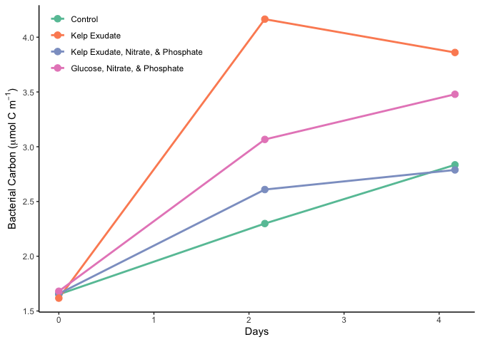<!-- -->

``` r
saveRDS(trt_ba, "~/Documents/College/Fourth Year/EEMB 144L/Github/144l_students_2021/Output_Data/week6/144L_trt_ba_plot.rds")
```

``` r
#Plot BV derived bacterial carbon.

trt_ba_biovol <- bactcarbon %>%
  ggplot(aes(x = days, y = biovol_bc, color = Treatment, group = Treatment)) +
  geom_line(size = 1) +
  geom_point(size = 3) +
  labs(x = "Days", y = expression(paste("Biovolume-Derived Bacterial Carbon ", mu, "mol C ", L^-1, ")")), fill = "", color = "") +
  guides() +
  theme_classic() +
  custom_colors +
  custom_legend +
  theme(legend.position = c(0.2, 0.9))

trt_ba_biovol
```

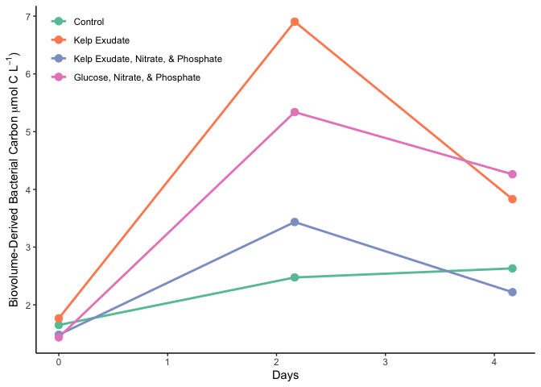<!-- -->

``` r
saveRDS(trt_ba_biovol, "~/Documents/College/Fourth Year/EEMB 144L/Github/144l_students_2021/Output_Data/week6/144L_trt_ba_biovol_plot.rds")
```

## Barplots

``` r
bar.data <- bactcarbon %>% 
  select(Treatment, mew, doubling, delta_cells) %>%
  unique()
```

``` r
#Plot specific growth rate.

mew <- bar.data %>% 
  ggplot(aes(x = Treatment, y = mew, fill = Treatment, color = Treatment)) +
  geom_bar(position = position_dodge(), stat = "identity", alpha = 1) +
  geom_errorbar(aes(ymin = ifelse(mew - sd(mew) < 0, 0, mew - sd(mew)), ymax = mew + sd(mew)), width = 0.1, color = "black") +
  labs(x = "", y = expression(paste("Specific Growth Rate (", d^-1, ")"))) +
  guides(scale = "none") +
  coord_flip() +
  theme_classic() +
  scale_x_discrete(labels = c("Control", "Kelp Exudate", "Kelp Exudate,
Nitrate, & Phosphate", "Glucose, Nitrate,
& Phosphate")) +
  theme(legend.position = "none") +
  custom_colors +
  custom_fill

mew 
```

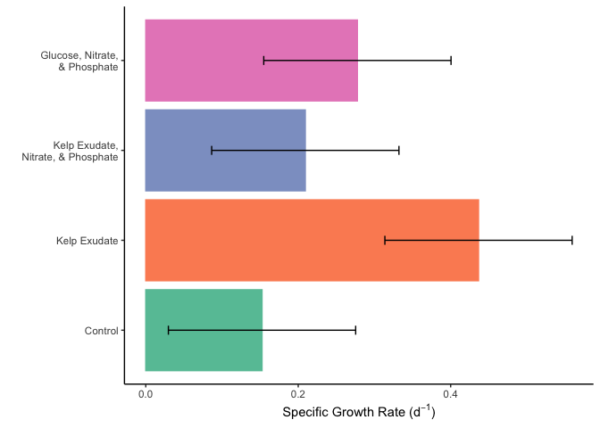<!-- -->

``` r
#Plot doubling time.

doubling <- bar.data %>% 
  ggplot(aes(x = Treatment, y = doubling, fill = Treatment, color = Treatment)) +
  geom_bar(position = position_dodge(), stat = "identity", alpha = 1) +
  geom_errorbar(aes(ymin = ifelse(doubling - sd(doubling) < 0, 0, doubling - sd(doubling)), ymax = doubling + sd(doubling)), width = 0.1, color = "black") +
  labs(x = "", y = expression(paste("Doubling Time (", d^-1, ")"))) +
  coord_flip() +
  theme_classic() +
  scale_x_discrete(labels = c("Control", "Kelp Exudate", "Kelp Exudate,
Nitrate, & Phosphate", "Glucose, Nitrate,
& Phosphate")) +
  theme(legend.position = "none") +
  custom_colors +
  custom_fill

doubling
```

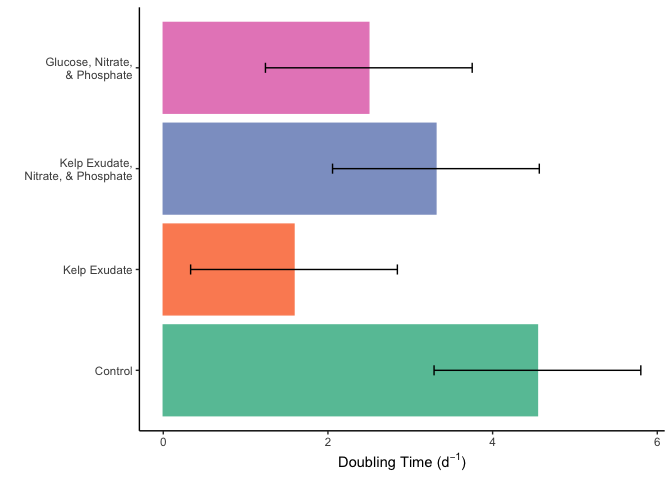<!-- -->

``` r
#Plot change in cell abundance.

delta_cells <- bar.data %>% 
  ggplot(aes(x = Treatment, y = delta_cells, fill = Treatment, color = Treatment)) +
  geom_bar(position = position_dodge(), stat = "identity", alpha = 1) +
  geom_errorbar(aes(ymin = ifelse(delta_cells - sd(delta_cells) < 0, 0, delta_cells - sd(delta_cells)), ymax = delta_cells + sd(delta_cells)), width = 0.1, color = "black") +
  labs(x = "", y = expression(paste("∆Cells (", L^-1, ")"))) +
  coord_flip() +
  theme_classic() +
  scale_x_discrete(labels = c("Control", "Kelp Exudate", "Kelp Exudate,
Nitrate, & Phosphate", "Glucose, Nitrate,
& Phosphate")) +
  theme(legend.position = "none") +
  custom_colors +
  custom_fill

delta_cells
```

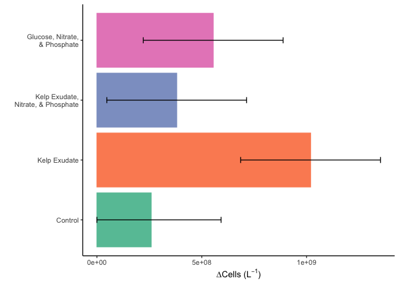<!-- -->

``` r
#Load more packages.

library(patchwork)
```

``` r
#Combine figures into one image.

delta_cells + mew + doubling + plot_annotation(tag_levels = "a") +plot_layout(ncol =1)
```

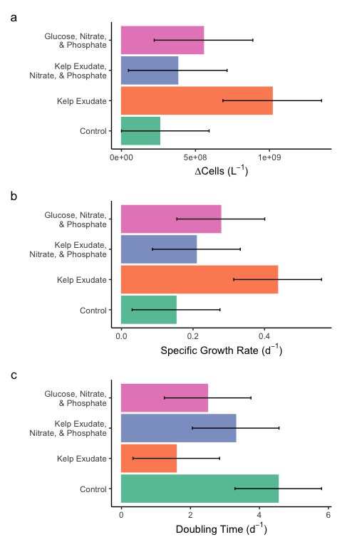<!-- -->

``` r
#Save data.

saveRDS(bactcarbon, "~/Documents/College/Fourth Year/EEMB 144L/Github/144l_students_2021/Output_Data/week6/144L_Exp_Processed_BactAbund.rds")
```

# Incorporate TOC data.

``` r
#Plot TOC data.

toc <- left_join(bactcarbon, toc_data)
```

    ## Joining, by = c("Timepoint", "Treatment")

``` r
toc %>% 
  ggplot(aes(x = days, y = Mean_uMC, group = Treatment, color = Treatment)) + 
  geom_errorbar(aes(ymin = Mean_uMC - Stdev_uMC, ymax = Mean_uMC + Stdev_uMC), width = 0.4) +
  geom_point(size = 3) +
  geom_line(size = 1) +
  labs(x = "Days", y = expression(paste("Total Organic Carbon (", mu, "mol C ", L^-1, ")"))) +
  theme_classic() +
  facet_wrap(Treatment ~ ., nrow=1, labeller = as_labeller(treatment_names)) +
  theme(legend.title = element_blank()) +
  theme(legend.position = "none") +
  custom_colors +
  custom_fill
```

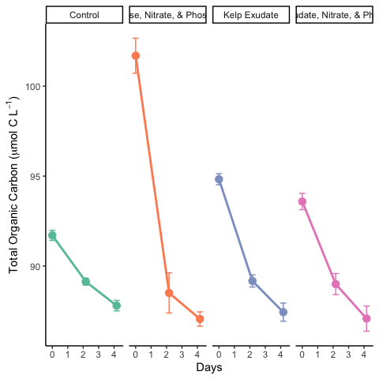<!-- -->

## Calculate DOC, ∆DOC, Bioavailable DOC Fraction, and Bacterial Growth Efficiency (BGE)

``` r
#Calculate DOC.

doc <- toc %>% 
  mutate(doc = Mean_uMC - bc, 
         doc_bv = Mean_uMC - biovol_bc) %>% 
  group_by(Treatment) %>%
  mutate(doc_exp_end = ifelse(Timepoint == exp_end, doc, NA),
         bioav_doc = (first(doc) - doc_exp_end) / first(doc),
         delta_doc = first(doc) - doc_exp_end,
         bge = ifelse(delta_doc > 1.5, delta_bc/delta_doc, NA), 
         doc_bv_exp_end = ifelse(Timepoint == exp_end, doc_bv, NA),
         bioav_doc_bv = (first(doc_bv) - doc_bv_exp_end) / first(doc_bv),
         delta_doc_bv = first(doc_bv) - doc_bv_exp_end,
         bge_bv = ifelse(delta_doc_bv > 1.5, delta_biovol_bc/delta_doc_bv, NA)) %>% 
  fill(doc_exp_end:bge_bv, .direction = "downup") %>% 
  ungroup()
```

``` r
#Plot bioavailable DOC fraction.

bioav <- doc %>% 
  ggplot(aes(x = Treatment, y =  bioav_doc, fill =Treatment, color = Treatment))  + 
  geom_bar(position = position_dodge(), stat = "identity") +
  geom_errorbar(aes(ymin = ifelse(bioav_doc - sd(bioav_doc) < 0, 0, bioav_doc - sd(bioav_doc)), ymax = bioav_doc + sd(bioav_doc)), position = position_dodge(width = 0.9), stat = "identity", width = 0.1, size = 0.5, color = "black") +
  labs(x = "", y = expression(paste("Bioavailable DOC Fraction")), color = "") +
  theme_classic() +
  coord_flip()+
  guides(scale = "none") +
  scale_x_discrete(labels = c("Control", "Kelp Exudate", "Kelp Exudate,
Nitrate, & Phosphate", "Glucose, Nitrate,
& Phosphate")) +
  theme(legend.position = "none") +
  custom_colors +
  custom_fill

bioav
```

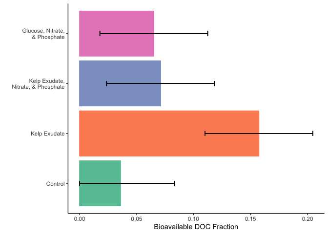<!-- -->

``` r
#Plot BV derived bioavailable DOC fraction.

bioav_bv <- doc %>% 
ggplot(aes(x = Treatment, y =  bioav_doc_bv, fill = Treatment, color = Treatment))  + 
  geom_bar(position = position_dodge(), stat = "identity") +
  geom_errorbar(aes(ymin = ifelse(bioav_doc_bv - sd(bioav_doc_bv) < 0, 0, bioav_doc_bv - sd(bioav_doc_bv)), ymax = bioav_doc_bv + sd(bioav_doc_bv)), position = position_dodge(width = 0.9), stat = "identity", width = 0.1, size = 0.5, color = "black") +
  labs(x = "", y = expression(paste("Biovolume-Derived Bioavailable DOC Fraction")), color = "") +
  theme_classic() +
  coord_flip()+
  guides(scale = "none") +
  scale_x_discrete(labels = c("Control", "Kelp Exudate", "Kelp Exudate,
Nitrate, & Phosphate", "Glucose, Nitrate,
& Phosphate")) +
  theme(legend.position = "none") +
  custom_colors +
  custom_fill

bioav_bv
```

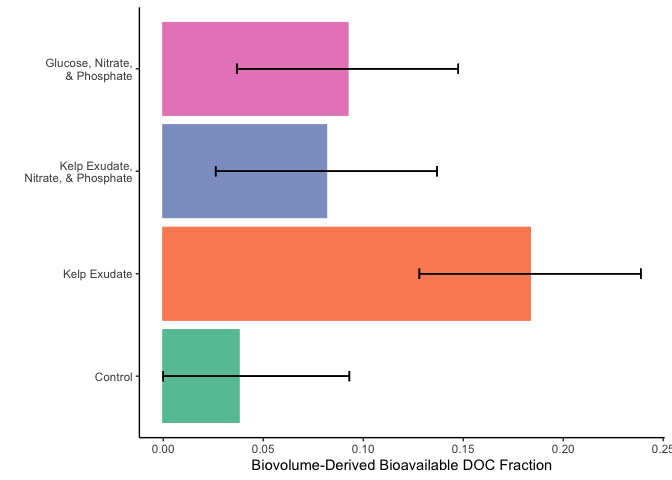<!-- -->

``` r
#Plot ∆DOC.

deldoc <- doc %>% 
ggplot(aes(x = Treatment, y =  delta_doc, color = Treatment, fill = Treatment))  + 
  geom_bar(position = position_dodge(), stat = "identity") +
  geom_errorbar(aes(ymin = ifelse(delta_doc - sd(delta_doc) < 0, 0, delta_doc - sd(delta_doc)), ymax = delta_doc + sd(delta_doc)), position = position_dodge(width = 0.9), stat = "identity", width = 0.1, size = 0.5, color = "black") +
  labs(x = "", y = expression(paste("∆DOC (µmol C ",L^-1,")")), color = "") +
  theme_classic() +
  coord_flip()+
  guides(scale = "none") +
  scale_x_discrete(labels = c("Control", "Kelp Exudate", "Kelp Exudate,
Nitrate, & Phosphate", "Glucose, Nitrate,
& Phosphate")) +
  theme(legend.position = "none") +
  custom_colors +
  custom_fill

deldoc
```

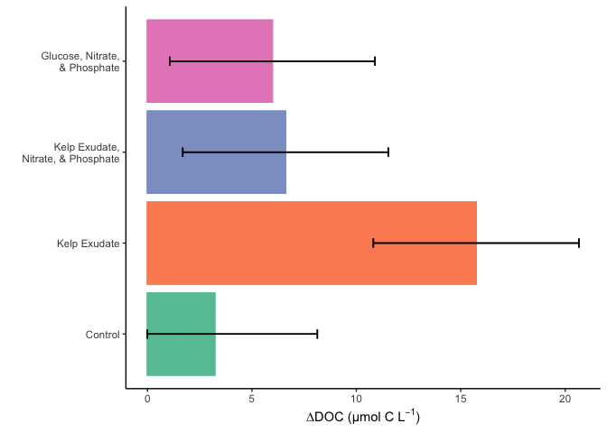<!-- -->

``` r
#Plot BV derived ∆DOC.

deldoc_bv <- doc %>% 
ggplot(aes(x = Treatment, y =  delta_doc_bv, color = Treatment, fill = Treatment))  + 
  geom_bar(position = position_dodge(), stat = "identity") +
  geom_errorbar(aes(ymin = ifelse(delta_doc_bv - sd(delta_doc_bv) < 0, 0, delta_doc_bv - sd(delta_doc_bv)), ymax = delta_doc_bv + sd(delta_doc_bv)), position = position_dodge(width = 0.9), stat = "identity", width = 0.1, size = 0.5, color = "black") +
  labs(x = "", y = expression(paste("Biovolume-Derived ∆DOC, (µmol C ", L^-1, ")")), color = "") +
  theme_classic() +
  coord_flip()+
  guides(scale = "none") +
  scale_x_discrete(labels = c("Control", "Kelp Exudate", "Kelp Exudate,
Nitrate, & Phosphate", "Glucose, Nitrate,
& Phosphate")) +
  theme(legend.position = "none") +
  custom_colors +
  custom_fill

deldoc_bv
```

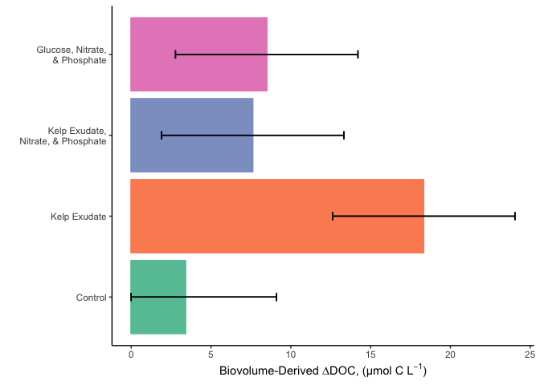<!-- -->

``` r
#Plot BGE.

bge <- doc %>% 
ggplot(aes(x = Treatment, y =  bge, color = Treatment, fill = Treatment))  + 
  geom_bar(position = position_dodge(), stat = "identity") +
  geom_errorbar(aes(ymin = ifelse(bge - sd(bge) < 0, 0, bge - sd(bge)), ymax = bge + sd(bge)), position = position_dodge(width = 0.9), stat = "identity", width = 0.1, size = 0.5, color = "black") +
  labs(x = "", y = expression(paste("Bacterial Growth Efficiency")), color = "") +
  theme_classic() +
  coord_flip()+
   guides(scale = "none") +
  scale_x_discrete(labels = c("Control", "Kelp Exudate", "Kelp Exudate,
Nitrate, & Phosphate", "Glucose, Nitrate,
& Phosphate")) +
  theme(legend.position = "none") +
  custom_colors +
  custom_fill

bge
```

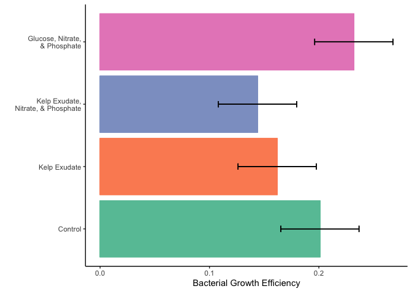<!-- -->

``` r
#Plot BV derived BGE.

bge_bv <- doc %>% 
ggplot(aes(x = Treatment, y =  bge_bv, color = Treatment, fill = Treatment))  +
  geom_bar(position = position_dodge(), stat = "identity") +
  geom_errorbar(aes(ymin = ifelse(bge_bv - sd(bge_bv) < 0, 0, bge_bv - sd(bge_bv)), ymax = bge_bv + sd(bge_bv)), position = position_dodge(width = 0.9), stat = "identity", width = 0.1, size = 0.5, color = "black") +
  labs(x = "", y = expression(paste("Biovolume-Derived Bacterial Growth Efficiency")), color = "") +
  theme_classic() +
  coord_flip()+
  guides(scale = "none") +
  scale_x_discrete(labels = c("Control", "Kelp Exudate", "Kelp Exudate,
Nitrate, & Phosphate", "Glucose, Nitrate,
& Phosphate")) +
  theme(legend.position = "none") +
  custom_colors +
  custom_fill

bge_bv
```

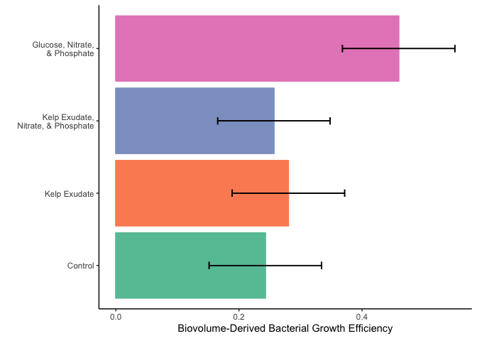<!-- -->

``` r
#Combine bar plots into one image.

deldoc / deldoc_bv / bioav / bioav_bv / bge / bge_bv + plot_annotation(tag_levels = "a") + plot_layout(ncol = 2)
```

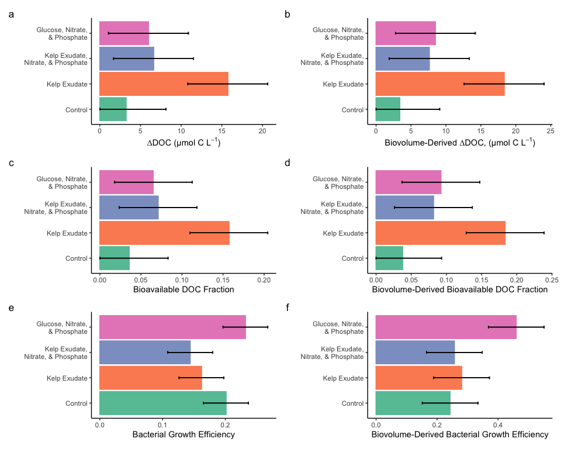<!-- -->
