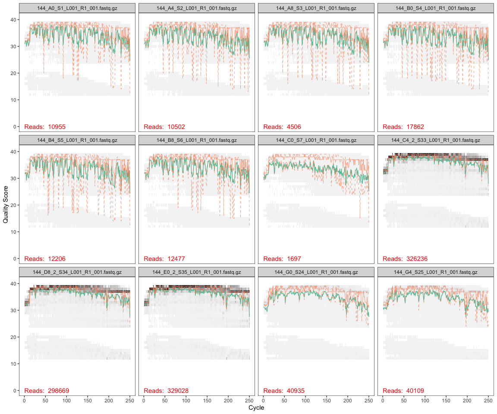
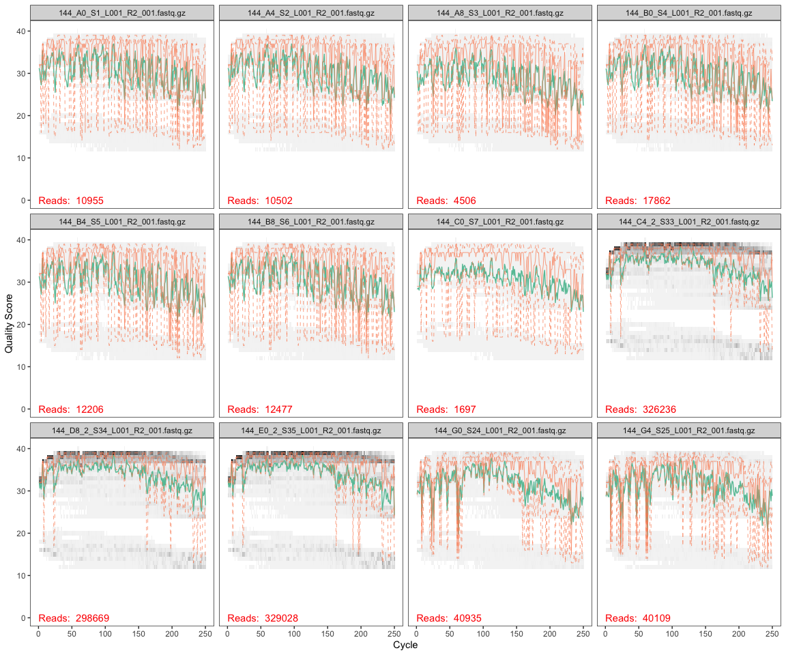
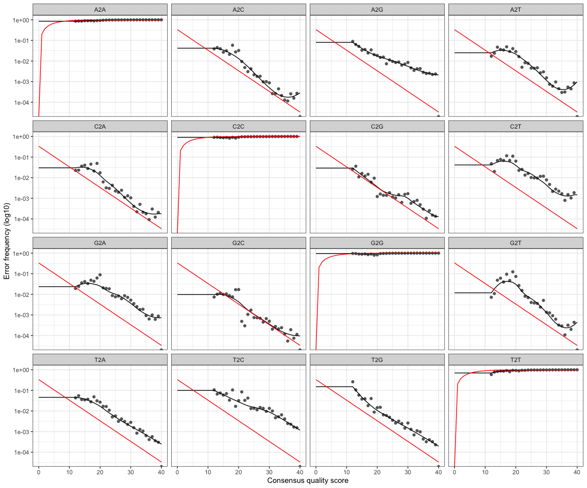
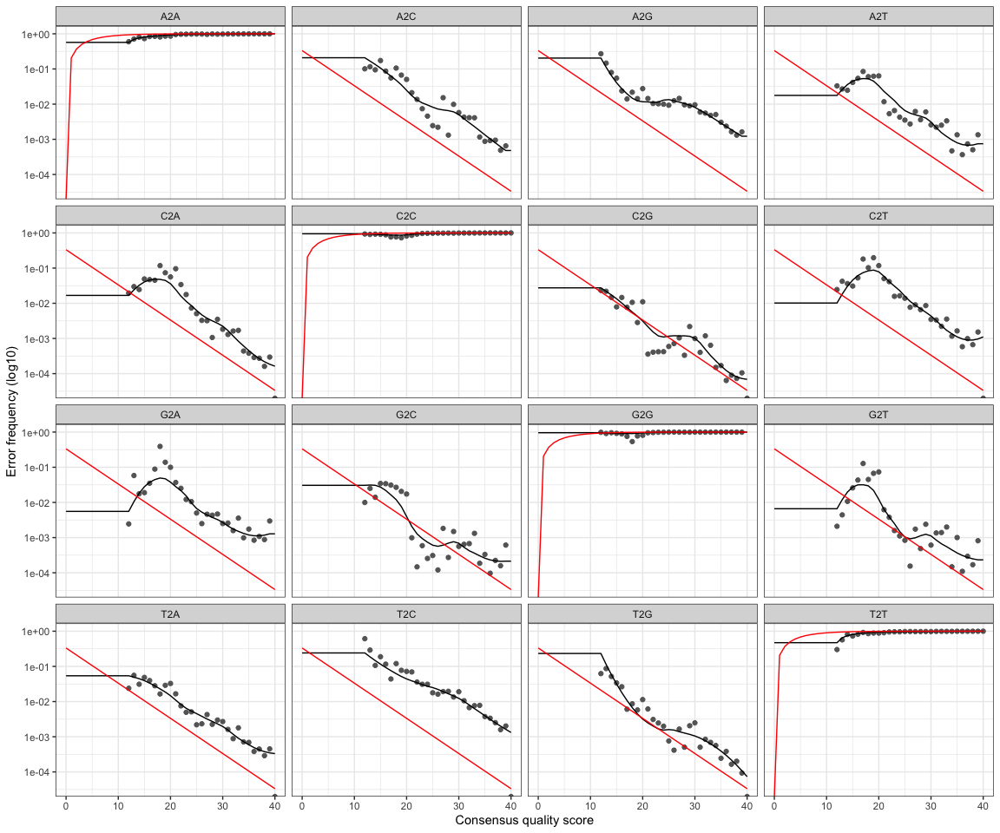

2021 DADA2
================
Victor Trandafir
11/22/2021

This script processes trimmed (w/o primers) sequences through the [DADA2
(1.18) pipeline](https://benjjneb.github.io/dada2/tutorial.html).

# Install and load DADA2 and Shortread from Bioconductor

uncomment (remove the #’s preceding each line of code) the following
code to install the required packages. This may take a few minutes.

``` r
#if (!requireNamespace("BiocManager", quietly = TRUE))
#    install.packages("BiocManager")
#BiocManager::install("dada2", version = '3.14')
#BiocManager::install("ShortRead")
```

# Load packages

``` r
library(tidyverse)
library(dada2)
library(ShortRead)
```

# Import data

You will need to download your sequences from the [shared google
drive](https://drive.google.com/drive/folders/1kmLhML2Sanv0gE8RnxpcyNEcrhan-Q2h?usp=sharing)
to a folder in your repository. Because this folder will then contain a
lot of data (over the limit for pushing to the GitHub server), you’ll
want to have your commits ignore the addition and any changes to that
folder. THIS IS IMPORTANT. You can modify the .gitignore file in your
repository by:

-clicking on the .gitignore file to open it in R Studio if you can see
it in the “Files” tab of RStudio (the bottom right pane where you can
navigate around inside your 144L repository)

OR by:  
- revealing hidden files (command + shift + . on a mac and in
[windows](https://support.microsoft.com/en-us/help/4028316/windows-view-hidden-files-and-folders-in-windows-10),
open *file explorer*, select *view \> options \> change folder* and
*search options*, select *view* and in *advanced setting*, select *show
hidden files, folders, and drives* ) - open the .gitignore file
(textedit on a mac and notepad in widows) - add the name of the folder
containing the fastq (sequence) files to the .gitignore file, save, and
close

``` r
#save the path to the directory with a COPY of your unzipped fastq files that you WILL work with. MAKE SURE YOU HAVE ANOTHER DIRECTORY WITH THE FILES THAT YOU WILL NEVER DIRECTLY WORK WITH. 

path <- "~/Documents/College/Fourth Year/EEMB 144L/Github/144l_students_2021/Input_Data/week9/Kelp_Remin_fastq_copy" 
#make sure there is no / at the end of the path
#also make sure there are no unzipped files in this directory

#store the names of fwd and rv files as lists
fnFs <- list.files(path, pattern = "_R1_001.fastq", full.names = TRUE)
fnRs <- list.files(path, pattern = "_R2_001.fastq", full.names = TRUE)
```

# Retrieve orientation of primers

This part stores all the orientations of the V4 514F-Y and 806RB primers
( [see Apprill et al.,
2015](http://www.int-res.com/articles/ame_oa/a075p129.pdf)), so that we
can look for them when we want to trim them out.

``` r
FWD = "GTGYCAGCMGCCGCGGTAA"
REV = "GGACTACNVGGGTWTCTAAT"

#now store all orientations of fwd and rvs primers 
allOrients <- function(primer) {
  # Biostrings works w/ DNAString objects rather than character vectors
  require(Biostrings)
  dna <- DNAString(primer)
  orients <- c(Forward = dna, Complement = complement(dna), Reverse = reverse(dna), 
              RevComp = reverseComplement(dna))
  #Convert back to character vector
  return(sapply(orients, toString))
  }
  
#Store the fwd and rvs orientations separately 
FWD.orients <- allOrients(FWD)
REV.orients <- allOrients(REV)

#view the orientations of the primers
FWD.orients
```

    ##               Forward            Complement               Reverse 
    ## "GTGYCAGCMGCCGCGGTAA" "CACRGTCGKCGGCGCCATT" "AATGGCGCCGMCGACYGTG" 
    ##               RevComp 
    ## "TTACCGCGGCKGCTGRCAC"

``` r
REV.orients
```

    ##                Forward             Complement                Reverse 
    ## "GGACTACNVGGGTWTCTAAT" "CCTGATGNBCCCAWAGATTA" "TAATCTWTGGGVNCATCAGG" 
    ##                RevComp 
    ## "ATTAGAWACCCBNGTAGTCC"

#search for Primers

``` r
primerHits <- function(primer, fn) {
  #Counts number of reads in which the primer is found
  nhits <- vcountPattern(primer, sread(readFastq(fn)), fixed = FALSE)
  return(sum(nhits >0))
}
rbind(FWD.ForwardReads = sapply(FWD.orients, primerHits, fn = fnFs[[1]]), 
      FWD.ReverseReads = sapply(FWD.orients, primerHits, fn = fnRs[[1]]), 
      REV.ForwardReads = sapply(REV.orients, primerHits, fn = fnFs[[1]]), 
      REV.ReverseReads = sapply(REV.orients, primerHits, fn = fnRs[[1]]))
```

    ##                  Forward Complement Reverse RevComp
    ## FWD.ForwardReads       0          0       0       0
    ## FWD.ReverseReads       0          0       0       1
    ## REV.ForwardReads       0          0       0       1
    ## REV.ReverseReads       0          0       0       0

# Insepct read quality profiles

You should look at least some of the quality profiles to assess the
quality of the sequencing run.

## Forward reads

``` r
plotQualityProfile(fnFs[1:12])
```

    ## Warning: `guides(<scale> = FALSE)` is deprecated. Please use `guides(<scale> =
    ## "none")` instead.

<!-- -->

# Reverse reads

``` r
plotQualityProfile(fnRs[1:12])
```

    ## Warning: `guides(<scale> = FALSE)` is deprecated. Please use `guides(<scale> =
    ## "none")` instead.

<!-- -->

# Filtering and Trimming

``` r
#Get the sample names
#define the basename of the fnFs as the first part of each fastq file name until "_L"
#apply this to all samples
sample.names <- sapply(strsplit(basename(fnFs), "_L"), `[`, 1)
sample.names
```

    ##  [1] "144_A0_S1"    "144_A4_S2"    "144_A8_S3"    "144_B0_S4"    "144_B4_S5"   
    ##  [6] "144_B8_S6"    "144_C0_S7"    "144_C4_2_S33" "144_D8_2_S34" "144_E0_2_S35"
    ## [11] "144_G0_S24"   "144_G4_S25"   "144_G8_S26"   "144_H0_S27"   "144_H4_S28"  
    ## [16] "144_H8_S29"

``` r
#created a "filtered" folder in the working directory as a place to put all the new filtered fastQ files. 
filt_path <- file.path(path, "filtered")
#add the appropriate designation string to any new files made that will be put into the "filtered" folder
filtFs <- file.path(filt_path, paste0(sample.names, "_F_filt.fastq"))
filtRs <- file.path(filt_path, paste0(sample.names, "_R_filt.fastq"))
```

Below is the actual filtering step. We’re using standard filtering
parameters. 1. dada2 generally advises trimming the last few nucleotides
for weird sequencing errors that can pop up there. 2. maxEE is the max
number of expected errors (calculated from Q’s) to allow in each read.
This is a probability calculation. 3. minQ is threshold Q - and read
with a Q \< minQ after truncating reads get discarded. This isn’t that
important for 16S.

``` r
out <- filterAndTrim(fnFs, filtFs, fnRs, filtRs, truncLen = c(240, 150), maxN = 0, maxEE = c(2,2), truncQ = 2, rm.phix = TRUE, compress = TRUE)
#look at this output. This tells you how many reads were removed. 
out <- transform(out, percent_retained = ((reads.out/reads.in)*100)) #Add column to out with the percent retained for each read.
out
```

    ##                                   reads.in reads.out percent_retained
    ## 144_A0_S1_L001_R1_001.fastq.gz       10955      9112         83.17663
    ## 144_A4_S2_L001_R1_001.fastq.gz       10502      8124         77.35669
    ## 144_A8_S3_L001_R1_001.fastq.gz        4506      3220         71.46028
    ## 144_B0_S4_L001_R1_001.fastq.gz       17862     13583         76.04412
    ## 144_B4_S5_L001_R1_001.fastq.gz       12206      9589         78.55972
    ## 144_B8_S6_L001_R1_001.fastq.gz       12477     10322         82.72822
    ## 144_C0_S7_L001_R1_001.fastq.gz        1697      1166         68.70949
    ## 144_C4_2_S33_L001_R1_001.fastq.gz   326236    311641         95.52624
    ## 144_D8_2_S34_L001_R1_001.fastq.gz   298669    282860         94.70685
    ## 144_E0_2_S35_L001_R1_001.fastq.gz   329028    314579         95.60858
    ## 144_G0_S24_L001_R1_001.fastq.gz      40935     36168         88.35471
    ## 144_G4_S25_L001_R1_001.fastq.gz      40109     35236         87.85061
    ## 144_G8_S26_L001_R1_001.fastq.gz      35610     31788         89.26706
    ## 144_H0_S27_L001_R1_001.fastq.gz      63711     57388         90.07550
    ## 144_H4_S28_L001_R1_001.fastq.gz      27892     24291         87.08949
    ## 144_H8_S29_L001_R1_001.fastq.gz      36860     32338         87.73196

``` r
mean(out$percent_retained) #Calculate average retention for all reads.
```

    ## [1] 84.64038

# Learn the error rates

``` r
errF <- learnErrors(filtFs, multithread = TRUE)
```

    ## 155908080 total bases in 649617 reads from 9 samples will be used for learning the error rates.

``` r
errR <- learnErrors(filtRs, multithread = TRUE)
```

    ## 144629400 total bases in 964196 reads from 10 samples will be used for learning the error rates.

This took \~20 seconds each on a 2021 MacBook Pro.

This dada2 algorithm makes use of a parametric error model (err) as
every amplicon dataset has a different set of error rates. This is what
dada2 is all about. The step creates the parameters for designating
unique sequences.

Each sequence has an x number of reads. dada2 uses the numbers of reads
per sequence as well as the q-score to build this model. This algorithm
assumes that your most abundant sequence is “real” (the true sequence
for a particular organism). There is a very high probability that it is.

What the algorithm does is look at each base pair of an individual
sequence and calculate the probability that the base pair is an error
based on the quality score of the read and the sequence of your most
abundant read. It also does this for the second most abundant sequence,
etc. etc. hence the message “convergence after x rounds” after running
the algorithm.





# Dereplication

This is another big thing that dada2 does. It combines all identical
sequences into one unique sequence, keeping track of the number of
identical sequences.

``` r
derepFs <- derepFastq(filtFs, verbose = TRUE)
```

    ## Dereplicating sequence entries in Fastq file: ~/Documents/College/Fourth Year/EEMB 144L/Github/144l_students_2021/Input_Data/week9/Kelp_Remin_fastq_copy/filtered/144_A0_S1_F_filt.fastq

    ## Encountered 6849 unique sequences from 9112 total sequences read.

    ## Dereplicating sequence entries in Fastq file: ~/Documents/College/Fourth Year/EEMB 144L/Github/144l_students_2021/Input_Data/week9/Kelp_Remin_fastq_copy/filtered/144_A4_S2_F_filt.fastq

    ## Encountered 6442 unique sequences from 8124 total sequences read.

    ## Dereplicating sequence entries in Fastq file: ~/Documents/College/Fourth Year/EEMB 144L/Github/144l_students_2021/Input_Data/week9/Kelp_Remin_fastq_copy/filtered/144_A8_S3_F_filt.fastq

    ## Encountered 2718 unique sequences from 3220 total sequences read.

    ## Dereplicating sequence entries in Fastq file: ~/Documents/College/Fourth Year/EEMB 144L/Github/144l_students_2021/Input_Data/week9/Kelp_Remin_fastq_copy/filtered/144_B0_S4_F_filt.fastq

    ## Encountered 10336 unique sequences from 13583 total sequences read.

    ## Dereplicating sequence entries in Fastq file: ~/Documents/College/Fourth Year/EEMB 144L/Github/144l_students_2021/Input_Data/week9/Kelp_Remin_fastq_copy/filtered/144_B4_S5_F_filt.fastq

    ## Encountered 6917 unique sequences from 9589 total sequences read.

    ## Dereplicating sequence entries in Fastq file: ~/Documents/College/Fourth Year/EEMB 144L/Github/144l_students_2021/Input_Data/week9/Kelp_Remin_fastq_copy/filtered/144_B8_S6_F_filt.fastq

    ## Encountered 6872 unique sequences from 10322 total sequences read.

    ## Dereplicating sequence entries in Fastq file: ~/Documents/College/Fourth Year/EEMB 144L/Github/144l_students_2021/Input_Data/week9/Kelp_Remin_fastq_copy/filtered/144_C0_S7_F_filt.fastq

    ## Encountered 885 unique sequences from 1166 total sequences read.

    ## Dereplicating sequence entries in Fastq file: ~/Documents/College/Fourth Year/EEMB 144L/Github/144l_students_2021/Input_Data/week9/Kelp_Remin_fastq_copy/filtered/144_C4_2_S33_F_filt.fastq

    ## Encountered 75469 unique sequences from 311641 total sequences read.

    ## Dereplicating sequence entries in Fastq file: ~/Documents/College/Fourth Year/EEMB 144L/Github/144l_students_2021/Input_Data/week9/Kelp_Remin_fastq_copy/filtered/144_D8_2_S34_F_filt.fastq

    ## Encountered 66946 unique sequences from 282860 total sequences read.

    ## Dereplicating sequence entries in Fastq file: ~/Documents/College/Fourth Year/EEMB 144L/Github/144l_students_2021/Input_Data/week9/Kelp_Remin_fastq_copy/filtered/144_E0_2_S35_F_filt.fastq

    ## Encountered 71204 unique sequences from 314579 total sequences read.

    ## Dereplicating sequence entries in Fastq file: ~/Documents/College/Fourth Year/EEMB 144L/Github/144l_students_2021/Input_Data/week9/Kelp_Remin_fastq_copy/filtered/144_G0_S24_F_filt.fastq

    ## Encountered 10822 unique sequences from 36168 total sequences read.

    ## Dereplicating sequence entries in Fastq file: ~/Documents/College/Fourth Year/EEMB 144L/Github/144l_students_2021/Input_Data/week9/Kelp_Remin_fastq_copy/filtered/144_G4_S25_F_filt.fastq

    ## Encountered 8483 unique sequences from 35236 total sequences read.

    ## Dereplicating sequence entries in Fastq file: ~/Documents/College/Fourth Year/EEMB 144L/Github/144l_students_2021/Input_Data/week9/Kelp_Remin_fastq_copy/filtered/144_G8_S26_F_filt.fastq

    ## Encountered 8503 unique sequences from 31788 total sequences read.

    ## Dereplicating sequence entries in Fastq file: ~/Documents/College/Fourth Year/EEMB 144L/Github/144l_students_2021/Input_Data/week9/Kelp_Remin_fastq_copy/filtered/144_H0_S27_F_filt.fastq

    ## Encountered 15044 unique sequences from 57388 total sequences read.

    ## Dereplicating sequence entries in Fastq file: ~/Documents/College/Fourth Year/EEMB 144L/Github/144l_students_2021/Input_Data/week9/Kelp_Remin_fastq_copy/filtered/144_H4_S28_F_filt.fastq

    ## Encountered 5919 unique sequences from 24291 total sequences read.

    ## Dereplicating sequence entries in Fastq file: ~/Documents/College/Fourth Year/EEMB 144L/Github/144l_students_2021/Input_Data/week9/Kelp_Remin_fastq_copy/filtered/144_H8_S29_F_filt.fastq

    ## Encountered 9702 unique sequences from 32338 total sequences read.

``` r
derepRs <- derepFastq(filtRs, verbose = TRUE)
```

    ## Dereplicating sequence entries in Fastq file: ~/Documents/College/Fourth Year/EEMB 144L/Github/144l_students_2021/Input_Data/week9/Kelp_Remin_fastq_copy/filtered/144_A0_S1_R_filt.fastq

    ## Encountered 7544 unique sequences from 9112 total sequences read.

    ## Dereplicating sequence entries in Fastq file: ~/Documents/College/Fourth Year/EEMB 144L/Github/144l_students_2021/Input_Data/week9/Kelp_Remin_fastq_copy/filtered/144_A4_S2_R_filt.fastq

    ## Encountered 6859 unique sequences from 8124 total sequences read.

    ## Dereplicating sequence entries in Fastq file: ~/Documents/College/Fourth Year/EEMB 144L/Github/144l_students_2021/Input_Data/week9/Kelp_Remin_fastq_copy/filtered/144_A8_S3_R_filt.fastq

    ## Encountered 2941 unique sequences from 3220 total sequences read.

    ## Dereplicating sequence entries in Fastq file: ~/Documents/College/Fourth Year/EEMB 144L/Github/144l_students_2021/Input_Data/week9/Kelp_Remin_fastq_copy/filtered/144_B0_S4_R_filt.fastq

    ## Encountered 11786 unique sequences from 13583 total sequences read.

    ## Dereplicating sequence entries in Fastq file: ~/Documents/College/Fourth Year/EEMB 144L/Github/144l_students_2021/Input_Data/week9/Kelp_Remin_fastq_copy/filtered/144_B4_S5_R_filt.fastq

    ## Encountered 7882 unique sequences from 9589 total sequences read.

    ## Dereplicating sequence entries in Fastq file: ~/Documents/College/Fourth Year/EEMB 144L/Github/144l_students_2021/Input_Data/week9/Kelp_Remin_fastq_copy/filtered/144_B8_S6_R_filt.fastq

    ## Encountered 8371 unique sequences from 10322 total sequences read.

    ## Dereplicating sequence entries in Fastq file: ~/Documents/College/Fourth Year/EEMB 144L/Github/144l_students_2021/Input_Data/week9/Kelp_Remin_fastq_copy/filtered/144_C0_S7_R_filt.fastq

    ## Encountered 882 unique sequences from 1166 total sequences read.

    ## Dereplicating sequence entries in Fastq file: ~/Documents/College/Fourth Year/EEMB 144L/Github/144l_students_2021/Input_Data/week9/Kelp_Remin_fastq_copy/filtered/144_C4_2_S33_R_filt.fastq

    ## Encountered 83078 unique sequences from 311641 total sequences read.

    ## Dereplicating sequence entries in Fastq file: ~/Documents/College/Fourth Year/EEMB 144L/Github/144l_students_2021/Input_Data/week9/Kelp_Remin_fastq_copy/filtered/144_D8_2_S34_R_filt.fastq

    ## Encountered 70371 unique sequences from 282860 total sequences read.

    ## Dereplicating sequence entries in Fastq file: ~/Documents/College/Fourth Year/EEMB 144L/Github/144l_students_2021/Input_Data/week9/Kelp_Remin_fastq_copy/filtered/144_E0_2_S35_R_filt.fastq

    ## Encountered 74371 unique sequences from 314579 total sequences read.

    ## Dereplicating sequence entries in Fastq file: ~/Documents/College/Fourth Year/EEMB 144L/Github/144l_students_2021/Input_Data/week9/Kelp_Remin_fastq_copy/filtered/144_G0_S24_R_filt.fastq

    ## Encountered 13092 unique sequences from 36168 total sequences read.

    ## Dereplicating sequence entries in Fastq file: ~/Documents/College/Fourth Year/EEMB 144L/Github/144l_students_2021/Input_Data/week9/Kelp_Remin_fastq_copy/filtered/144_G4_S25_R_filt.fastq

    ## Encountered 11615 unique sequences from 35236 total sequences read.

    ## Dereplicating sequence entries in Fastq file: ~/Documents/College/Fourth Year/EEMB 144L/Github/144l_students_2021/Input_Data/week9/Kelp_Remin_fastq_copy/filtered/144_G8_S26_R_filt.fastq

    ## Encountered 10202 unique sequences from 31788 total sequences read.

    ## Dereplicating sequence entries in Fastq file: ~/Documents/College/Fourth Year/EEMB 144L/Github/144l_students_2021/Input_Data/week9/Kelp_Remin_fastq_copy/filtered/144_H0_S27_R_filt.fastq

    ## Encountered 19510 unique sequences from 57388 total sequences read.

    ## Dereplicating sequence entries in Fastq file: ~/Documents/College/Fourth Year/EEMB 144L/Github/144l_students_2021/Input_Data/week9/Kelp_Remin_fastq_copy/filtered/144_H4_S28_R_filt.fastq

    ## Encountered 9788 unique sequences from 24291 total sequences read.

    ## Dereplicating sequence entries in Fastq file: ~/Documents/College/Fourth Year/EEMB 144L/Github/144l_students_2021/Input_Data/week9/Kelp_Remin_fastq_copy/filtered/144_H8_S29_R_filt.fastq

    ## Encountered 11301 unique sequences from 32338 total sequences read.

``` r
# Name the derep-class objects by the sample names 
names(derepFs) <- sample.names
names(derepRs) <- sample.names
```

# Infer sequence variants

Apply the core dada2 sample inference algorithm to the dereplicated
data.

Infer the sequence variants in each sample, taking out the sequence
variants that have excessive error rates.

So here, we are applying the error models to the data. Before, the error
models were run using a subset of the data (parameterizing). Now, we’re
using the parameters of the model and applying it to the whole data set
to see which sequences are real and which are not.

``` r
dadaFs <- dada(derepFs, err = errF, multithread = TRUE)
```

    ## Sample 1 - 9112 reads in 6849 unique sequences.
    ## Sample 2 - 8124 reads in 6442 unique sequences.
    ## Sample 3 - 3220 reads in 2718 unique sequences.
    ## Sample 4 - 13583 reads in 10336 unique sequences.
    ## Sample 5 - 9589 reads in 6917 unique sequences.
    ## Sample 6 - 10322 reads in 6872 unique sequences.
    ## Sample 7 - 1166 reads in 885 unique sequences.
    ## Sample 8 - 311641 reads in 75469 unique sequences.
    ## Sample 9 - 282860 reads in 66946 unique sequences.
    ## Sample 10 - 314579 reads in 71204 unique sequences.
    ## Sample 11 - 36168 reads in 10822 unique sequences.
    ## Sample 12 - 35236 reads in 8483 unique sequences.
    ## Sample 13 - 31788 reads in 8503 unique sequences.
    ## Sample 14 - 57388 reads in 15044 unique sequences.
    ## Sample 15 - 24291 reads in 5919 unique sequences.
    ## Sample 16 - 32338 reads in 9702 unique sequences.

``` r
dadaRs <- dada(derepRs, err = errR, multithread = TRUE)
```

    ## Sample 1 - 9112 reads in 7544 unique sequences.
    ## Sample 2 - 8124 reads in 6859 unique sequences.
    ## Sample 3 - 3220 reads in 2941 unique sequences.
    ## Sample 4 - 13583 reads in 11786 unique sequences.
    ## Sample 5 - 9589 reads in 7882 unique sequences.
    ## Sample 6 - 10322 reads in 8371 unique sequences.
    ## Sample 7 - 1166 reads in 882 unique sequences.
    ## Sample 8 - 311641 reads in 83078 unique sequences.
    ## Sample 9 - 282860 reads in 70371 unique sequences.
    ## Sample 10 - 314579 reads in 74371 unique sequences.
    ## Sample 11 - 36168 reads in 13092 unique sequences.
    ## Sample 12 - 35236 reads in 11615 unique sequences.
    ## Sample 13 - 31788 reads in 10202 unique sequences.
    ## Sample 14 - 57388 reads in 19510 unique sequences.
    ## Sample 15 - 24291 reads in 9788 unique sequences.
    ## Sample 16 - 32338 reads in 11301 unique sequences.

merge the overlapping reads -> this will also decrease the number of
sequence variants. If you above had hits of the reverse complement in
the FWD.ReverseReads and the REV.ForwardReads, you can trim here by
adding trimOverhang = T.

``` r
mergers <- mergePairs(dadaFs, derepFs, dadaRs, derepRs, verbose = TRUE, trimOverhang = T)
```

    ## 7328 paired-reads (in 22 unique pairings) successfully merged out of 8217 (in 225 pairings) input.

    ## 6547 paired-reads (in 22 unique pairings) successfully merged out of 7175 (in 219 pairings) input.

    ## 1744 paired-reads (in 10 unique pairings) successfully merged out of 2471 (in 126 pairings) input.

    ## 8482 paired-reads (in 65 unique pairings) successfully merged out of 11735 (in 1115 pairings) input.

    ## 6666 paired-reads (in 59 unique pairings) successfully merged out of 8503 (in 668 pairings) input.

    ## 7145 paired-reads (in 51 unique pairings) successfully merged out of 9263 (in 743 pairings) input.

    ## 530 paired-reads (in 37 unique pairings) successfully merged out of 813 (in 93 pairings) input.

    ## 291343 paired-reads (in 547 unique pairings) successfully merged out of 308334 (in 2587 pairings) input.

    ## 267782 paired-reads (in 400 unique pairings) successfully merged out of 281155 (in 1558 pairings) input.

    ## 292389 paired-reads (in 509 unique pairings) successfully merged out of 312279 (in 2010 pairings) input.

    ## 30153 paired-reads (in 189 unique pairings) successfully merged out of 35599 (in 405 pairings) input.

    ## 32819 paired-reads (in 124 unique pairings) successfully merged out of 34822 (in 339 pairings) input.

    ## 29087 paired-reads (in 142 unique pairings) successfully merged out of 31490 (in 296 pairings) input.

    ## 40598 paired-reads (in 238 unique pairings) successfully merged out of 56677 (in 597 pairings) input.

    ## 22804 paired-reads (in 108 unique pairings) successfully merged out of 23905 (in 277 pairings) input.

    ## 28274 paired-reads (in 147 unique pairings) successfully merged out of 31973 (in 303 pairings) input.

inspect the merged data frame from the first sample. this will output a
table. the numbers in the forward and reverse columns tell where those
sequences are in the dadaFs and dadaRs files.

``` r
head(mergers[[1]])
```

    ##                                                                                                                                                                                                                                                        sequence
    ## 1 TACGAAGGGACCTAGCGTAGTTCGGAATTACTGGGCTTAAAGAGTTCGTAGGTGGTTGAAAAAGTTGGTGGTGAAATCCCAGAGCTTAACTCTGGAACTGCCATCAAAACTTTTCAGCTAGAGTTTGATAGAGGAAAGCAGAATTTCTAGTGTAGAGGTGAAATTCGTAGATATTAGAAAGAATACCAATTGCGAAGGCAGCTTTCTGGATCATTACTGACACTGAGGAACGAAAGCATGGGTAGCGAAGAGG
    ## 2 TACGGAGGGTCCGAGCGTTATCCGGAATCATTGGGTTTAAAGGGTCCGCAGGCGGTCAATTAAGTCAGAGGTGAAATCCCATAGCTCAACTATGGAACTGCCTTTGATACTGGTTGACTTGAGTCATATGGAAGTAGATAGAATGTGTAGTGTAGCGGTGAAATGCATAGATATTACACAGAATACCGATTGCGAAGGCAGTCTACTACGTATGTACTGACGCTGAGGGACGAAAGCGTGGGGAGCGAACAGG
    ## 3 TACGGAGGATCCAAGCGTTATCCGGAATCATTGGGTTTAAAGGGTCCGTAGGCGGTCTAATAAGTCAGAGGTGAAATCCTACAGCTCAACTGTAGCATTGCCTTTGATACTGTTAGACTTGAGTTATTGTGAAGTAGTTAGAATGTGTAGTGTAGCGGTGAAATGCATAGATATTACACAGAATACCGATTGCGAAGGCAGATTACTAACAATATACTGACGCTGAGGGACGAAAGCGTGGGTAGCGAACGGG
    ## 4 TACGGAGGGGGTTAGCGTTGTTCGGAATTACTGGGCGTAAAGCGTACGTAGGCGGATTAATAAGTTAGAGGTGAAATCCCAGGGCTCAACCCTGGAACTGCCTTTAAAACTGTTAGTCTTGAGATCGAGAGAGGTGAGTGGAATTCCAAGTGTAGAGGTGAAATTCGTAGATATTTGGAGGAACACCAGTGGCGAAGGCGGCTCACTGGCTCGATACTGACGCTGAGGTACGAAAGTGTGGGGAGCAAACAGG
    ## 5 CACGGAAGGTGCAAGCGTTAATCGGAATTACTGGGCGTAAAGCGCGCGTAGGTGGTTTGTTAAGTTGGATGTGAAAGCCCTGGGCTCAACCTAGGAACTGCATCCAAAACTAACTCACTAGAGTACGATAGAGGGAGGTAGAATTCATAGTGTAGCGGTGGAATGCGTAGATATTATGAAGAATACCAGTGGCGAAGGCGGCCTCCTGGATCTGCACTGACACTGAGGTGCGAAAGCGTGGGTAGCGAACAGG
    ## 6 TACGGAGGGGGTTAGCGTTGTTCGGAATTACTGGGCGTAAAGCGCACGTAGGCGGATTAGTAAGTTAGAGGTGAAATCCCAGGGCTCAACCCTGGAACTGCCTTTAATACTGCTAGTCTTGAGTTCGAGAGAGGTAAGTGGAATTCCGAGTGTAGAGGTGAAATTCGTAGATATTCGGAGGAACACCAGTGGCGAAGGCGGCTTACTGGCTCGATACTGACGCTGAGGTGCGAAAGTGTGGGGAGCAAACAGG
    ##   abundance forward reverse nmatch nmismatch nindel prefer accept
    ## 1      1233       1       2    137         0      0      1   TRUE
    ## 2      1204       3       3    137         0      0      1   TRUE
    ## 3      1142       2       1    137         0      0      1   TRUE
    ## 4       768       4       4    137         0      0      1   TRUE
    ## 5       430       5       5    137         0      0      1   TRUE
    ## 6       323       7       8    137         0      0      1   TRUE

save the unassigned merged reads

``` r
#tutorial says week 5/6, just save in Input & Output data for Week 7 (we are on a different schedule this year than previous)
saveRDS(mergers, "~/Documents/College/Fourth Year/EEMB 144L/Github/144l_students_2021/Output_Data/week9/dada_merged.rds")
saveRDS(mergers, "~/Documents/College/Fourth Year/EEMB 144L/Github/144l_students_2021/Input_Data/week9/dada_merged.rds")
```

Construct a sequence table of our samples that is analogous to the “OTU
table” produced by classical methods

``` r
seqtab <- makeSequenceTable(mergers)
dim(seqtab) # samples by unique sequence
```

    ## [1]   16 1099

check the distribution of sequence lengths

``` r
table(nchar(getSequences(seqtab)))
```

    ## 
    ##  251  252  253  254  255  256  257  258  265  266  270  280 
    ##    1   16 1009   51    6    6    4    1    1    1    2    1

# Remove the Chimeras

in PCR, two or more biological sequences can attach to each other and
then polymerase builds a non-biological sequence. weird. These are
artefacts that need to be removed.

``` r
seqtab.nochim <- removeBimeraDenovo(seqtab, verbose = TRUE)
```

    ## Identified 221 bimeras out of 1099 input sequences.

``` r
dim(seqtab.nochim)
```

    ## [1]  16 878

check the proportion of sequences that are not chimeras

``` r
sum(seqtab.nochim)/sum(seqtab)
```

    ## [1] 0.9877861

# Assign taxonomy using a reference database

here we are referencing the Silva database

``` r
  taxa <- assignTaxonomy(seqtab.nochim, "~/Documents/College/Fourth Year/EEMB 144L/Github/144l_students_2021/Input_Data/week9/Reference_Database/silva_nr_v138_train_set.fa", multithread = TRUE)
```

This took \~90s to complete on a 2021 MacBook Pro

create a table out of the taxa data (one with the sequences and
taxonomic assignments, one with just all the taxa)

these are the tables you want to save!!

``` r
saveRDS(t(seqtab.nochim), "~/Documents/College/Fourth Year/EEMB 144L/Github/144l_students_2021/Output_Data/week9/seqtab-nochimtaxa.rds")
saveRDS(taxa, "~/Documents/College/Fourth Year/EEMB 144L/Github/144l_students_2021/Output_Data/week9/taxa.rds")

#save in both Output and Input data folders for week7

saveRDS(t(seqtab.nochim), "~/Documents/College/Fourth Year/EEMB 144L/Github/144l_students_2021/Input_Data/week9/seqtab-nochimtaxa.rds")
saveRDS(taxa, "~/Documents/College/Fourth Year/EEMB 144L/Github/144l_students_2021/Input_Data/week9/taxa.rds")
```
